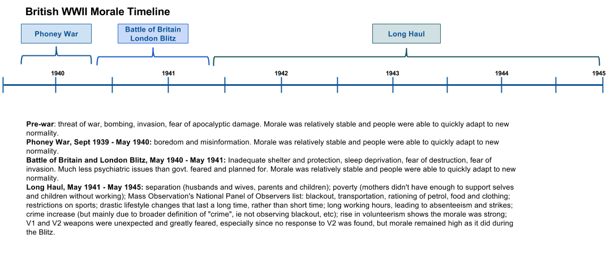
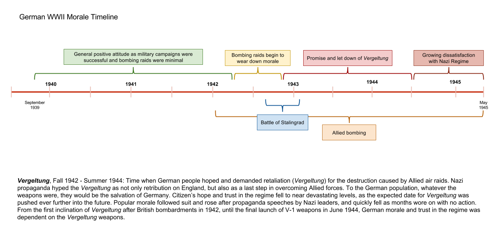
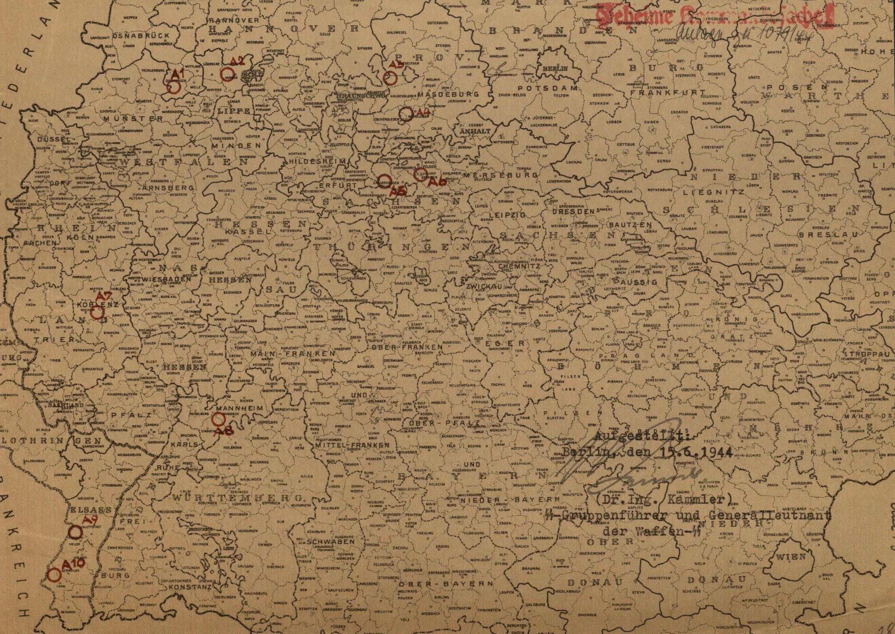
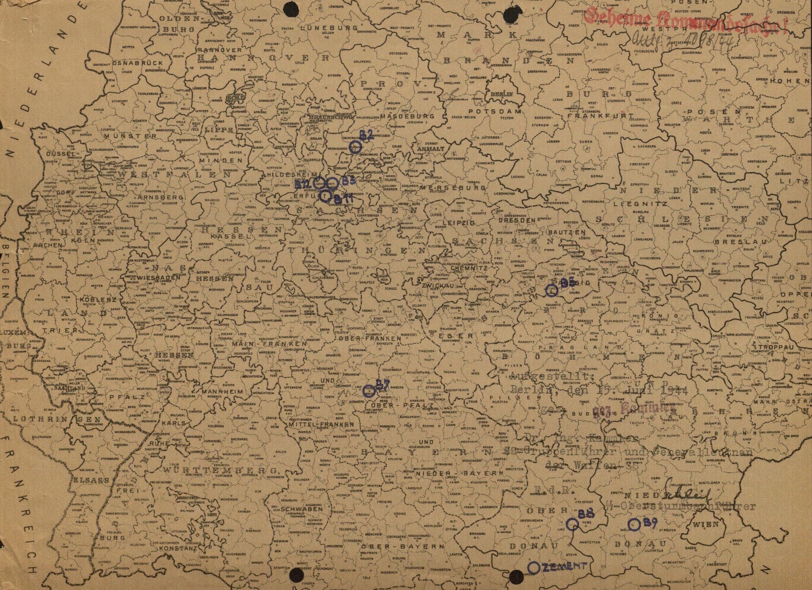

**Chapter One: Moving Underground**

In August 1944, Heinrich Himmler, Chief of the German Police and Reichsführer of the *Schutzstaffel* (SS), wrote to Oswald Pohl, who at the time was head of the SS-WVHA (SS Main Office for Economy and Administration) and in charge of organizing all concentration camps for the SS, about a recent discovery that “we as people of the twentieth Century can hardly fathom.”[1] Himmler’s letter referred to the discovery of a massive cave system underneath Nazi occupied Warsaw, Poland. Five years of war in and around Warsaw led to the discovery of a massive cave and catacomb system underneath part of the city. An excited Himmler noted that after speaking with the mayor of Vienna, he learned that this Austrian city also had extensive underground catacombs, sometimes two or three stories deep. “I am convinced,” wrote Himmler, “that we have many cities… with such caverns, which can be used, in my opinion, without any further changes as manufacturing facilities.”[2] He then instructed Pohl to investigate other cities including Prague, Wroclaw, Schweid, and Hohentwiel for similar subterranean spaces. Himmler’s excitement over these ready-made subterranean factory spaces was perhaps understandable considering the widespread destruction of vital factories throughout that year caused by Allied bombing raids. Several building projects to shelter critical aircraft facilities in massive underground tunnels throughout Germany were already underway in 1944, and the prospect of expanding the underground factories with minimal effort was obviously very enticing.

Chapter one describes some of the events, decisions and organizations within the Nazi government and German businesses that led to the utilization of underground relocation as a means of answering the Allies’ aggressive air attacks. First, this section briefly discusses the role of strategic bombing and its intended use to weaken morale and disrupt German war production, with specific emphasis placed on the combined Allied efforts during “Big Week,” along with a brief comparison of the effect of bombing on German and British morale. Second, the German government and military response to “Big Week” is explained, paying particular attention to the changes in the aviation industry and the *Reichsluftfahrtministerium* (German Ministry of Aviation, RLM). Third, a discussion of the various plans for protecting armaments factories show how underground relocation was seen as the most desirable, although most impractical, solution for protecting German war production. A general, post-war sense of the effectiveness of the differing dispersal possibilities is then addressed. Finally, the use of slave labor in the Third Reich is briefly discussed, and shows that solving the issue of protecting factories helped fulfill Nazi ideology of ridding the world of the “racially impure.”

**Strategic Use Of Air Power In WWI And WWII**

By some accounts, the total Allied air offensives during World War II dropped almost two million tons of bombs on Germany, completely destroying over sixty cities, killing an estimated 583,000 Germans as well as 80,000 Allied air crew.[3] What was the goal of strategic bombing? Did the bombing of British or German cities really have the desired effect? During their initial utilization in World War I, airplanes were believed by only a few military leaders at the time to be of any strategic advantage in modern warfare. As the world seemed to be teetering towards another war, US military leaders again addressed the usability of airplanes. Incorporating strategic use of airplanes in wartime planning was in itself an early battle fought among US military leaders, even before Germany embroiled Europe in another war. This section describes the early use of bombing and how it came to be used strategically in World War II by both Germany and the Allies. Weakening civilian morale and destroying military production facilities were the main goals for both sides of the conflict. This section looks at these two goals, and describes the success or failure of the goals as seen by contemporary observations as well as present-day arguments. Finally, Big Week is discussed as a major turning point in German military planning, effectively cementing the turn from offensive to defensive measures.

*Bombing as Strategy*

A few British and US airmen saw the advantage of strategic bombing in World War I but were unable to convince Army officers in charge of the war to utilize bombing as an offensive strategy, that is, bombing specific non-battle front targets for the sake of military advantage. For US and British Army commanders in the Great War, the fight was on the ground, between the battling foot soldiers. An aircraft’s main and only responsibility, according to those commanding officers, was to support those troops. If bombs were to be dropped, was the current military mentality, they would be at or near the battle’s front. Bombing specific targets, such as military production facilities, was not seen as contributing to winning a war. After the First World War, several United States airmen continued to push their belief that strategic bombing could impact a war. Their break came, when air force strategists replied to President Franklin Roosevelt’s general inquiry to the US military in the summer of 1941 for best practices for defeating Axis powers, as they expected and planned for the US entry into the current war in Europe.[4]

Britain had also began interwar plans for strategic bombing, and beginning with their entrance into war in 1939, British air forces began a systematic bombing of German cities. After the United States entered the war in 1941, they added the US air force to the British offensive, intensifying the bombing efforts the next year. Bombing raids by the Allies were designed to complete two tasks in hopes of shortening the war: weaken soldier and citizen morale, and destroy German war production. British Bomber Command under Arthur Harris sought total destruction of industrial areas and their associated civilian support as the main objective. While the press and population saw the bombing of German cities as retribution for bombed British cities, Harris saw it as the way to disarm the German military, city by city if necessary.[5]

Americans approached the issue of bombing with different goals than the RAF. American air strategists, even between the wars, had long studied the problem of bombing in order to determine the most effective strategy. In studying New York City, for example, they learned that the city could be rendered uninhabitable by destroying just seventeen key locations. In studying examples of how the Japanese bombed Chinese cities as well as German and Italian bombing during the Spanish Civil War, American strategists came to the conclusion that terror bombing, or bombing civilians to weaken morale, most often had the opposite effect, and usually led to a much more resistant population. Based on these studies, American strategy was for precision bombing, targeting key industrial and military locations. The fact that American bombing often ended up destroying civilian areas just as much as RAF bombing seems to be due to the limits of technology, rather than conscious implementation of strategy. US operational records and mission reports from raids show that the Americans consistently and honestly, even relentlessly, stressed precision bombing of military and industrial areas.[6] Official talk was one thing, though, as actual practice showed Allied bombing was relatively indiscriminate between civilian and military targets. Allied airmen sentiment, as expressed by leaders after the war, seemed to hold that destroying the civilian who created the weapons was just as good as destroying the soldiers who fired the weapons.[7]

Differing opinions as to the purpose of strategic bombing caused some tension among British and American air force leaders. American air forces entered the European Theater as a junior companion to the British forces that had already been fighting for two years. Commanders of the Eighth Air Force and Eighth Bomber Command were committed to day time precision bombing, and viewed civilian bombing as a waste of resources and inefficient military strategy. Despite this mindset, they did not want to create more unwanted tension in the British-American alliance. British military leaders pressed their US counterparts to adopt night time raids, citing high casualty rates and the seemingly ineffectiveness of daytime bombing. American air commanders were able to reach concessions at the Casablanca Conference in January 1943 by persuading British leaders to adopt an around the clock bombing strategy, with RAF bombing civilian locations at night, and American bombers carrying out raids on military targets by day.[8]

German use of air craft as a military weapon began similarly to Allied usage, beginning in World War I. In the beginning years of that war, German military leaders saw airplanes as a new and unreliable technology, and used them only as a means of reconnaissance and photography. German pilots, on the other hand, realized early on that their airplanes were much more useful than a pair of sky high eyes. In 1915, Max Immelmann turned the use of his new Fokker biplane from reconnaissance to weapon as he actively sought and shot down British planes. Armed with an advanced interrupter machine gun, German Fokker biplanes could be pointed at the enemy and thus be used as an extension of the machine gun by the pilot. This advantage and the acceptance of German military leaders to adapt the airplane as a strategic weapon, quickly lead to German dominance in the skies.[9] Germany also had the Zeppelin airships. Bombing raids by Zeppelin airships on London began in late 1915. German use of airships declined through 1916, though because they were slow and hard to protect, making them easy targets for British pilots.[10]

The interwar period was decidedly different for German military aviation than for the Allied military. With heavy restrictions placed upon them by the Versailles Treaty, Germany was required to turn over all military aircraft and forbidden for a period of six months to create any civilian aircraft, leaving Germany with only 140 aircraft and 169 engines for commercial use.[11] German civilian aviators and German military alike sought to keep a German presence in the field of aviation. To get around the restrictions placed on them by the Versailles Treaty, German military created offices and built factories in other countries, particularly in Russia, where they made secret arrangements for training of pilots and testing of German aircraft and equipment.[12] In 1926 the government consolidated all civilian aviation companies into *Lufthansa*, which under the control of the German Defense Ministry, contributed to the continued training and improvement of technical skills to German pilots.[13] As early as 1919, German civilians began focusing on gliding as a means to elevate the dreams of flight. In July and August 1920, the first gliding competitions were held on Wasserkuppe near Gersfeld and Fulda. Originally carried out for sport and pleasure, these gliding competitions, and gliding in general became a nationalistic practice, a virtual snub to the Allied nations who wished to restrict German aviation.[14] In practice, gliding gave military pilots continual training, and grew a cohort of individuals interested in flight, upon which the German military was later able to rely. Gliding as the main source of pilot training lasted only until 1925 when most restrictions on German aviation were eased.[15]

During the interwar period the major branches of the German military, army, navy and air force, competed with each other for limited resources and funding. When Hitler came to power, he appointed Hermann Göring, a career aviator and loyal supporter of the Luftwaffe, as second in command. Göring naturally increased the prominence of the Luftwaffe, often putting its needs above the army and navy.[16] Air strategy before the war was influenced by previous studies such as *The Command of the Air* by Italian general Giulio Douhet which were highly favorable to strategic bombing practices, but official doctrine promoted a more defensive role for the Luftwaffe. Strategic and tactical doctrine for the Luftwaffe was established in a 1936 manual which called for an aggressive defense against any enemy, and proclaimed, on paper at least, that terror raids upon cities were unethical, but justified the use of retaliatory raids as long as such raids were clearly defined as retaliation.[17] In general, the manual set up the Luftwaffe with defensive and support roles in an ensuing warfare.

*Bombing Morale and Production*

Since the purpose of Allied bombing was to destroy German morale and production, a brief look at what the bombings actually affected is in order. It is debatable how much of Allied bombing was actually strategic. Historian Earl R. Beck argues that most of the bombings were not militarily ”strategic” at all. British desires from the beginning were to destroy German civilians in an attempt to destroy their morale and desire to fight. A February 14, 1942, decree stated that the prime objective of British bombing in Germany “should now be focussed on the morale of the enemy civil population and, in particular, of the industrial workers.”[18] A list of industrial centers was given, but a clarification was added that the targets were to be populated industrial centers, not dockyards or aircraft factories. “This must be made quite clear if it not already understood.”[19] British strategy was a bombing of morale. As such, most of this section will focus on the effect bombing had on British and German morale, concluding with how this moved the Nazi government to seek protection for certain factories in underground spaces.

Surprisingly, consolidated numerical data for the air raids flown on Britain are difficult to ascertain. The best resource for consolidated and condensed information at present seems to be the online encyclopedia, Wikipedia. The following numbers and data are from Wikipedia, which in turn source their information from numerous authoritative and scholarly sources.[20] Several historians report that Germans flew over 71,000 sorties from September 1940 until May 1941, dropping over 30,000 tons of bombs and killing approximately 40,000 British civilians and over 3,000 British air crew.[21] By comparison, over 1.588 million tons of bombs were dropped on Germany by the RAF and the USAAF over the course of the war with death tolls for German civilians ranging from 300,000 to 600,000 due to bombing.[22] A single bombing raid on Hamburg in July 1943 killed over 45,000 German civilians; more than all of the British civilians killed in German raids on Britain.[23]

**RAF Bombing Sorties and Losses 1939-1945**

|           |             |            |
|-----------|-------------|------------|
|           | **Sorties** | **Losses** |
| **Night** | 297,663     | 7,449      |
| **Day**   | 66,851      | 876        |

\[Table 1.1. The total number of sorties flown by RAF during the war, and the total number of losses. Source: https://en.wikipedia.org/wiki/Strategic\_bombing\_during\_World\_War\_II\#Allied\_bombing\_statistics\_1939.E2.80.9345\]

**RAF and USAFB Bombing Tonnages on Germany 1939-1945**

|           |                               |                             |
|-----------|-------------------------------|-----------------------------|
| **YEAR**  | **RAF Bomber Command (tons)** | **US 8th Air Force (tons)** |
| 1939      | 31                            |                             |
| 1940      | 13,033                        |                             |
| 1941      | 31,504                        |                             |
| 1942      | 45,561                        | 1,561                       |
| 1943      | 157,457                       | 44,165                      |
| 1944      | 525,518                       | 389,119                     |
| 1945      | 191,540                       | 188,573                     |
| **Total** | **964,644**                   | **623,418**                 |

\[Table 1.2. Tonnage of bombs dropped on Germany by British and US air forces, from 1939 until 1945. Source: https://en.wikipedia.org/wiki/Strategic\_bombing\_during\_World\_War\_II\#Allied\_bombing\_statistics\_1939.E2.80.9345\]

The introduction to the post-war United States Strategic Bombing Survey (USSBS) describes the numbers as follows:

> In the attack by Allied air power, almost 2,700,000 tons of bombs were dropped, more than 1,440,000 bomber sorties and 2,680,000 fighter sorties were flown. The number of combat planes reached a peak of some 28,000 and at the maximum 1,300,000 men were in combat commands. The number of men lost in air action was 79,265 Americans and 79,281 British. \[Note: All RAF statistics are preliminary or tentative.\] More than 18,000 American and 22,000 British planes were lost or damaged beyond repair.
>
> In the wake of these attacks there are great paths of destruction. In Germany, 3,600,000 dwelling units, approximately 20% of the total, were destroyed or heavily damaged. Survey estimates show some 300,000 civilians killed and 780,000 wounded. The number made homeless aggregates 7,500,000. The principal German cities have been largely reduced to hollow walls and piles of rubble. German industry is bruised and temporarily paralyzed. These are the scars across the face of the enemy, the preface to the victory that followed. (United States Government Printing Office. “The United States Strategic Bombing Survey Summary Report (European War),” 1.)

RAF efforts before 1944 were relatively small. Tonnage of bombs tripled from 1942 to 1943. The RAF saw another triple in tonnage dropped in 1944 over 1943, but US dropped nearly nine times as much tonnage in 1944 as 1943. 1945 had second highest number of tonnage, after 1944, within half a year.[24]

*Bombing Morale*

Airplanes allowed warring nations to bring the war to the doorstep of the citizen. Bombing from both sides in World War II sought to deflate the morale of citizens and thereby bring an early termination to the war. A common belief was that the constant terror and fear of the destruction of homes and lives would send citizens clamoring to their government for surrender. The Luftwaffe bombed England for this reason[25] during the Blitzkrieg, hoping to terrorize their island neighbors into an early surrender. American air forces, at least in theory, limited their attacks to non-civilian, military and production facility targets, while British forces, in retaliation for *Blitz* bombing of England, felt no compulsion to limit bombing targets to military and industrial sites, and actively bombed occupied German cities. As this section will show, terror bombing, more often than not, only solidified the desire to resist and build confidence in their cause.

*British Morale*

Morale is just as hard to define today as it was during the war; and many attempts were made by scholars to define and assess morale during the war.[26] Stephen Taylor, Britain’s Director of Home Intelligence for the Ministry of Information during World War II attempted a definition by stating that morale is “ultimately measured not by what a person thinks or says, but what he \[and presumably she\] does and how he does it.”[27] After 1960, historians determined that two distinct camps of thought had evolved in regards British morale during the war; an official British version and a revisionist version. The official view states that Britons “endured the dangers and burdens that total war imposed on them with fortitude, a capacity to adapt, and unwavering resolve. National solidarity... stayed firm under the strains of total war” and even reinforced them. “The shared experiences of evacuation, bombing, war service and austerity served only to demonstrate that the well-known differences relating to region, class and status were in the end less important than the sense of belonging to a national community.”[28] In a word, British stoicism and bravery held up against the German onslaught.

The “revisionist” response shows the side of Britons that was less admirable; class antagonism, looting of bombed places, use of a black market, strikes, absenteeism, and low productivity are described as the norm. This movement wanted to show that Britons weren’t always, and not ever to the extent previously believed, “cheerful, resourceful, and unselfish” in the face of total war, but were rather more like all common humans when faced with such extreme disruption; sinking to the lowest forms of humanity, rather than rising to the highest as befitted the ideal British citizen.[29]

Four phases throughout the war led officials to worry about morale in different ways. During the first phase, the first eight months after Britain and France declared war on Germany, no large military action occurred, earning this time period the label the “Phony War.” The second phase of the war as seen by England were the many dramatic events from May 1940 (the evacuation of British Expeditionary Forces at Dunkirk, the collapse of France, the threat of invasion, and the Battle of Britain) leading up to the third phase consisting of the Blitz on London and other cities from September 1940 until May 1941. The final phase of the war on British morale, termed the “Long Haul” by historians lasted from May 1941 to May 1945, and added new dimensions to influence civilian morale. Many British struggled with the separation of loved ones, and poverty was a constant demoralizing factor for many mothers who despite government support did not have enough to support themselves and their children without working. Throughout the war, morale ebbed and flowed depending on the military events in Europe, and especially with what was happening locally. Generally speaking, civilian morale in Britain seemed to remain positive, that is, the British citizen desired to keep fighting the war despite the destruction and stress of being bombed.

\[Figure 1.1. British morale during WWII went through four phases. Created by the author.\]

*German Morale*

German citizens faced similar issues with bombing as did their British enemies. An estimated 1,673,000 tons of bombs dropped on Germany during WWII, more than 1/4 of all houses in Germany were damaged or destroyed.[30] Several large scale attacks which included a thousand RAF bombers on German cities led to tens of thousands of deaths during each raid.

Less has been research and written about German civilian morale than their British counterparts. After the war, scholarly writing and reporting by the popular media were held to an unspoken “taboo” against showing Germans as victims, so that images of the atrocities suffered by German citizens never made it into the national consciousness. Not until the early 2000s with W. G. Sebald’s *Luftkrieg Und Literatur: Mit Einem Essay Zu Alfred Andersch*, 2005, and Jörg Freidrich’s *Der Brand: Deutschland Im Bombenkrieg 1940-1945*, 2002, and a complete issue dedicated to the bombing victims in the German news weekly, *Der Spiegel* did it become socially permissible to debate the suffering inflicted upon the German population during World War II. Public discussion after the publication of the books by Sebald and Friedrich resulted in three basic arguments: 1) Allied air strategy in Europe could be condensed to two objectives: demoralize Germans, and destroy war production ability 2) Allied leaders knew these policies were fruitless, but carried out the bombings anyway 3) it was assumed at the time that the war was over by summer of 1944, so heavy bombing after this time (when more than half the tonnage of bombs were dropped on Germany) was unnecessary.[31]

Nearly everyone in Germany was in some way affected by the Allied air raids, and the problems were not just destroyed housing and food shortages. Citizens faced issues when applying for food and shelter after bombing raids, as government offices and personnel were also affected by the raid. Fire brigades and clean up crews were brought in from other cities and often received material and food originally set aside for the local bombing victims. Even towns and cities not directly bombed felt the influence of bombing raids as they saw an influx of refugees and were also required to supply labor to clear rubble and rebuild destroyed buildings. The basics of society seemed to dissolve, as citizens devolved to basic communal, familial and individual classifications, and disregarded political and party identity and authority. Mass exodus from the cities implies declining morale as the cities inhabitants were unsatisfied with local government protection and support.

The air war at such a scale was entirely new to humanity. There was no rule book, no proven strategy guides for offense or defense of a large scale air war. Childers argues that strategic bombing did exactly what it was hoped it would, make a contribution to Allied victory. It limited German military production, affected civilian morale, and contributed to Allied combatants on the front, and finally, argues Childers, the bombing war helped produce such utter defeat of Germany that there was no possibility of “what if” or “stab in the back” scenarios to haunt a post-war Germany.[32] The Allied bombing offensive, if anything, helped German civilians see through the charade of the Nazi regime. Civilians realized that Nazi leaders could have done more to stop the bombing, protect the civilians, or even surrender to stop the constant destruction of cities and civilians, but instead Hitler chose to ignore civilians and chase after increasingly drastic military wonder weapons. By the end of the war, Germans had lost their trust in the Nazi regime; it had crumbled to ruin as had many of their cities.[33]

\[Figure 1.2. German morale during WWII declined steadily, ultimately leading to wide spread dissatisfaction with the Nazi party. Created by the author.\]

*Bombing Production*

Ostensibly, the purpose of Allied bombing, particularly after the US entered the war, was to destroy German industry and shorten the war. One way to assess the effectiveness of the bombing is to look at the production output that bombing was to disrupt. The early years of the war saw a great increase in armaments production, but was more a result of using the available resources more effectively and efficiently. Speer’s appointment as Minister in the Reich Ministry for Armaments and Munitions (Reichsministerium für Rüstung und Kriegsproduktion, RMfRuK) came with complete control over armament output, from the very source of materials through to production in the factory. More efficient management of resources and tighter control on management itself led to greater output. As an example, aircraft production increased 40 percent from 1941 to 1942, using only 5% more labor and less aluminum.[34]

Bombing began in earnest in 1943, a greater than 3% increase in tonnage of bombs dropped than 1942. One would expect production numbers to show a decrease in production with the accompanying destruction that comes with over 200,000 tons of bombs dropped on Germany in 1943. Historians Jurgen Brauer and Hubert P. Van Tuyll argue that Allied bombing was tactical rather than strategic. Rather than affecting the outcome of the total war and interacting with the overall Allied military plan, bombing was just a way to disrupt the Wehrmacht forces. Looking at *when* the majority of bombs were dropped can show the overall importance of bombing in Allied planning. Over 70% of Allied bombs were dropped after the third quarter of 1944. At this point German production had already began to drop; after D-Day, and after the ground war had been basically decided.[35]

Bombing before 1944 hurt German production, but only temporarily. In most cases, Germans were able to salvage the tools and equipment because the bombs mostly destroyed the buildings and left critical machinery intact. In some instances, businesses did not repair buildings but kept working inside, hoping to fool the Allies into thinking the factory had been abandoned. Many industries also had a stock pile of resources, particularly for ball-bearings, so destruction of factories did not severely impact fighting ability. It was not until focus was turned to bombing oil and fuel production that bombing took a significant toll; there were still plenty of vehicles, aircraft and parts, but no fuel to drive them, and no pilots to fly them.

Allied bombing had at least five different industry focuses throughout the war; U-boats, ball-bearings, aircraft manufacturing, oil and fuel production, and transportation systems. From 1939 until 1941, as the British fought Germany virtually alone, their main bombing targets were cities. US Military leaders insisted on aiming for industrial targets only. From December 1942 until June 1943 Allied main industrial focus was on factories that manufactured U-boats. In January 1943, the Casablanca Conference reaffirmed Allied usage of bombing and named specific German industries as targets. From August until October 1943, ball-bearing industries were in the bombsights, particularly those at Schweinfurt. Allies suffered the loss of many bombers during these raids because they were required to fly over Germany unescorted by fighter planes that could not fly the distance. After the raids on Schweinfurt long day-time sorties were put on hold until the P51-Mustang, a fighter able to cover the distances required on bombing raids, became available in December 1943. During the summer of 1943 and through February 1944, Allied focus was turned on Aircraft manufacturing plants. A week long raid in February earned the title “Big Week” and will be discussed below as a pivotal moment in Allied bombing and German reaction to bombing. Because of the bombings in February and throughout the spring of 1944 the Luftwaffe was basically out of commission. Not only were many aircraft on the ground destroyed during bombing raids, many more were lost to the superior Allied aircraft and pilots who purposely sought to draw German pilots into aerial combat. Germans produced plenty of aircraft to be influential, but there was not enough fuel nor enough pilots to engage the US again in meaningful resistance. April through May 1944 was focused on the Oil industry, and by July 1944 every major synthetic plant had been hit. During the last half of 1944, the steel industry and transportation systems of the Ruhr were the focus of Allied bombing.[36]

The German aviation industry was the second highest priority target for the Allied Combined Bomber Offensive in January 1943; by June of that year it had taken top priority. Air superiority over Germany was seen by the Allies as the only way for Allied air forces to safely practice strategic bombing and bring a quick end to the war. It was thought that wiping out any one of four main parts of airplane manufacturing—engine production, ball bearing production, component plants, and final assembly plants—would collapse air industry, leaving open skies for the Allied[37] aircraft, and more importantly, leaving the skies clear of enemy aircraft as the army advanced on land. Throughout 1943, the combined Allied bombing efforts focused more and more on the German aviation industry. As 1943 came to a close USAAF and RAF forces concentrated on final assembly plants and component plants, as well as aero-engine and ball bearing factories.

In November 1943, USAAF began planning a massive attack on these areas with the hope of completely knocking out German airplane production. Weather during the winter of 1943-1944 was unfavorable for carrying out the massive attacks, and it was not until late February that the USAAF and RAF were able to carry out their massive attack plan, Operation Argument. Planned as a ten day concentrated attack on the German aircraft industry, the offensive was limited to five days due to unfavorable weather, which later gained the operation the moniker “Big Week.” From February 20 through February 25, USAAF and RAF bombers dropped over 19,000 tons of bombs on 31 factories and cities that supported the aviation industry[38]. While destruction of buildings was great, it was soon determined that the machines under the rubble were mostly left intact and could be used for production after a relatively quick clean up and rebuilding of the work space. Nevertheless, “Big Week” was the single most traumatic event in World War II air war for Germany, causing military leaders serious reflection and gave rise to the need to reorganize the aviation industry, leading to two central elements that needed continual improvement: control and standardization.[39] While recovery from the attacks was possible, Germany’s military leaders realized that such sustained attacks on key factories would severely cripple and could even destroy Germany’s military production capabilities. The war could be lost, they realized, by the destruction of any one key industry; ball bearings, oil production, and aircraft production. “Big Week” lead directly to protection measures that found some leaders seeking protection for aviation factories under ground.

Despite the number of bombs and amount of destruction, German production kept apace of demand until late 1944 when bombing became more accurate, the P-51 Mustang provided fighter escort for the whole journey greatly reducing Allied bomber casualties, and concentration on petroleum sources actually affected German fighting potential.[40] Not until after the war did Allied commanders realize how close their bombing efforts came to shorten the war. During post-war interviews, Albert Speer, Reichsminister for Armaments and War Production, was asked about the effect of the Allied air raids. He responded that the Allies had missed a great opportunity. Speer stated that if they had used their 1500 bombers in concentrating on just a single industry, the destruction would have been so complete that rebuilding would be impossible and the war would have ended within eight weeks.[41]

In their book *Castles, Battles, & Bombs: How Economics Explains Military History,* Jurgen Brauer and Hubert P. Van Tuyll argue that the Allied bombing of Germany in World War II followed the economic principle of diminishing marginal returns. Allied belief at the time, particularly that of the British air commanders, was that if enough bombs were dropped on Germany, they would eventually surrender. Brauer and Van Tuyll argue that based on production rates, civilian morale, and the dates when the majority of bombs were dropped, that the bombing had the desired effect (decrease in production) to a certain point, but after that point an increase in bombs did not affect a decrease in production.[42] Likewise, Kenneth Werrell argues that in the end, strategic bombing did not achieve the goals that were set by Allied airmen. It was not the clean, decisive, surgical, and revolutionary force it was hoped to be. Effectiveness, though, depends on how one interprets the data; bombing had no clear effective role.[43]

**German Businesses and the Nazi Regime**

German businesses had a long history of interaction with the Nazi government. Big Week altered these relationships, especially for companies supplying the Luftwaffe, like airplane production and oil and aircraft fuel production.

The aircraft industry had production problems before Big Week, but the concentrated destruction of factories was extremely exacerbated by the destruction of 75% of the industry’s buildings and 30% of the machinery during those 5 days.[44] Big Week necessitated the wholesale takeover of the aviation industry as the German government sought desperately to stop the hemorrhaging loss of airplanes and the factories which built them. While the aviation industry had seen some government intervention, Big Week ushered in a complete amalgamation of business and government.

Organizational reforms in the aviation industry began before Big Week, and even before the war. The aviation industry became nationalized because factories were unable to produce the required numbers under their current, privatized leadership. Nationalization began in May 1941, when Göring established a committee to integrate general policy-making and planning into the greater Nazi leadership. Members included executives of the top aviation firms. In February the following year, Albert Speer was appointed as Minister of Armaments after former Minister Fritz Todt’s death in a plane crash. Speer believed tighter integration and more central control were needed to improve German military production. The aviation industry was assigned to a central planning unit of Göring’s Four Year Plan, the *Zentrale Planung im Vierjahresplan* (Central Planning of the Four Year Plan), wherein the top executives were excluded as being counterproductive. The focus was on airframes, engines and equipment. The Central Planning and the Technical Office in the RLM under Erhard Milch became the two organizations to turn the aviation industry around and help them become productive.

Throughout 1942-1944, Speer’s ministry had infiltrated most businesses in the armaments industry by making heads of industry part of the committees or replacing them with government appointed leaders. The aviation industry, on the other hand, had remained relatively on its own due to the leadership under Milch and the RLM, and to direct involvement by Hermann Göring, whose high ranking in the Nazi government and personal interest in aviation kept that industry separate from other conglomeration efforts.[45] After Big Week, such autonomy was no longer sustainable, as the answer to Allied bombing was to bring all production under one command to ensure efficient production and effective protection.

Official handover of aviation production from RLM to the Armaments Ministry happened in June of 1944, after the establishment of several offices to handle the new organizational structure. This change over marked a decided change in the way airplanes were produced up to this point. Aviation production and management was now in charge of government representatives and technology and industrial experts rather than aviation engineers, former pilots and enthusiasts. As such, focus shifted from research and development and a desire to build the finest, most elite machines, to a numbers game. The new leaders just wanted more out put, the most number of planes, in the quickest amount of time. Increased output became the ultimate goal, but it soon outstripped its need. Germany found itself with airplanes but no trained pilots to fly them, no petrol to fuel them, and they flew so poorly that the Allied planes could easily shoot them down.[46]

First steps for increasing and protecting the aviation industry began immediately after the devastation of Big Week. On March 1, 1944, with authorization directly from Hitler, the *Jägerstab* (Fighter Command) was established as a “supreme committee for the management of fighter production in the next six months.” The aviation production was basically given the highest priority in German war production, and with that a blank check and the ability to repair and relocate damaged factories without any “bureaucratic scruples.”[47] Milch desired to create a special staff to bring together representatives from industry and government ministries to solve the bottlenecks in manufacturing, resource allocation, and priorities. Speer and Milch headed the Jägerstab, but the responsibility of day-to-day affairs and planing was given to Karl-Otto Saur, the former right-hand man of Fritz Todt, and a deputy under Speer in the Armaments Ministry. Göring called him “the whip," whipping the industry into shape[48]. Along with increasing the production of fighter planes, the Jägerstab was tasked with protecting the aviation factories by creating bombproof, underground facilities. This assignment was given to Himmler who put Oswald Pohl in charge as leader of the *SS-Wirtschafts-Verwaltungshauptamt* (SS-WVHA, SS Main Bureau for Economic Administration). Pohl subsequently delegated the responsibility to Hans Kammler, chief of the Amtsgruppe C, which was the inspection division of the SS. The SS, Kammler and Saur, worked well together in the Jägerstab, enjoying the status as an elite team.[49]

The Jägerstab broke many rules, political and ideological, in order to conduct business. Saur commandeered any factory, material, or laborer that he needed, even using the SS to arrest those who offered resistance.[50] International laws on treatment of prisoners were subjugated to the principle that increased production was paramount. They even employed Jewish inmates for the production of aircraft, an ideological taboo ignored for the sake of higher output.[51] Jägerstab projects employed thousands of workers. Just two weeks after the Jägerstab was formed, 36,000 laborers from concentration camps were employed in factories with Jägerstab oversight, with a plan to increase the number to 90,000 soon thereafter.[52] Forced labor from concentration camp inmates was critical to the underground relocation projects, as most of the laborers were used to excavate tunnels, clean up old mines, and even produce Germany’s weapons. Plans for more than 3 million square meters of tunnels were approved.[53]

Special note must be given to Hans Kammler, SS-Obergruppenführer. Kammler began his career in the Luftwaffe, but became a full-time SS officer in 1941. By 1942 Kammler had climbed the ranks in the SS and was appointed head of Office Group C, the main construction group of the SS. In 1943 Kammler led the main construction of the Mittelwerk underground V-2 production plant. With his experience with the V-2 production plant, Kammler was included as a member of the Jägerstab, and the later Rüstungsstab.[54] Many of the largest building projects[55] were given to Kammler. Within the Jägerstab, Kammler established a special group, called the Kammler Staff, to oversee the SS efforts. Special Inspection groups were installed regionally at Porta, Halle/Saale, Bad Wimpfen, and Wien, with local staffs to oversee local needs.[56] In March 1945, the need to protect armaments production became so severe that Hitler, Speer, Göring all signed off on a document to allow Kammler much greater power than ever before.[57]

In April and May 1944, Allied bombing raids focused on companies and factories for oil production. As big week shook up the aviation industry, the bombing offensives of April and May 1944 shook up the oil and fuel production industry. Because of these attacks, officials decided to repurpose several existing underground relocation projects for protecting oil production factories rather than aviation production plants. Edmund Geilenberg was given charge of helping the oil production industry relocate to underground spaces, just as was the aviation industry earlier that year. Speer appointed him as *Generalkommissar für die Sofortmassnahmen* (General Commissioner for the Immediate Measures) and was give power and authority to take what ever resources needed to move oil production underground, including resources under the Jägerstab.[58]

Production of fighter aircraft increased with the focused attention, limited bureaucratic restrictions, and priority given to production and protection of fighter aircraft. With such a positive reaction from the Jägerstab, Speer wanted to create an organization like it that would control all of armament production, with the idea that the Jägerstab would be rolled into this unit. In October 1944, Hitler approved the creation of the Rüstungsstab as an organization with complete control over the entire German armaments production. Aviation production was still given the highest priority under the Rüstungsstab.[59]

**Factory Dispersal Plans**

Several types of dispersion were considered after Big Week, physical distribution of factory machinery, moving factories wholesale or piecemeal into forested locations for concealment, and moving factories to underground spaces. Forest dispersal consisted of moving factories to heavily forested locations and setting up temporary structures for producing aircraft. Forest dispersal was the best form of dispersal in that no factories in forests were ever found or bombed by Allies. But forest dispersal was only seen as an intermediary step in the grand plan to move everything underground.[60] The government required several major companies to undergo a process of dispersal, wherein sections of the factories were physically moved far apart so that Allied bombing did not destroy all of a company’s assets. These industries included Daimler-Benz, Messerschmitt, BMW, IG Farben, Bosch, and Junkers, among many others.[61]

*Underground Dispersal*

Initially, Hitler did not fear the Allied air raids even though Albert Speer and Luftwaffe General Galland wrote numerous memos and had many conversations in an effort to convince Hitler that the air raids did indeed contribute to the destruction of the military’s economic machine.[62] Hitler thought the Allied bombings were implemented merely as a terror tactic, and felt that this actually benefited Germany by building morale and causing the Germans to fight more fiercely for their homeland. Hitler used such reasoning himself, as the purpose for bombing of England. “I can only win this war,” Hitler supposedly said, “if I destroy more of the enemy’s \[cities\] than he destroys of ours, by teaching him the terrors of war.[63]” Hitler’s air raids had the opposite effect on the English, the same effect he was hoping for with his Germans. In the first years, the air raids were merely terror tactics to Hitler, for he could not see how they would damage the war economy.[64] As the bombings grew more destructive, plans were developed for proactively sheltering factories. Hitler jumped on this new bandwagon that he hoped would become a tide in turning the war in his favor.

Oil and fuel production factories presented a unique issue for dispersal. It was not practical or feasible to split up these factories due to the steps required for producing oil and the need to store intermediate products. The sensitive nature of the product also led officials to make underground spaces a top priority for oil and fuel production plants.[65]

Some businesses and Nazi officials were skeptical of the practicality and efficacy of sheltering factories in underground spaces or building giant cement bunkers. During the war, Speer was not convinced that underground shelters would be able to sufficiently save the war economy. “Bombers \[can\] not be combated with concrete,[66]” wrote Speer, who was supportive of spending effort and money on fighters to combat the Allied bombers, instead of wasting precious resources on fanciful designs, like the V-1 and V-2 vengeance rockets, converting their jet powered fighter into a short-range bomber, and various other massive building projects.

Daimler-Benz was one such company reluctant to disperse their factories or move them to underground spaces. In early summer of 1943, as the Allies successfully damaged many German factories during the combined bomber offensives, government and industry leaders alike realized the need to more offensively protect their war industries from air attack, particularly their fighter airplane factories.[67] Daimler-Benz, manufacturer of airplane engines, trucks, and other military vehicles and parts, suffered almost complete annihilation of several factories. Before any of their factories had been targeted by Allied bombings, Daimler-Benz executives were very reluctant to participate in the dispersal of their factories. They quickly reconsidered the value of dispersing and relocating to underground facilities after their Mannheim plant was hit by an air raid in April 1943.[68] Although the damage did little to stop production, they were suddenly able to see the value in dispersing factories to avoid destruction. After two months of bombing in late 1944, nearly all of Daimler-Benz’s plants were forced to shutdown because almost all buildings had been destroyed.[69]

After the war, the United States Strategic Bombing Survey commented that a Professor Krauch, Commissioner General for problems in the Chemical industry, estimated that moving plants to underground locations was three times as costly as dispersing them on the surface.[70] To Germany’s officials, though, the best way to protect key factories from Allied bombs was to put them far enough underground that they could not be destroyed.[71]

Once decisions were made to move factories underground, the process for finding such spaces began in earnest. The most obvious places to look were for existing underground spaces; caves, mines, and unused railroad tunnels were the first options. The military was already using underground spaces for munitions and machinery storage, and these spaces became primary possibilities for underground relocations. A June 1944 correspondence from General Field Marshall Keitel noted that the Jägerstab had power to take whatever resources, including caverns, tunnels and mines used for storage.[72]

In April 1944, the SS took over a number of underground projects specified by the Jägerstab. Divided into two groups, these projects were to benefit from the organizational skill and seemingly boundless supply of laborers that the SS could provide. “A Projects” were designated as those projects where factories had been identified and paired with existing mines, tunnels and caves for immediate possession. “B Projects” were those projects where factories had been identified but new construction of mines or caves were necessary.[73]

Management and planning on the highest level of the SS was given to Kammler. Documents prepared by Kammler in 1944 show which projects he controlled, the total floor space planned for each project, the total civilian and concentration camp workers required by the project and business, the businesses involved, and the location of each project. By March 1944, the Jägerstab had planned twelve projects which would use existing mines and caves (those designated as A Projects), with a total underground floor space of 262,930 square meters (49 NFL football fields worth, or nearly 32 FIFA soccer pitches worth)[74]. The largest of these projects was located at Neckarelz (between Frankfurt and Stuttgart, along the Neckar River), with a planned floor space of 60,000 square meters. Daimler-Benz was the company that occupied the tunnel space, where they produced aircraft engines.

Plans for newly constructed mines, adits, and tunnels (designated as B Projects) were finalized by June 1944, as detailed in documents sent by Kammler to Himmler and others.[75] Plans for these projects were very ambitious, each of them exceeding the largest of the A Projects, with a combined planned floor space of 1,095,529 square meters. One project bears particular mention. By far the largest planned Jägerstab project, the B12 project at Niedersachswerfen, at 247,000 meters square was to house an oil refinery, airplane frame construction, and improve the existing space for the V-2 rocket production which was already in production. Given the code name Mittelbau-Dora, this project was the largest undertaking of Kammler and his staff.

**A and B Projects**

|                    |                                       |                             |                                 |                           |
|--------------------|---------------------------------------|-----------------------------|---------------------------------|---------------------------|
| **Project Number** | **Location**                          | **Code Names**              | **Company**                     | **Planned Square Meters** |
| A1                 | Lengerich                             | Rebuhn                      | Vereinigte Leichmetalwerke      | 3,500                     |
| A2                 | Porta                                 | Stör I, Stör II, Kröte      | Ambi-Budd                       | 11,000                    |
| A3                 | Schacht Bartensleben                  | Iltis, Bulldogge            | Askania                         | 38,430                    |
| A4                 | Hadmersleben                          | Marder                      | Ago, Oschersleben               | 29,000                    |
| A5                 | Heimkehle b. Uftrungen (Rottelberode) | Heller                      | Junkers, Schönebeck             | 8,000                     |
| A6                 | Wansleben (St. Georg und Neumansfeld) | Biber                       | Chr. Mansfeld, Leipzig          | 21,000                    |
| A7                 | Bruttig b. Kochem                     | Zeisig                      | Bosch                           | 21,000                    |
| A8                 | Neckarelz, Gipsgrube Obrigheim        | Goldfisch, Brasse, Rotzunge | Daimler-Benz                    | 60,000                    |
| A9                 | Markirch/Elsaß                        |                             | BMW, München                    | 56,000                    |
| A10                | Wesserling/Elsaß                      |                             | Daimler-Benz                    | 15,000                    |
| A12                |                                       | Döbel II                    |                                 | 2,000                     |
| B1                 | Stadt Oldendorf                       | Silberfisch                 | Junkers, Desau                  | 60000                     |
| B2                 | Halberstadt                           | Malachit                    | Junkers, Desau                  | 65000                     |
| B3                 | Nordhausen (Anhydrit)                 | Hydra I                     | Junkers, Desau                  | 123000                    |
| B4                 | Krölpa b. Pößneck                     |                             | Arado-Brandenburg               | 60000                     |
| B5                 | Leitmeritz (Not for the Jägerstab)    | Richard                     | Elsabe (Autounion) Osram        | 80000                     |
| B6                 | Eschenlohe                            |                             | Dornier-Süd                     | 60000                     |
| B7                 | Hersbruck b. Nürnberg                 | Esche                       | BMW, München                    | 60000                     |
| B8                 | St. Georgen a.d. Gusen                | Bergkristall                | Messerschmitt, Regensburg       | 45000                     |
| B9                 | Melk a.d. Donau                       | Quarz                       | Steyr-Daimler-Puch A.G.         | 65000                     |
| B10                | Melk a.d. Donau                       |                             | Wiener-Neustädter-Flugzeugwerke | 80000                     |
| B11                | Niedersachswerfen (Mittelbau)         | Eber, Kuckuck               | Junkers-Dessau                  | 101000                    |
| B12                | Niedersachswerfen (Mittelbau)         | Kaolin                      | Junkers-Dessau                  | 247000                    |
| Zement             | Ebensee                               | Zement                      | Fakowa                          | 45000                     |
| Schlier            | Zipf                                  | Schlier                     | V2 engine tests                 | 4529                      |

\[Table 1.3. A and B projects: project number, location, code name, production company, planned square meters.\]

The projects were spread fairly evenly across German territory, making use of mountain ranges near the factories that needed protection. Two maps created by Hans Kammler’s office show the distribution of the A and B projects. Each project is noted with a circle and the A or B and ordinal designation, see figures 1.3 and 1.4. While most projects were within present day German borders, two projects were in present day France and one project in present day Czech Republic.[76]

\[Figure 1.3. Map designating the location of A Projects, assigned to existing mines, tunnels and caves. Source: United States Holocaust Memorial Museum. “The Samuel and Irene Goudsmit Collection, 1944-1985.”\]

\[Figure 1.4. Map designating the location of B Projects, where mines, adits, and tunnels were to be newly created. Source: United States Holocaust Memorial Museum. “The Samuel and Irene Goudsmit Collection, 1944-1985.”\]

Underground factory dispersal, seen as unnecessary and extreme before 1943, became a source of salvation. Hitler declared underground bunkers and mines as the long term goal, sidelining other more achievable options such as forest dispersal as temporary[77], with a desire to move all of Germany’s war production underground.[78] Hitler even pushed an idea to build a six million square foot cement bunker to house a fighter jet factory that would build a plane completely in one factory, from first to last bolt. A discussion between Göring, Milch, Saur and Doring about this plan led Saur and Milch to try to persuade Göring, and thereby influence Hitler, that it was better to use existing caves and tunnels, arguing some projects were already underway. Göring replied that Hitler was intent on having cement bunkers and was willing to put everything into the project.[79]

Desire to move underground swept through the upper officials in the Nazi government, leading sometimes to odd results. In January 1945, Himmler suggested to hold a contest after the War to find the best underground work in small, medium and large cities. The winning community would receive a tax rebate or some other recognition.[80]

**Forced Labor**

Construction of underground space and relocation into underground factories would not have happened if such a requirement had been asked of the private industries. They were inexperienced in underground construction, and most importantly lacked the political clout to cut through local bureaucratic tape and possessed inadequate man power to successfully complete such an undertaking.[81] For these reasons the SS was given control of constructing underground spaces and relocating many factories. They had experience in constructing the underground production facility for the V-1 and V-2 missiles in 1943, and they had the political ability to cut through any red tape that national, regional and local governments might try to impose. Most importantly for their hoped for success, though, was their seemingly endless supply of laborers available in the concentration camps.

Beginning in 1936, the National Socialist government discussed the issue of Germany’s labor shortage. Agricultural and industrial jobs were left unfilled in unmanageable numbers with German men entering the military to prepare for, and eventually fight in, war. Two options arose as the answer to so many vacant vocational positions: employ women, or employ foreigners. Both options were unsatisfactory when viewed with the lens of Nazi propaganda. The role of women in Germany was clear, they were to remain at home as focal point of the family and the German society and to be the bearer of a plenteous Aryan population. Propaganda called for a foreign-free Germany, so employing foreigners, especially those of an inferior race, was seen as problematic. In the end, importing foreign workers was decided as the more practical option. By the summer of 1940, 310,000 Polish workers had been brought to work in Germany, nearly 90% of them in agricultural positions, and another 390,000 Polish prisoners of war were classified as civil workers in Germany.[82]

As the war progressed, Germany’s labor force issue increased. Most of the able bodied men were called into the Wehrmacht to fight the war, especially after June 1941 when Germany began fighting a two front war. Germany’s failure to win in Russia increased German labor shortages. Instead of the war ending as planned and the economy returning to normal production, contentions increased pulling the German economy into total war; instead of soldiers coming home and laying down guns for hammers, the military was pulling more men from the factories to the front. Germany’s struggling war economy were leading to the SS and war industries to come closer together.[83] In order to keep the fighting men on the fronts, Germany altered policy on labor usage and began to use German women, any foreigner, and in the end concentration camp inmates.

The centralization of the armaments production led to an increase of military goods over consumer goods. But the effort to increase military production grew inversely proportional to the available labor force. In response to this shortage, foreign laborers were brought in from outside Germany to fill the staggering labor needs. By March 1943 over 1 million Poles, and over 100,000 Soviets came to Germany as foreign workers, and by April 1943, 198,000 workers came from France, 42,000 from Belgium, and thousands more from the Netherlands, Denmark, Norway, Czech, Slovakia, Greece and Yugoslavia. With the increase in labor, production numbers saw an increase from 1940 through 1944. By the end of 1944, 5.5 million foreigners had been brought to Germany, mostly from the Soviet Union and Poland.[84] 1944 saw the decline of armaments production due to the freeing of occupied lands and the toll of Allied bombing on German industry and infrastructure; after March 1945 regulated production was no longer possible.[85]

Labor shortages for underground construction became so severe that the SS felt it necessary to try and recall skilled workers who were already serving in the Wehrmacht. In April 1944, Kammler wrote to *SS-Gruppenführer* Hermann Fegelein (General of the Waffen-SS) pleading for his help to influence *Oberkommando der Wehrmacht* Wilhelm Keitel (Supreme High Command of the German Armed Forces) to allow his request to have 4,500 skilled laborers released from the Wehrmacht in order to push through on the objectives of the Jägerstab.[86] Five days later Kammler followed up through Standartenführer Dr. Rudolf Brandt, adding that the entire Jägerstab construction projects were dependent upon the release of these skilled workers.[87]

A final source of labor came from inmates in the thousands of concentration camps throughout Germany and the occupied lands. Concentration camps began as early as 1933, but mainly as prisons for political opponents to the Nazi party. The early goal of the camps was to “educate” and “reform” political prisoners, with the intent to let them go after their will was broken.[88] Persecution of “asocial” Germans was begun for the “war effort” in 1938. This year also saw the formation of a new SS economic enterprise. The German Earth and Stone Works (Deutsche Erd- und Steinwerke \[DEST\]) was formed to fulfill the building and architectural desires of Himmler and the SS. DEST was organized to utilize prisoners from concentration camps as a labor force for providing bricks and stone from SS owned and run quarries and factories, with the materials supporting Hitler’s monumental building projects.[89] From 1938, some concentration camp prisoners were used in SS-owned companies, mainly in manual labor and repair shops. Even then, work was seen as punishment, reform, or revenge.[90]

During the preparation of and throughout the war, the purpose, function and usage of the camps altered. Defeat on the eastern front in 1941 not only caused a reorganization of German military strategy, but also the purpose of armament production to accommodate the new long-term war to be fought. With this change, the SS was given oversight of armament production, under a newly created Main Office for Economy and Administration (WVHA), due to their seemingly abundant source of labor. SS Main Offices of Administration and Business and the Main Office of Budget and Building were combined and brought under the Inspectorate of Concentration Camps in the WVHA. Chief of this office was given to SS-Obergruppenführer and General of the Waffen-SS, Oswald Pohl. Focus for the SS changed from providing a labor force to produce materials for architectural projects to providing a labor force that could produce materials for the armaments production.[91] Three main types of camps were identified: Grade 1 consisted of labor camps; Grade 2 were labor camps with hard labor and poor living conditions; and Grade 3 were extermination camps.[92] Practical implementation of prisoners in factories did not occur until late 1942, with help from a decree from Hitler (with encouragement from Speer) which placed concentration camp inmates as loanable labor to private enterprises.[93]

In January 1942, Himmler wrote of the need for 150,000 Jews to fill a great economic need in the form of jobs.[94] The Wehrmacht had captured over 3 million Soviet POWs in 1941, and Himmler hoped to feed these into Kammler’s Building Inspections as an “unlimited” supply of labor. In September 1941 the General Staff agreed to send 350,000 Soviet POWs to SS camps, which Himmler split evenly between Auschwitz and Lublin, ordering their expansion to accommodate them. Most of prisoners, though, never made it to the camps because they died of malnutrition and mistreatment by the end of the year. The expected Soviet POWs were to be replaced with 150,000 Jews, male and female.[95] Redirecting Jews into the labor force was not meant to undermine the “Final Solution to the Jewish Question.” The SS intended to kill more than they would need for labor.[96] Concentration camps now had a dual purpose: persecution and elimination of those opposed to fascism, and the preparation of exploitable concentration camp prisoners for the purpose of defense production.[97] This change in focus is seen in the dramatic increase of satellite concentration camps during 1944. March of that year began with 20 main camps and 165 satellite camps, by the end of the year there were fewer main camps, but satellite camps grew to number over 500, with over 714,000 inmates in the concentration camp system.[98] This shows a restructuring of the concentration camp system as the SS sought to fulfill their new role to disperse factories important to war production, but likewise disperse their new labor force to meet the building demand. Concentration camp inmates were a last resort, used by the SS and German war economy only when all other resources had been exhausted.[99]

SS use of concentration camp inmates for labor was not initiated first in 1944. The first use of concentration camp inmates for armaments production was by the Buna-Werk of the IG-Farben company, which used inmates from Auschwitz in 1941[100]. Speer identified the criteria for the most effective use of prisoners in the armaments production in a 1943 letter to Himmler. This formula would prove effective for increasing armament production, but deadly for the prisoners: highest efficiency using minimal resources to produce the greatest economic outcome. In the early stages of the war, using camp prisoners was reserved for individual factories. The SS, in the only control they had in the armaments production, would then supply the plant with the desired number of prisoners. Attempts by the SS to control armament goods, as in Buchenwald, did not go well. The RMfRuK restricted the influence of the SS on the armaments production. By the end of 1944, Concentration camps contained approximately 600,000-700,000 prisoners. Over 250,000 were employed in private armament industries, nearly 200,000 of these in projects controlled directly by RMfRuK (for example the V-weapons), and over 50,000 were utilized in Amtsgruppe C of the SS-WVHA, the projects controlled by Kammler for the building of underground factory space.[101] In general, the total number of prisoners used for industrial labor was far less than German civilians (40 million), but in certain industries (for example aircraft manufacture and chemical production) and by the underground facilities, the number of forced laborers exceeded the number of civilian laborers.[102]

“Big business was an active partner in many key facets of Hitler’s National Revolution,” writes historian Adam Tooze, and “in virtually every context, even settings in which one might have expected some resistance, the regime’s political representatives found active collaborators in German business.[103]” Concern for industry leaders going into the war was the need to balance the desire to supply the required needs for armament, thereby increasing profits, but also keep from increasing capital beyond post-war needs, which would saddle them with useless machines and loss of invested money.[104] As mid- and long-term market options were increasingly being blown up after 1942, German business owners found a greater need to produce for the war economy, and eventually looked to the government for help in protecting their depleting assets. German businesses actively and anxiously sought government protection and were eventually willing to overlook the use of forced laborers who built their tunnels and bunkers, as long as it saved their machinery from being destroyed. Studies by Mark Spoerer show that of thirty-three known cases of industries employing slave labor, only one, the Akkumluatorenfabirk AG Stöcken a battery factory for U-boats, was forced from the outside by the SS to use slave labor. Twenty-two factories, state and private corporations, employed slave labor after direct request and dealings from the managers. The businesses requested concentration camp laborers, they were not forced upon them by the SS.[105]

One example of the use of concentration camp inmates for labor in the aircraft industry is seen in a report to Reichsmarschall Göring by Reichsführer-SS Himmler in February 1944.[106] In the letter, Himmler assigns Pohl to work with the *Reichsluffahrtministerium* (RLM) in planning and implementation of concentration camp prisoners. Himmler continues the letter by mentioning how the forced laborers have already proven a great asset to the airplane industry. By the time of the letter, 2,000 were already manufacturing 900 nose cones and fire shields, as well as 120,000 various other parts for the Jäger Me 109. In Oranienburg, 6,000 inmates accounted for 60% of the workforce of the Heinkel-Werken plant where the He 177 was built. The inmates worked perfectly there, so increasing the number to 8,000 was planned.

Female inmates were also used for aircraft production. A production plant in Neubrandenburg used 2,500 women inmates at mechanical workstations to produce bombing equipment and rudder machinery. Completely composed of women inmates, the plant produced 30,500 pieces in the month of January, and therefore the number of inmates were to be increased to 4,000. The work produced by these inmates, declared Himmler, was excellent (“*ausgezeichnet*”). Himmler concluded the letter with the outlook that the implementation of underground production facilities would require an additional 100,000 inmates, plans for which were already underway. The compulsory use of women in the factories led to an initial increase of the labor force. In 1944, 14.8 million women worked in armaments production.[107]

Throughout the letter, Himmler emphasized the role of the SS in implementing the Reich’s plan to use concentration camp prisoners for labor, specifically in the airplane manufacturing industry. 36,000 prisoners were already in use for Luftwaffe purposes, wrote Himmler, and the number was expected to increase to 90,000. A subsequent report from Pohl to Himmler shows the total number of inmates for February 1944 to be 35,839, spread throughout 45 factories. Heinkel-Werke’s Oranienburg plant had the largest number of inmates at 5,939, with BMW’s München-Allach plant with the second largest group of inmates at 3,434, and the smallest factories assigned 15-20 inmates as at Bev. F. Hochfrequenzforschung. A further 59,946 inmates were planned for, with an additional five factory locations. Pohl recorded a total 8,733,495 hours worked by inmates for the month of February 1944.[108]

Göring also approved the use of concentration camp inmates as labor in the aviation industry, even offering trades in favors to increase the number of inmate laborers. In a telegram reply to Himmler, who asked for the creation of another squadron for the 7th Special Flying Group (Fliegergruppe z.b.V. 7), Göring took the opportunity to ask for as many inmates as available for the aviation industry. “The air war situation makes the relocation of industry under the earth mandatory,” wrote Göring, and “previous experience has found these workers to be very useful, \[because\] the work is particularly suited to concentration camp convicts (KZ-Sträflinge).”[109]

Numbers of forced laborers during the war are staggering. Herbert reports that 9.5 to 10 million foreign civilian workers and prisoners of war were used in Germany at any given time, with a peak usage of 7.6 million during the summer of 1944.[110] An accurate number of concentration camp inmates as laborers is impossible to calculate, but roughly 2.5 million were used between 1939 and 1945. Of the 2.5 million, a conservative estimate of 836,000 to 995,000 of these people died. “One should assume that practically every concentration camp inmate was used for forced labor for short or long periods during imprisonment, however, in very different and changing ways.”[111]

This work upholds the argument that use of concentration camp prisoners as an inexhaustible labor force and a means of eliminating the Jews from Europe came as a result of labor shortages as the war progressed rather than a grand scheme envisioned before the war, following the mantra of *Vernichtung durch Arbeit*, extermination through (by means of) work.

Nazi leadership desperately sought for some kind of effective response to the destruction of Allied bombing, especially after Big Week in February 1944. Protecting factories vital to the production of airplanes was seen as the most viable option for such protection. Of all the options for factory protection—relocation to forests, dispersal to multiple locations and relocation to underground locations—underground relocation was accepted as the best alternative. Underground relocation became another miracle cure for Nazi leaders. Just like other wonder weapons, Nazi leaders, especially Hitler, clung tenaciously to the big, bold, and overwhelmingly expensive plans for military salvation. Unwilling to grasp the reality that engulfed them—no man-power, no labor force, no resources—Nazi leaders squeezed every ounce of usability from the only source of labor they had, the concentration camp inmates, and it just so happened working these prisoners to death also fulfilled their goals to eradicate the Jews and “others.”

[1] Himmler, “38/111/44g Letter from Himmler to Pohl.”

[2] Ibid.

[3] Hansen, *Fire and Fury*, 279.

[4] Birkey, “AIMING FOR STRATEGIC EFFECT,” 7.

[5] Childers, “Facilis Descensus Averni Est,” 87.

[6] Ibid., 88–89.

[7] Schaffer, “American Military Ethics in World War II,” 333.

[8] Childers, “Facilis Descensus Averni Est,” 91–92.

[9] Killen, *Luftwaffe*, 3.

[10] Ibid., 9.

[11] Ibid., 35.

[12] Suchenwirth, “Development of the German Air Force, 1919-1939,” 12.

[13] Ibid., 14.

[14] Fritzsche, *A Nation of Fliers*, 106.

[15] Ibid., 107.

[16] Suchenwirth, “Development of the German Air Force, 1919-1939,” xi.

[17] Ibid., 170.

[18] Beck, “The Allied Bombing of Germany, 1942-1945, and the German Response,” 329.

[19] Ibid.

[20] As an interesting aside, this page on strategic bombing during World War II seems like a good argument in favor of the open research available on Wikipedia. Over 200 footnotes link to over 50 sources, some of them primary documents, with a further 25 books listed for further reading.

[21] *http://en.wikipedia.org/wiki/The\_Blitz\#Bombing\_raid\_statistics*

[22] http://en.wikipedia.org/wiki/Strategic\_bombing\_during\_World\_War\_II\#Allied\_bombing\_statistics\_1939.E2.80.9345

[23] Beck, “The Allied Bombing of Germany, 1942-1945, and the German Response,” 232.

[24] *https://en.wikipedia.org/wiki/Strategic\_bombing\_during\_World\_War\_II\#cite\_ref-Humble\_169-0*

[25] Perz, *Projekt Quarz*, 129.

[26] Bateson and Mead, “Principles of Moral Building”; Estorick, “Morale in Contemporary England”; Glicksberg, “Morale Promotion in Wartime”; Hocking, “The Nature of Morale”; Kris, “Morale in Germany”; Park, “Morale and the News”; Washburn, “What Makes Morale?”; Gallup, “Reporting Public Opinion in Five Nations”; Glicksberg, “War Attitudes of My English Pupils”; Miller, “Effect of the War Declaration on the National Morale of American College Students”; Glicksberg, “Morale Promotion in Wartime”; Eliot, “The German Army Today.”

[27] Baldoli, Knapp, and Overy, *Bombing, States and Peoples in Western Europe, 1940-1945*, 172.

[28] Mackay, *Half the Battle Civilian Morale in Britain during the Second World War*, 3.

[29] Ibid., 5.

[30] Baldoli, Knapp, and Overy, *Bombing, States and Peoples in Western Europe, 1940-1945*, 185.

[31] Childers, “Facilis Descensus Averni Est,” 76.

[32] Ibid., 104.

[33] Beck, “The Allied Bombing of Germany, 1942-1945, and the German Response,” 336. For more on German morale during the War see also Friedrich, *Der Brand*., Gregor, “A Schicksalsgemeinschaft?” and Kirwin, “Waiting for Retaliation - A Study in Nazi Propaganda Behaviour and German Civilian Morale.”

[34] Overy, *War and Economy in the Third Reich*, 254.

[35] Brauer and Van Tuyll, *Castles, Battles, & Bombs*, 209.

[36] United States Government Printing Office, “The United States Strategic Bombing Survey Summary Report (European War),” 4–11.

[37] Spaatz, “Strategic Air Power,” 392.

[38] Uziel, *Arming the Luftwaffe*, 57.

[39] Ibid., 71.

[40] Beck, “The Allied Bombing of Germany, 1942-1945, and the German Response,” 332.

[41] National Archives Microfilm Publication, “‘Records for the Reich Ministry for Armaments and War Production,’” Frames 3406546 and 3406547.

[42] Brauer and Van Tuyll, *Castles, Battles, & Bombs*, 213.

[43] Werrell, “The Strategic Bombing of Germany in World War II.”

[44] Lange, “Die Konzentrationslager an der Porta Westfalica,” 27.

[45] Uziel, *Arming the Luftwaffe*, 74.

[46] Ibid., 81.

[47] Ibid., 77 see also Daily meeting of Jägerstab, NARA, M888/6/591, 6 März 1944, p. 5.

[48] Ibid. see also NARA, RG243/31/Box 1, USSBS interview \#44 w/ Dr. Karl Frydag, 9 July 1945, p. 21.

[49] Allen, *The Business of Genocide*, 203.

[50] Ibid., 232.

[51] Tooze, *The Wages of Destruction*, 630.

[52] Ibid.

[53] United States Holocaust Memorial Museum, “The Samuel and Irene Goudsmit Collection, 1944-1985,” 2.

[54] Blanke-Bohne, “Die unterirdische Verlagerung von Rüstungsbetrieben und die Außenlager des KZ Neuengamme in Porta Westfalica bei Minden,” 16.

[55] Uziel, *Arming the Luftwaffe*, 125.

 RG-10.228, “Telegram from Himmler to Frank, April 8, 1944.” Himmler suggests to SS-Obergruppenführer Karl Hermann Frank that Kammler take over the entire B5 project at Litomerice near Prague.

[56] Allen, *The Business of Genocide*, 237.

[57] Hitler, Speer, and Göring, “Der Einsatz von Strahlflugzeugen hat die absolute Überlegenheit über die feindlichen Maschinen erwiesen.”

[58] Uziel, *Arming the Luftwaffe*, 140.

[59] Ibid., 82–84 see also NARA T73/30/3159064, 1 August 1944, BA-B, R3/1597, 17 Juli 1944, and NARA T73/30/3159063, 12 Oktober 1944.

[60] Ibid., 120.

[61] United States Holocaust Memorial Museum, “The Samuel and Irene Goudsmit Collection, 1944-1985” Several documents list the numerous companies involved in dispersal operations.

[62] Speer, *Inside the Third Reich*, 350–351.

[63] Overy, “Hitler and Air Strategy,” 411.

[64] Ibid., 411f.

[65] United States Strategic Bombing Survey, Oil Division, *Underground and Dispersal Plants in Greater Germany*, 3, 34, 62.

[66] Speer, *Inside the Third Reich*, 336.

[67] Zilbert, *Albert Speer and the Nazi Ministry of Arms*, 215.

[68] Gregor, *Daimler-Benz in the Third Reich*, 219.

[69] Ibid., 103.

[70] United States Strategic Bombing Survey, Oil Division, *Underground and Dispersal Plants in Greater Germany*, 4.

[71] Uziel, *Arming the Luftwaffe*, 79.

[72] Bundesarchiv Freiburg, “RW-19 1788.”

[73] United States Holocaust Memorial Museum, “The Samuel and Irene Goudsmit Collection, 1944-1985.” and RG-10.228, “Letter from Pohl to Himmler, April 1, 1944.”

[74] A soccer pitch is 8250 meters square at its largest FIFA international dimensions. [*http://www.fifa.com/development/education-and-technical/referees/laws-of-the-game.html*](http://www.fifa.com/development/education-and-technical/referees/laws-of-the-game.html)

An NFL football field is 5351 meters square. [*http://www.nfl.com/rulebook/field*](http://www.nfl.com/rulebook/field)

[75] United States Holocaust Memorial Museum, “The Samuel and Irene Goudsmit Collection, 1944-1985.”

[76] An interactive web version is also available at https://www.google.com/maps/d/edit?mid=zuMewFpePmAg.kwT3zmWukW\_0&usp=sharing

[77] Uziel, *Arming the Luftwaffe*, 120 footnote 283 see RG243/6/Box 224, Besprechung beim Führer am 28 und 29 November 1944, p.4.

[78] Ibid., 124 footnote 311 see R3/1509, Protokoll der Führerbesprechung am 5 März 1944.

[79] Bundesarchiv Freiburg, “N 653, 109, 22, H 1 EG, 27, 1, 5” N 653, 109, 22, H 1 EG, 27, 1, 5. Hertel, Section 1065.

[80] T-175 23 2528474 932, “T-175 23 2528474 932.”

[81] United States Strategic Bombing Survey, Oil Division, *Underground and Dispersal Plants in Greater Germany*, 55.

[82] Herbert, *Geschichte der Ausländerpolitik in Deutschland*, 130–132.

[83] Allen, *The Business of Genocide*, 165.

[84] Blanke-Bohne, “Die unterirdische Verlagerung von Rüstungsbetrieben und die Außenlager des KZ Neuengamme in Porta Westfalica bei Minden,” 9.

[85] Ibid., 10.

[86] United States Holocaust Memorial Museum, “The Samuel and Irene Goudsmit Collection, 1944-1985” 1944.04.28-1927-1+Fegelein\_Kammler.

[87] Ibid. 1944.05.02-682-1+Brandt\_Kammler.

[88] Blanke-Bohne, “Die unterirdische Verlagerung von Rüstungsbetrieben und die Außenlager des KZ Neuengamme in Porta Westfalica bei Minden,” 13.

[89] Jaskot, *The Architecture of Oppression*, 3, 11.

[90] Herbert, “Forced Laborers in the Third Reich,” 200.

[91] Jaskot, *The Architecture of Oppression*, 33.

[92] Kieler, *Resistance Fighter*, 250.

[93] Herbert, “Forced Laborers in the Third Reich,” 200.

[94] Blanke-Bohne, “Die unterirdische Verlagerung von Rüstungsbetrieben und die Außenlager des KZ Neuengamme in Porta Westfalica bei Minden,” 13.

[95] Allen, *The Business of Genocide*, 150.

[96] Ibid., 151.

[97] Blanke-Bohne, “Die unterirdische Verlagerung von Rüstungsbetrieben und die Außenlager des KZ Neuengamme in Porta Westfalica bei Minden,” 14.

[98] Ibid., 10. and KZ-Gedenkstätte Neuengamme, “Das System der Konzentrationslager,” 5 (412).

[99] Allen, *The Business of Genocide*, 166.

[100] Blanke-Bohne, “Die unterirdische Verlagerung von Rüstungsbetrieben und die Außenlager des KZ Neuengamme in Porta Westfalica bei Minden,” 14.

[101] Ibid., 15.

[102] Ibid., 16.

[103] Tooze, *The Wages of Destruction*, 134.

[104] Gregor, *Daimler-Benz in the Third Reich*, 109.

[105] Allen, *The Business of Genocide*, 170.

[106] United States Holocaust Memorial Museum, “The Samuel and Irene Goudsmit Collection, 1944-1985,” 1944.02.xx–1+Görgin\_Himmler–USHMM–Goudsmit–RG10.228\_Folder4.

[107] Blanke-Bohne, “Die unterirdische Verlagerung von Rüstungsbetrieben und die Außenlager des KZ Neuengamme in Porta Westfalica bei Minden,” 9.

[108] United States Holocaust Memorial Museum, “The Samuel and Irene Goudsmit Collection, 1944-1985,” 1944.02.21–20+To\_Pohl–Chart.

[109] RG-10.228, “Aufstellung der 7. Staffel/Fliegergruppe Z.B.V.7.” 1944.04.15-24411-1+Himmler\_Goering.

[110] Herbert, “Forced Laborers in the Third Reich,” 205.

[111] Ibid., 206.
