**Chapter Two: Porta Westfalica**

This chapter discusses the more technical aspects of the tunnel projects in Jakobsberg and Wittekindsberg. First, a brief outline of how the tunnels were selected, followed by a detail of the Wittekindsberg adits, the location, construction and description of the businesses and what they were supposed to or did produce. Next, the Jakobsberg adit is described, also detailing the location, construction and description of the businesses and their production. Finally, a very brief outline is given of other dispersal and relocation projects in the area, some of which also used concentration camp labor for production and construction purposes.

At least 25 underground projects were concurrently undergoing active construction or planning during 1944 and through to the end of the war. Hans Kammler was assigned by the SS to manage the higher level details and planning of the 25 projects under SS command, with four regional offices to manage a sub-set of projects.

Porta Westfalica, as a town, existed only since 1973, when 15 villages were incorporated into one city. Two villages, now districts of Porta Westfalica, are pertinent to this study; Barkhausen on the east side of the Weser River, and Hausberge on the west side of the river. Both districts surround the points of the Wesergebirge bisected by the Weser River. The underground projects at Porta Westfalica consist of two separate tunnel systems, one in each of the mountains on either side of the Weser River. Both hills are composed of sedimentary rock forming the base of the hills. Sandstone runs through the middle of each hill, 40 meters high in some places. Clay shale, called Ornate stone is layered on top of the sandstone, with Cornbrash, a sometimes loose and gravely shale, making up the topmost layer of sediment. The Ornate stone shale is often used in the area to decorate outside walls in a layering affect similar to shingles on a roof.

The sandstone in both mountains, the Wittekindsberg on the west side of the Weser in the district of Barkhausen, and Jakobsberg on the east in the district of Hausberge, had been quarried since the middle ages. Stone from the Wittekindsberg was used in the 1890s to build the monument to Kaiser Wilhelm which stands at the peak of that mountain. In the 19th Century, two separate quarries in Jakobsberg were owned by two different families, both of them Jewish. Excavation ceased near the turn of the century, and the quarries remained unused until the 1940s.[1]

\[Figure 2-1 A map locating the major tunnel projects and camp locations. An online, interactive map with pictures of the locations is available.[2]\]

As early as January 1944, the empty quarries in Jakobsberg were singled out as possible locations for underground dispersal.[3] The process of selecting which factories to relocate was similar for all projects. Selection of companies was determined in counsel between Speer's *Rüstungslieferungsamt* and the main Rings  for the industry involved. The main Rings would suggest several factories to be dispersed and the Rüstungslieferungsamt would then decide which factories to disperse, not based on the importance to war production, but rather on how well the dispersal would eliminate the identified bottleneck in production.[4]

A report was made for each A and B project under Kammler’s command, which included a map of the tunnel locations, and information about the company to inhabit the tunnel, the planned floor space, and the electrical and water needs. Information on the A2 Project for Porta Westfalica includes the following:[5]

> General:
>
> 1) Cavern Porta by Minden
>
> 2) Production Company: Ambi-Budd Berlin
>
> 3) Production: Presses, Converstion Control kits
>
> 4) Total Area: 11,000 square meter
>
> 5) 1st Construction section completion date May 31, 1944: 5,000 square meters
>
> 2nd Construction section: 9,000 square meters
>
> Technical Details:
>
> 1) Total length of the cavern: 1,035
>
> 2) Average width: 7.5 meters
>
> 3) Rail access is not needed
>
> 4) Electrical Needs: 2,500 KVA
>
> 5) Water needs: 200 cubic meters per day

The map of the area includes Barkhausen, Porta Westfalica, and Lerbeck as named locations. The three tunnels are marked in red. An additional sketch includes the two Jakobsberg tunnels as seen from the top, to indicate the location and number of tunnels in relation to each other. A final sketch indicates a scale profile sketch of the mountain, and that the mountain is made of sandstone. The page is dated 30 March 1944, and signed by Kammler.

\[Figure 2-2 Project page for the A2 underground project at Porta Westfalica\]

A report from Kammler, dated May 20, 1944 includes data for all A projects in tabular (spreadsheet) format. Data for the A 2 project (see figure 2-3) is translated as:[6]

> Running Number: 2
>
> Code Number: A 2
>
> Location: Porta
>
> Production Company: Ambi-Budd
>
> Construction Begin: 15.3.44
>
> Completion:
>
> 1st Construction Section: May 31, 1944, 5,000 m2
>
> 2nd Construction Section: August 1, 1944, 9,000 m2
>
> Total Square Meters/Supply Systems:
>
> 14.000 m2
>
> Electricity 4.10 KVA
>
> Water: 300 m3/hour
>
> Gas: 700 m3 hour
>
> Moving Date:
>
> Begin: June 1, 1944
>
> End: August 1, 1944
>
> Quarters for production workers:
>
> Civilian:
>
> 100 Hotels Friedensthal
>
> 200 Private quarters
>
> 100 Brickworks Porta
>
> Prisoners:
>
> 500 Hotel Kaiserhof
>
> Production Start date: July 15, 1944
>
> Moving date with how many men and how many machines:
>
> August 1, 1944
>
> 400 Civilians
>
> 500 Prisoners
>
> 44 Presses

\[Figure 2-3. Spreadsheet showing report on A projects.\]

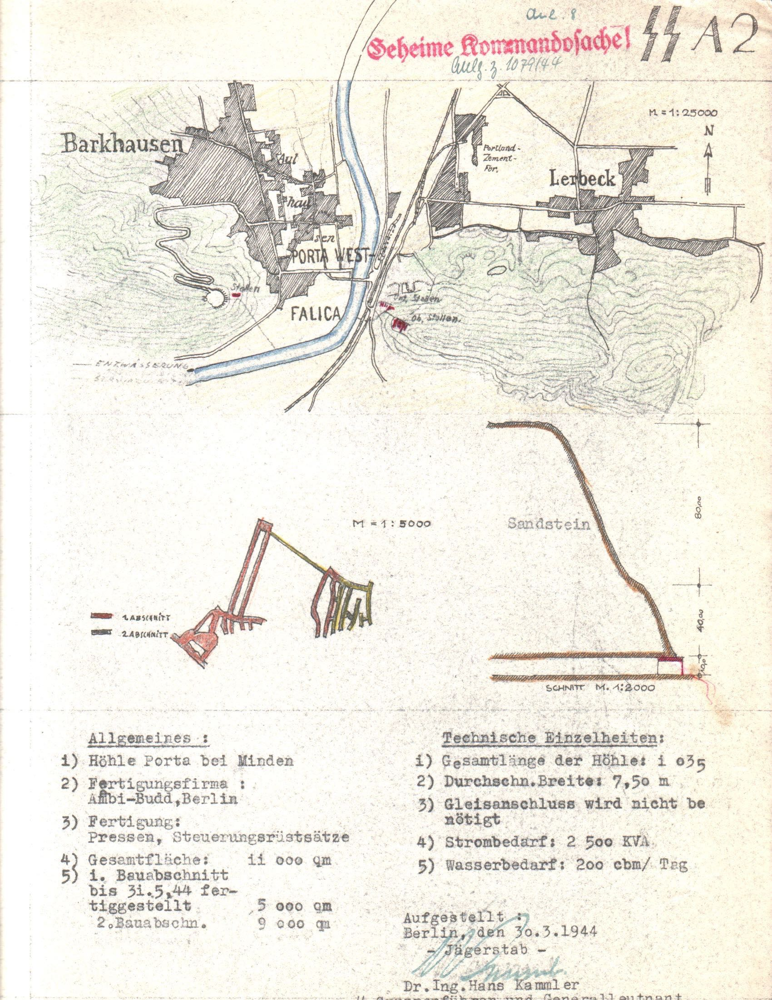

\[Figure 2-4. Spreadsheet showing report on remaining A projects.\]

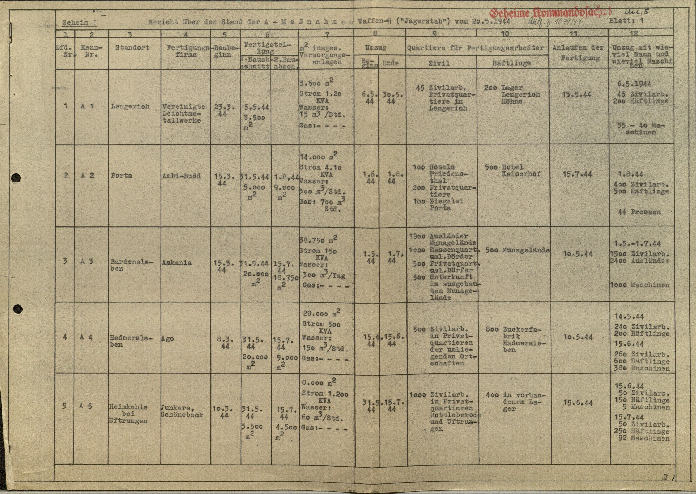

\[Figure 2-5. Spreadsheet showing report on B projects.\]

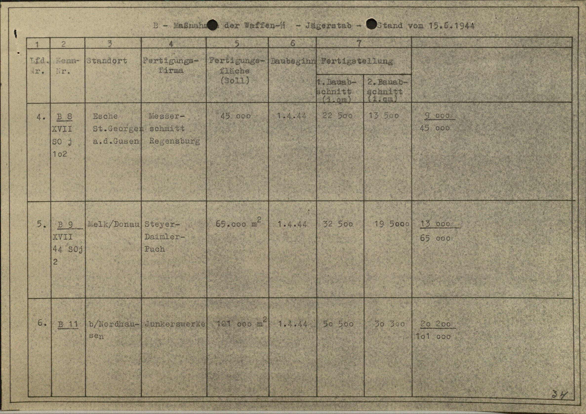

\[Figure 2-6. Spreadsheet showing report on B projects.\]

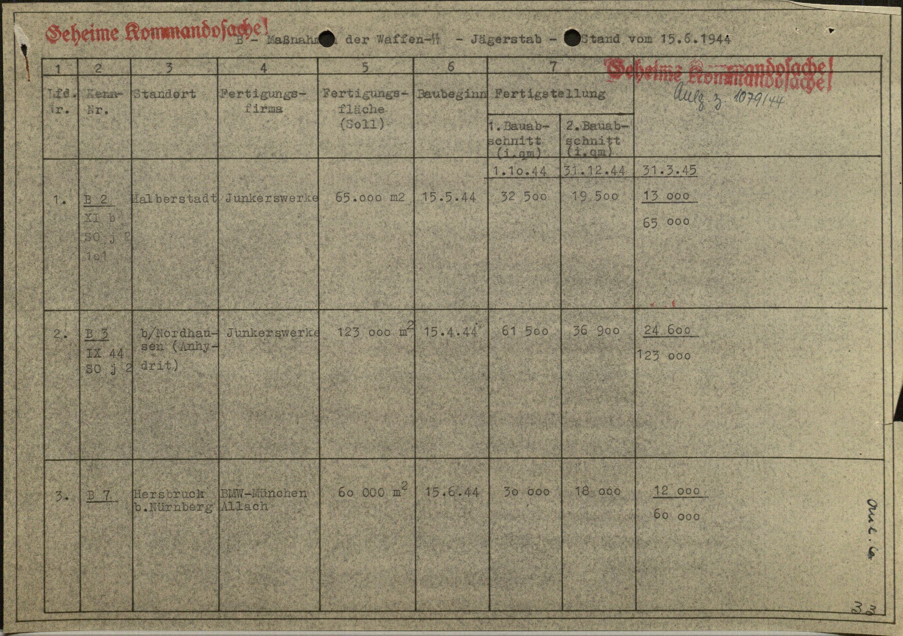

\[Figure 2-7. Spreadsheet showing report on B projects.\]

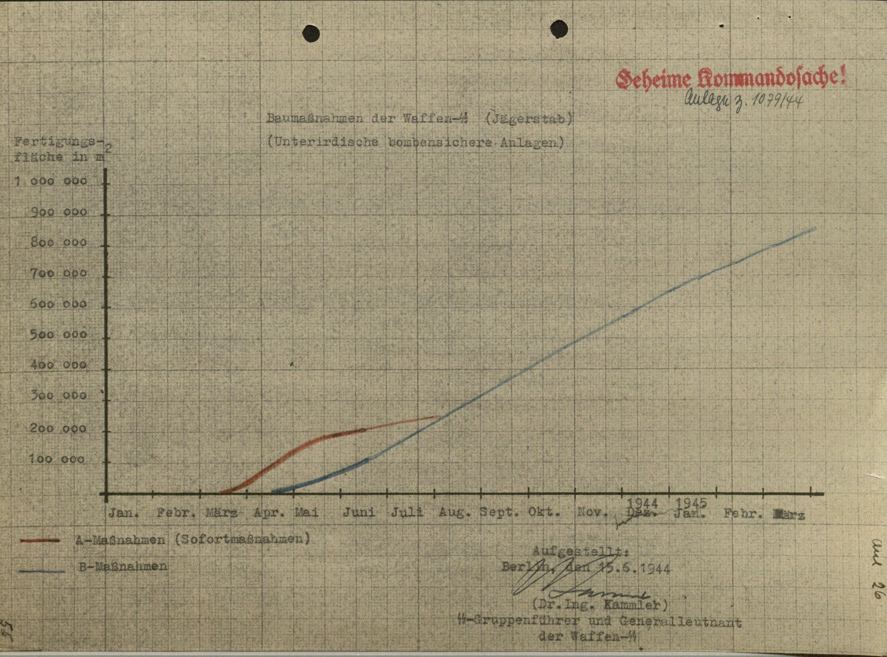

\[Figure 2-8. Spreadsheet showing projected growth of underground space from March 1944 until March 1945.\]

**Wittekindsberg**

**Location**

On the west side of the river lies the Wittekindsberg, topped with a monument to Kaiser Wilhelm I, constructed of large sandstone blocks, quarried from the very mountain on which it stands. Work to convert the old quarry into suitable factory space is reported to have began in the Fall of 1943. At about 90 meters (almost 100 yards) long, 12 meters (about 40 feet) wide and 17 meters (over 55 feet) high, the old quarry easily accommodated a total of four levels worth of factory floor with minimal excavation required. The code name Stöhr II was given to this project, but was more often known as the Denkmalstollen (Monument Tunnel).

**Construction**

Completion of the tunnel work was finished by the middle of 1944. Floors and stairwells were created of reinforced concrete. A massive reinforced concrete blast wall, 1.3 meters (4 feet 3 inches) thick, was constructed at the mouth of the tunnel to seal and protect against possible damage from Allied bombing. Each level contained a doorway sized entrance for receiving and distributing materials.[7]

\[Figure 2-9. The entrance to the Denkmal Stollen. Source: Communal Archive Minden.\]

All of the walls were unfinished except for being white washed. The ground floor, though, had a 1 meter (3 feet 3 inches) high wall, 22.8 centimeters (9 inches) thick, with a trough like gutter along the top for catching moisture and allowing the runoff to flow out of the tunnel. The rock roof was framed with timber and covered with wallboard. Near the back of each level there was an electric elevator (able to lift 2000 kilograms, 2 tons) which served all floors. Six foot by ten foot openings provided access to the outside on each level, with access provided by a large beam from the top floor and hand operated lifting block for raising large equipment. Moving things on the floors was done by hand or by battery driven floor trucks. Goods were moved to and from the factory by means of trucks, as the grade of the road was quite steep.[8]

Electrical power was fed from a feeder at 6,000 volts and transformed 380/220 volts in three phases. The switch room was located outside near the boiler room, and cables ran on boards which were suspended by hangers from transverse concrete beams. To apparently reduce risk of electrical shortage, very little metal conduit was used in routing the electrical cables. Metal conduit was used only for traversing between floors, and in such cases the conduit’s length reached 4 1/2 feet above floor level. Metal filament light bulbs with enameled reflectors provided light within the tunnel, with “all circuit wiring… carried out in the form of surface cleat work.”[9] Ground wires did not seem to be used.

Heating was accomplished by coke burning boilers installed on the outside mountainside. Steam produced from the three “cast-iron sectional low-pressure steam boilers” was pumped into an “air heater battery,” a second battery for storerooms and to several pieces of machinery requiring steam.[10]

Ventilation was achieved by pulling in fresh air from the outside using a double entry fan which was located in a sealed chamber. An extraction system was used to spray water from the main water supply into the air where it then passed over horizontal spray eliminator plates. As the air passed through the water spray, unwanted particles in the air attached to the water spray which then condensed on the eliminator plates. The cleaned air then passed into the factory through ventilation ducts. The water containing air contaminants was collected and drained as waste water. Air temperature control was achieved by varying the amount of air that was passed through a heating battery. The air spray system was used only in hot weather months to cool the air. Optimal air quality levels consisted of relative humidity at 58 to 65%, a temperature of 65-72 degrees F, and 8 air changes per hour. Air was circulated through the different floors from the third floor by painted sheet metal ducts that ran vertical between floors. Outlets were placed near floor level. Intake vents were located on the opposite wall, constructed of boards, and returned to the main exhaust duct on the third floor. An additional plenum heating and extraction system was built on the third floor to service chambers offset from the main tunnels.[11]

Compressed air was supplied by two vertical reciprocating compressors, one for redundancy. The compressed air was used for “pneumatic chucks for holding bearing rings for radius turning, and also for clearing swarf \[metal shavings and other small waste\] from machines.”[12]

Water was supplied from by pumping water from the local town’s supply to large holding tanks near the factory. Sewage was disposed of by means of water flushed directly into the Weser untreated.[13]

\[Figure 2-10. Sketches diagraming the Denkmal Stollen. Source: USSBS report.\]

**Dr. Ing. Böhme & Co.**

Two businesses occupied the four levels of the Denkmal Stollen in Wittekindsberg. The first two levels were occupied by the firm Dr. Ing. Böhme & Co., Metallwarenfabrik, Minden-Lubbecherstrasse for the production of ball bearings.[14] The privately owned company was headquartered in Minden and owned by Gustav Böhme and Carl Markes. On July 28, 1939, the company was instructed by *Oberkommando der Wehrmacht* (OKW, Supreme Command of the Armed Forces) to be involved in armaments production by producing cartridge belts for the MG 34 machine gun. Their plant in Minden also already made ball bearings. Shortly after the war began, production was increased with some work outsourced to Paris in order to meet a 2.4 million RM contract with OKW. With 95% of their production involved with rearmament, Böhme was soon tapped to become a Wehrwirtschaftsführer, which tied him closer to the Wehrmacht and gave his business military status.[15] This was a profitable move for Böhme, earning his company a profit of 3.2 million RM from 1939-1945.[16]

On July 17, 1944, Böhme’s company was invited to move into the underground factory space prepared in the Denkmalstollen. The cost of dispersal was 23,500 RM, and rent for the 4,000 square meter factory space came to 7,200 RM per month.

Employees at Böhme’s factories rose to 1,423. Just over a third, 381 were foreign workers, with over half of all workers being female (784).[17] In the Denkmalstollen factory, the Böhme company employed thirty Germans, supported by 120 women forced laborers. Most of the female laborers were from Ukraine, and were interned in a labor camp near Böhme headquarters in Minden. Conditions in the camp were abysmal. Work in the factory was done in two shifts with the foreign women working a 12 hour shift, and German women working an 8 hour shift.[18]

Production Engineer for Dr. Ing. Böhme & Co. was a Herr Bodenmuller, with a Herr Roettgen as Assistant Production Manager. Detailed information about the factory and how it ran was provided by interviews with these men. Non-precision bearings, ranging from 5/8” to 2” diameters, were manufactured on the first two levels. Balls for the bearings came from Schweinfurt and other places, and the casings came from the parent company in Minden. Final assembly was then carried out in the tunnel.[19] Böhme & Co.’s rolling bearings were produced exclusively for the Luftwaffe. Production in these underground factories is said to have begun in September, 1944, and ended April 4, 1945, a month before Allied troops reached the area.

**Veltrup KG**

The third and fourth levels were occupied by the Veltrup company from Aachen, which produced parts for tanks, hand grenades and gears. The Veltrup company moved their factory to Porta some time before the Allies reached Aachen in June 1944, and production in the upper levels of the Denkmalstollen began in October 1944. Production This company used 80 employees who were brought with the machinery from the plant in Aachen.[20]

In total, a labor force of 400-500 was used in two 12 hour shifts, with an estimated two thirds of the labor comprising foreign workers. In Aachen, Veltrup produced blanks for practice, hand grenade shafts with fins, pumps for coolant, gear oil and gasoline, steel bodies for engines, component parts for the Junkers-Motorenwerke. In the underground dispersal plant, production was limited to combustion chambers and vanes for the anti-tank rocket launcher, commonly known in English as the “tanks bane” and in German as the “*Panzerschreck*”. Additionally, shafts with fins for hand grenades were manufactured.[21] Fourteen welding booths were crammed into one 36 foot by 22 foot partition in the back of the third floor.[22] Working conditions would have been very uncomfortable due to the inadequate ventilation and long working hours.

**Jakobsberg**

**Location**

On the east side of the river, the Jakobsberg forms the westernmost peak of the Wesergebirge. A 40 meter thick layer of sandstone makes up the bulk of the range, laying at about a 20 degree angle from the North, so that the sandstone increases to the south. Through the 19th Century, two separate sandstone quarries existed in the Jakobsberg, owned by different families. By the turn of the century both mines had gone out of business and were left unused.[23] These mines were retrofitted for armaments production in 1944.

**Construction**

The upper system consisted of nine levels and was code named "Stöhr I,” and after August and September 1944 was fitted with machinery from the Philips Radio Valve factory from Eindhoven, in Holland, and given the code name "Hammerwerke". This was a massive open hall that was separated into different overlapping levels, depending on the position of the sandstone layers, creating 8,000 m2 of production floor space. The interior structure was for the most part unsupported except for a few areas where steel joists and timber lagging was used. The walls were left unfinished and only whitewashed. Excavation in this section was done at the same time as the lower mine.[24]

The lower mine was expanded to 6,500 m2 and was originally assigned to the Ambi-Budd company, manufacturer of airplane frames, but after August 1944 was turned over to the Deurag-Nerag company from Hannover for the production of lubricating oil (*Schmieröl*) and was given the code name "Dachs I.” As observed at the end of the war, the condition of the tunnel was extremely well. No cave-ins were observed in the main tunnel area, and only one cave-in for the unfinished tunnel that was to connect to the railway system. This area had suffered a large cave-in due to excavation into the loose and unstable Cornbrash shale. This section was enforced by “steel ribs and timber laggings.”[25]

**Hammerwerke**

A CIOS Report of 1946 offers the most concise details about the Hammerwerke project as it existed at the end of the War. The former quarries were “enlarged by the Gewerkschaft Porta to house the Phillips Radio Valve factory from Eindhoven, in Holland.” Construction started in March, 1944, and was completed by September 1944. Radio tubes and radio measuring systems were produced for a few weeks during the months of February and March 1945. Remote-controlled bombs were also produced by the Rentrop company of Stadthagen in a small part of the upper system.[26]

Access to the main entrance was on seventh floor through a 1.1 meters thick concrete blast wall. A ramp leading from the entrance connected to the “main road at Hausberge by a funicular railway” and to a small road leading through the woods for several kilometers to the east end of Hausberge. A total of 9 levels existed for factory floor space in the Hammerwerke tunnels. Stairwells inside provided access to the other levels and a 4x3 meter elevator (5,000 kilogram capacity) served floors 1-7. The floors were stacked at an angle following the upwards slanting strata of sandstone. The nine levels were used as follows:

> 1st floor: toolroom and maintenance shop. Everything in tip top shape with plenty of space and good tools and machinery. Gas mixing plant which was then distributed to other floors via normal piping.
>
> 2nd floor: devoted to grid rolling
>
> 3rd floor: component assembly
>
> 4th floor: assembly and testing
>
> 5th floor: filament wires and testing, not yet in full production. Floor also used by Carsten of Hamburg who stamped mica parts used by Philips for assembly.
>
> 6th floor: sleeping quarters and offices
>
> 7th floor: main entrance and exit. Production of cathodes and filaments
>
> 8th floor: preparation of cathodes and filaments
>
> 9th floor: offices and ablution, with small exit probably only used by staff.[27]

Water came from the town supply and was also processed from the river. Sewage was treated and dumped into river Weser. Heat came from the boiler at the lower ground level that went first to the Dachs I plant, then to the ground floor of Hammerwerke and further up.[28] Ventilation was adequate. “Condensation was evident on the lower floors but the general state of the factory suggests that production heat energy in conjunction with the use of steam heater batteries had resulted in a reasonable air condition.”[29] Electric power came from Dachs I, at 6,000 volts, and was transformed to “400 volts 3 phase 4 wire”[30]. Lighting was of high standard, 4 kilowatts of lighting for 7.62 by 7.62 meter inspection bay.[31] Suppression of fire was also taken into consideration with fire hydrants connected to the rising water main and portable fire extinguishers[32] throughout the factory. No evidence of air attack was visible on site, and no record of air strikes were recorded for the area.

Everything from the factory in Holland had been transferred to this underground replica, including the exact same inspection benches (as mentioned by some survivors). Production was supposed to reach 12,000 radio valves per day, but from February to May, only 7,000 working valves were produced. More were manufactured but were defective due to dust in the valves which could not be easily detected, and sabotage. Manufacture of the tubes was carried out by 1200-1400 workers, mostly young Jewish girls from concentration camps. The girls worked in three shifts, two at 6 hours and one at 8 hours, with a break between 3 a.m. and 7 a.m.[33]

The Hammerwerke tunnels were connected to the lower Dachs I tunnels by a nearly 100 meter tunnel. Stories were told by forced laborers of sliding down this tunnel in order to exit the system through the Dachs I entrance at the end of the working day.[34]

\[Figure 2-11. Sketch of Hammerwerke tunnels.\]

As was often the case, the floor space in the tunnels was repurposed and assigned to other companies as the production needs of the War effort changed. Such changes were made even into the late stages of War. In March 1945, Speer ordered 800 square meters of floor space be set aside for the Novella company from Freiburg/Silesia and Thorn, which was to produce magnetrons[35] for radar systems. It is unknown whether this move actually took place, and there is no record of the company or such equipment being found by Allied forces in their reports.

**Dachs I**

The lower section of the tunnel in Jakobsberg was originally assigned to the Ambi-Budd company of Berlin for the manufacture of air frames. Construction on the tunnel system began on March 13, 1944, and the first 5,000 square meters were scheduled to be completed by May 31, with a second construction site consisting of 9,000 square meters to be completed by August 1. According to a report from Kammler on July 31, the 5,000 square meters of the first site were completed by May 30, and the Ambi-Budd company had begun to move in as planned on June 1, and was nearly complete with the installation of machinery by the time of the report.[36]

A single adit allowed entrance to the lower tunnel system directly. A large hall exists immediately upon entering the tunnel, running to the right. Three halls, or galleries, run perpendicular to main hall, creating a sort of “E” shaped tunnel system with the three parallel galleries running 500 feet into the belly of the mountain. The ceiling of the tunnel follows the upward sloping band of sandstone, so that the ceiling is higher towards the back and south of the system, reaching about 30 feet at it’s highest point. The “E” of the tunnel faces nearly directly east, so that the entrance is on the west side of the mountain face, at a point where it is nearly vertical. The three galleries were numbered A, B, and C.

Relocating the Ambi-Budd company was in response to the Allied focus on destroying factories important to the aircraft building industry during “Big Week” in February 1944. Focus was changed again as Allied focus shifted to destroying the fuel and oil refineries in May. Creation of the Geilenbergstab in May allowed oil refineries to take precedence over former top priorities. Six plants, like the one in Porta, were to be constructed, each given the “DACHS” (badger) code name. As part of the Geilenbergstab these projects had highest priority, and were able to displace Jägerstab projects. No matter how many airplanes were built, if they didn’t have fuel and oil, they could not fly. Refining lube oil required several different steps and it was not practical to disperse these different steps in physically different locations, so large spaces were needed, and underground spaces were believed to provide the best protection from Allied bombing.[37]

A memorandum dated August 21, 1944, noted the changes made to several projects. Not only did occupancy change, but code names and identifiers changed as well.[38] The A2 project was now to become the B1 project with the code name Dachs I, and Ambi-Budd would make way in the lower tunnel system for the Deurag-Nerag company. The Deurag-Nerag company (a combination of the names of two companies that merged, the Deutsche Raffinerie AG, and Neue Erdölraffinerie AG) from Misburg, near Hanover, produced airplane fuel for a variety of aircraft as well as lubricating oil. Deurag-Nerag was often high on the target list for Allied bombers because they produced 40% of Germany’s airplane motor oil. Large amounts of intermediate material are stored in massive storage tanks when a refinery produces several different oils and fuels. Due to these large, exposed, highly flammable tanks, and the presence of a large cement factory in Misburg, this area was a highly desirable target for the Allies. Although 45 different sorties and 40,000 bombs were dropped on the area, only 4% of the refineries buildings were destroyed; the bombing did destroy 60% of the houses in the area.[39]

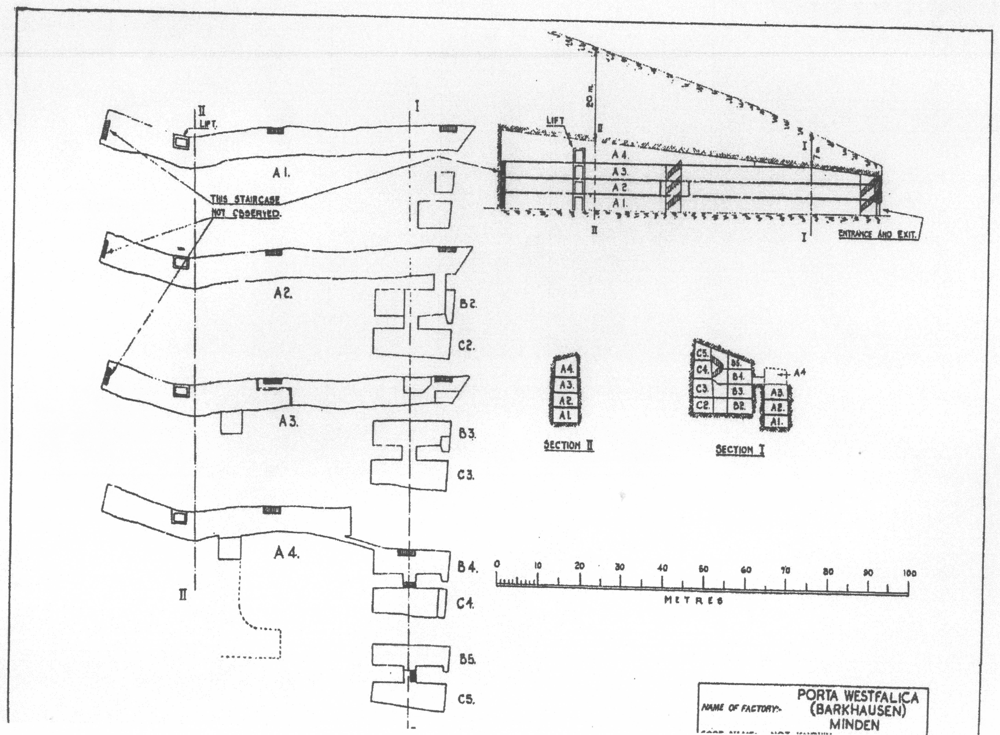

\[Figure 2-12 Destruction of the Misburg oil factory. Source: [40]\]

By August 1944, nearly all of Ambi-Budd’s machinery was already relocated into the lower Jakobsberg system. Changing the bombing focus meant a change in priority for protection; Ambi-Budd was out and Deurag-Nerag was in. Planning for the Deurag-Nerag relocation began the same month, and actual relocation began in October. Planners gave a completion date of May 1945. As the War ended, American officers estimated that the plant was within six weeks of production.[41] Once reassembly of Deurag-Nerag’s machinery was completed, the refinery was supposed to produce 5,500 tons of airplane lubricants a year. Production was to begin in May 1945, and construction was 85% complete by the end of the war. The raw material was to come from a small plant (code name "Ofen").[42]

\[Figure 2-13. Diagram of Dachs I, included in the USSBS report. Source: [43]\]

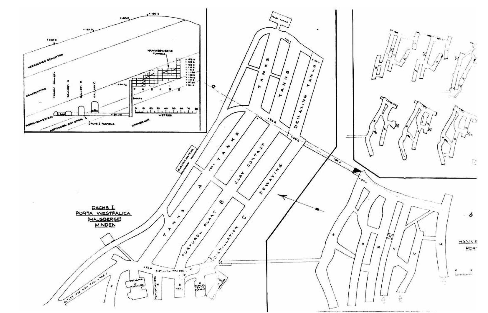

\[Figure 2-14. Diagrams of Dachs I, included in the CIOS report. Source: [44]\]

\[Figure 2-15. Diagrams of Hammerwerke, included in the CIOS report. Source: [45]\]

Reports from the USSBS and the CIOS post-War inspection provide the best resources at present to assess the cost, labor, machinery, output and environment of the Dachs I project. The CIOS report puts the total laborers for both the Dachs I and Hammerwerke projects at 4,000 to 4,500 people, which included 2,000 German craftsmen and 1,100 Russian, French, Italian and Latvian “civil prisoners” from concentration camps.[46] The USSBS report tabulated just the Dachs I workers at 550 skilled, 1250 unskilled and 500 foreign laborers. The concentration camp inmates must be included in the tally of unskilled laborers. The report further calculates the total labor completed as 1,220,000 man days. USSBS officers estimated the production output to reach 9,000 tons per month of topped crude oil, and the area of the tunnels at 48,000 square feet and the volume at 46,000 cubic yards.[47] Both reports also calculate the cost of the Dachs I project. The USSBS report estimates a total of 27 million RM,[48] while the CIOS report tallies are much more detailed and total only 15 million RM for both Dachs I and Hammerwerke, with only 2 million RM for the underground excavation.[49]

|                                                                    |              |
|--------------------------------------------------------------------|--------------|
| **Work**                    | **RM**       |
| 1. Preliminary works                                               | 50,300.00    |
| 2. Excavation of first section of tunnels A. B. And C. 34,000 c.M. | 644,102.80   |
| 3. Excavation of second section of tunnels Extensions to A.B. & C. | 384,331.45   |
| 4. Excavation for boiler house 4,000 c.M.                          | 224,128.13   |
| 5. Dayworks, 3,500 c.M.                                            | 292,158.88   |
| 6. Welfare, traveling expenses, etc                                | 74,299.36    |
| 7. Overhead Charges                                                | 180,250.00   |
| 8. Machinery charges and maintenance                               | 70,200.00    |
| 9. Recovery of plant and materials                                 | 8,000.00     |
| **TOTAL**                                                          | 1,927,770.62 |

\[Figure 2-16. Table showing the estimated cost for each aspect of underground dispersal.\]

Deurag-Nerag moved three existing units from their Misburg plant, “A two-stage vacuum distillation unit taking 3 side cuts on the primary unit and one on the secondary unit. (Lummus design)” and a “hot clay contact plant (Texaco design)”, and constructed two new units, a “furfural treating plant (copied from the Texaco furfural unit at Misberg \[sic\])” and a “dichlorethane dewaxing plant (Edeleanu design).”[50] The underground space was meant to be permanent and was calculated and constructed to fit the machinery, rather than the machinery adapted to the space. Gasoline or other fuels were not produced in this plant because of the fire hazard potential with accumulation of fumes in an underground confined space. Two boilers were to be used in the system on the inside, but one was constructed outside while they were being built. Plans were to construct a second one on the inside in a permanent location, then move the first to permanent inside housing once the second boiler took over. Each boiler could produce 500 lbs./sq.inch, but only needed to supply 330 lbs./sq.inch and could burn crude oil, gas from the Rhur or asphalte (although using this last fuel was untested).[51]

Electricity was supplied from an outside source via underground cable at high voltage (25,000V) and transformed over several steps to 400V. This source also supplied electricity to the Philips factory above.[52] Two large racks were installed for unloading 10 tons of topped crude, and one rack for loading finished products. Plans were made for loading products into barges in the River Weser.[53] Two separate tank systems were set up for storing unfinished and finished products. Unfinished products were stored inside the tunnel. Gallery A, north most section or top of the “E”, was converted into large tanks by bricking the walls and covering the floor with cement, and sub-divided by bulkheads made of cement. Exact measurements are unavailable, as each section of tanks was of varying size and the size of each individual tank varied. Some tanks were 10 or 12 feet high, 20 feet wide and 30 feet long. Others were over 20 feet high with similar width and length. These tanks held untreated spindle oil and light and heavy cylinder oil before they were pumped into the treating plants located in adjoining galleries. Finished products were stored outside in large, circular tanks on the north side of the hill.[54]

Galleries B and C housed the remaining equipment. Gallery B contained the furfural and clay contact machinery. Gallery C contained the distillation, dewaxing and solvent collection machinery. The main hall included several chambers opposite the main galleries for furnaces, electrical equipment and office space.

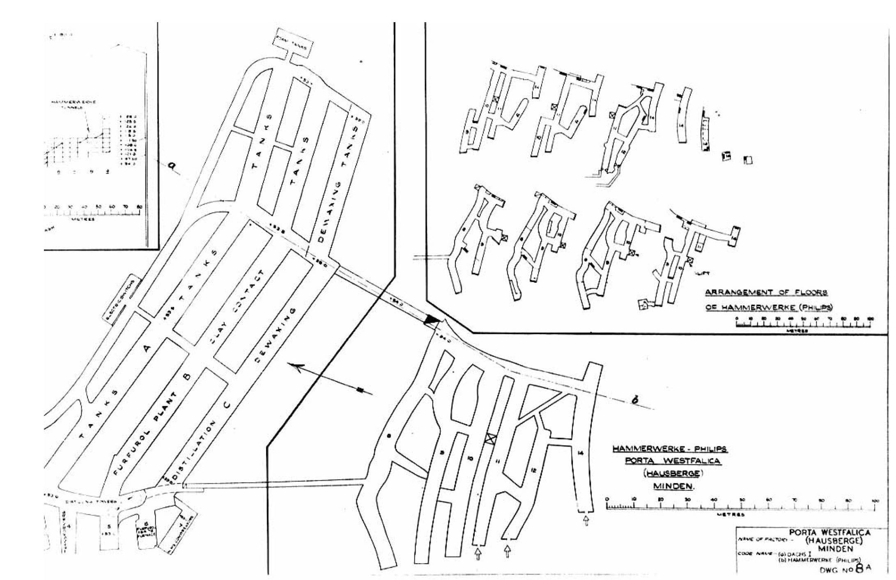

\[Figure 2-17. Photo from the USSBS report showing the main entrance to Dachs I. Source: [55]\]

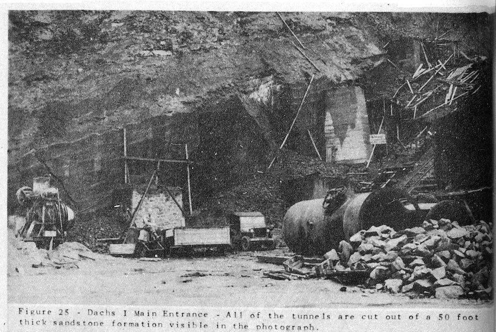

\[Figure 2-18. Photo from the USSBS report showing the furfural unit furnace used in the lubricating oil refinery in Dachs I. Source: [56]\]

\[Figure 2-19. Photo from the USSBS report showing the furfural separators used in the lubricating oil refinery in Dachs I. Source: [57]\]

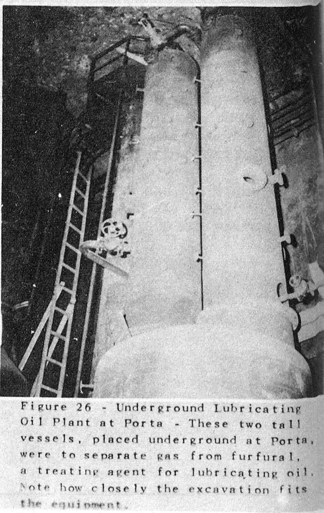

\[Figure 2-20. Photo from the USSBS report showing the gas separators used in the lubricating oil refinery in Dachs I. Source: [58]\]

\[Figure 2-21. Photo from the USSBS report showing the vaccum pump used in the lubricating oil refinery in Dachs I. Source: [59]\]

\[Figure 2-22. Photo from the USSBS report showing the vacuum distillation columns used in the lubricating oil refinery in Dachs I. Source: [60]\]

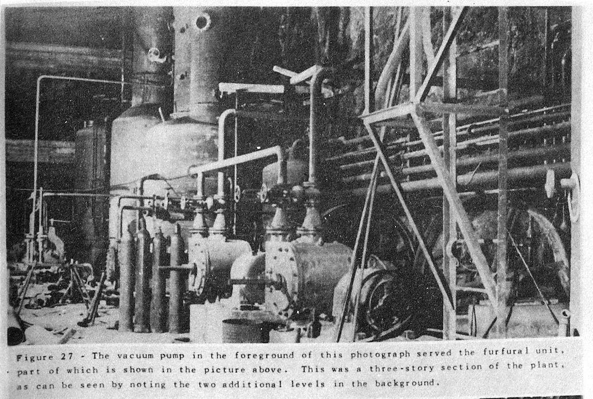

\[Figure 2-23. Photo from the USSBS report showing the dewaxing chillers used in the lubricating oil refinery in Dachs I. Source: [61]\]

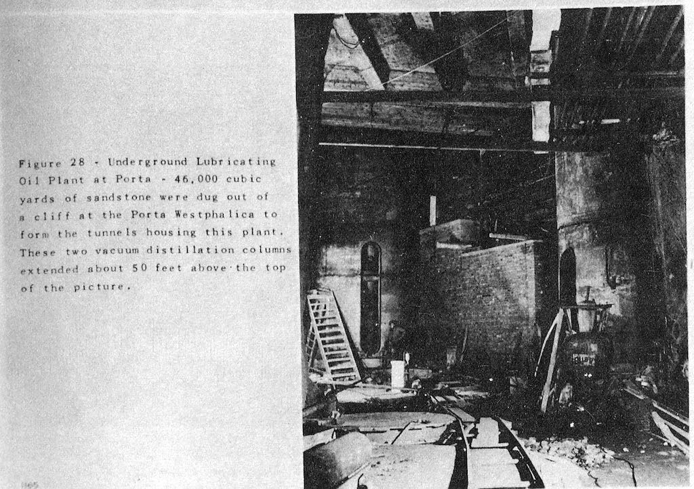

\[Figure 2-24. Photo from the USSBS report showing the dewaxing units used in the lubricating oil refinery in Dachs I. Source: [62]\]

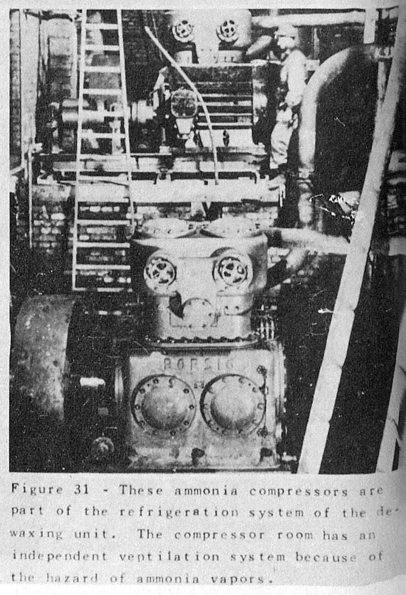

\[Figure 2-25. Photo from the USSBS report showing the ammonia compressors used in the lubricating oil refinery in Dachs I. Source: [63]\]

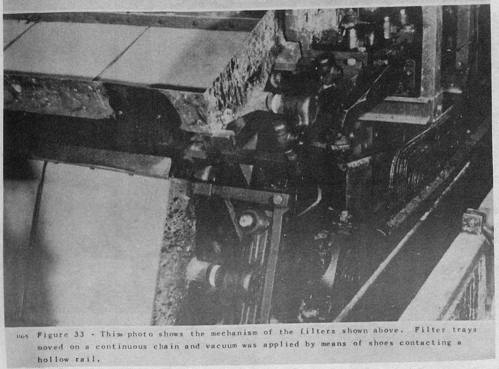

\[Figure 2-26. Photo from the USSBS report showing the filter mechanisms used in the lubricating oil refinery in Dachs I. Source: [64]\]

\[Figure 2-27. Photo from the USSBS report showing the boiler used in the lubricating oil refinery in Dachs I. Source: [65]\]

\[Figure 2-28. Photo from the USSBS report showing the feed tanks used in the lubricating oil refinery in Dachs I. Source: [66]\]

Ventilation was installed to prevent the accumulation of combustable gases in the galleries. One main axial flow fan (5,000 cubic meters per minute) was installed at the rear of the tunnel network to draw air through the gallery with storage tanks and expel through the galleries with machinery. Ammonia compressor and furnace rooms were ventilated separately. Fire suppression equipment was traditional hand held devises. Cooling water was provided by four centrifugal pumps pulling water from the Weser River.[67] During cooler weather the plant could operate on a single pump, with summer weather using more water for cooling. Heating and humidity removal relied on what the factory machinery could provide.[68] At time of inspection airflow was not adequate, the temperature was recorded at 57 F, and humidity was uncontrolled “with condensation everywhere.”[69]

**Other Dispersal Projects**

Several other dispersal projects existed in the area. In that his project focuses only on the underground factories in Wittekindsberg and Jakobsberg, the remaining projects will be mentioned only briefly. Other companies were also involved with dispersal and SS sponsored programs. Their involvement will also be only briefly detailed.

**Weserstollen**

Five kilometers south of Porta in the direction of Bad Oeynhausen, lay an adit used by the Gewerkschaft Porta for exploring a vein of iron ore. At 800 meters (.5 miles) long, 4 meters (13 feet) wide and 3 meters (9 feet 10 inches) wide was a small but protected space. With the code name “Kröte,” also known as Weserstollen, the adit was ready for occupation by June 1944. Conversion, including laying a concrete floor, providing electricity, water, ventilation and sewage, cost 480,000 RM, and was paid for by the RLM. Conversion work was completed by concentration camp in-mates from Hotel Kaiserhof. Three firms competed for the property, Peschke and Böhme from Minden, and Eisenwerk Weserhütte AG (existing today as PHB Weserhütte) from Bad Oeynhausen, who ultimately won the location. Initially, only 11% of Eisenwerk Weserhütte’s machines for manufacturing anti-aircraft weapons were relocated to the adit at the end of January and beginning of February 1945. Production would have begun the end of March 1945, but an allied bombing raid on March 30, 1945 destroyed 50% of Weserhütte’s remaining workshops and machines, and convinced them to move the remaining machinery underground. Work was to be done by 50-60 Soviet prisoners of war from the POW camp 107 in Dehme, a village in Bad Oeynhausen.[70]

**Häverstädter Mine**

A tunnel in Häverstädt, a district of Minden, was commandeered by the SS-Sonderbauvorhaben Porta and given the code name Silberfisch. The RLM set aside 5,750,000 RM for the expansion and conversion of the tunnel into a factory space, and the RMfRuK specified that space for the Hugo Schneider AG factory from Leipzig. Construction on the tunnel began in October 1944, with the plan to complete 25,000 cubic meters of underground space by July 1945. Conversion work was supplied by up to 200 inmates from the camp at Kaiserhof. By the end of the war, only 5,000 cubic meters had been completed. Multiple problems with the tunnel, among them not enough workers and electrical shutdowns one day a week, caused the program to be scrapped on November 28, 1944.[71]

**Kleinenbremen and Nammen**

Iron ore mines near Kleinenbremen owned by the Vereinigten Stahlwerke were under inspection and on the list as possible underground dispersal locations as early as July 1943, and were given the code name Elritze (minnow). Shortly thereafter the mines in Naamen, owned by Grube Wohlverwahrt, and were given the code name Barsch (perch). Barsch and Elritze locations required minimal construction, and were therefore to be used as quickly as possible. The RMfRuK set aside 4,925,000 RM for the projects, and 800 workers were put under the supervision of the Grube Wohlverwahrt. The locations in Kleinenbremen and Naamen encompassed five individual projects:[72]

> 1. Elritze I (Schermbecker Stollen) 28,000 qm, finished January 1945, Focke-Wulf wanted it for part of their military production. 33,000 cubic meters of stone taken out of quarry
>
> 2. Elritze II 2,000 qm finished in January 1945. Planned just for storage of materials and machines. Used by Ruhrstahl company from Brackwede near Bielefeld. Metallwarenfabrik Tönshoff and Co. KG also stored machines and a lathe (ein Lehrenbohrwerk). The tunnel was reachable by truck and was to be connected to the train station at Kleinenbremen.
>
> 3. Elritze III was to provide 10,000 square meters for the Preßwerk Ambi-Budd of Berlin.
>
> 4. Elritze IV was a an iron ore mine that was to provide 15,000 square meters.
>
> 5. The cave (Grube) at Nammen was not useful for the armaments production, but the 5,000 square meters was used by Weserflug GmbH, Bremen.

**Betonwerk Weber**

In Porta-Lerbeck, the Betonwerk Weber company, a concrete company, had several jobs from the SS-Sonderbauvorhaben. One job was to provide cement for the floors constructed in the Jakobsberg tunnel system. They were also assigned 15 concentration camp inmates on a charge-free contract basis. These workers supplemented Soviet and Italian forced laborers. In 1944, Betonwerk Weber received a total of 750,000 RM for SS-Sonderbauvorhaben projects.[73]

**Bense and Co.**

Bense und Co. was a code name used for the Klöckner-Flugmotoren GmbH company of Hamburg. It is unclear if the dispersal of this company had anything to do with the Jägerstab Program. The company used old and new buildings belonging to the Weber Concrete company, noted above, where they repaired airplane motors and subsequently tested the repaired motors. Around 500 concentration camp inmates were interned here as another satellite camp of the Neuengamme Concentration Camp.[74]

**Neesen/Lerbeck**

Just north of Jakobsberg, cradling the border between the small villages of Lerbeck and Neesen, a smaller camp consisting of 500 prisoners was created to work at an aircraft engine repair facility.[75]

Conclusion

[1] Discussion with Rainer Fröbe, May 9, 2015 at the former entrance to Hammerwerke on Jakobsberg.

[2] [*https://www.google.com/maps/d/edit?mid=zuMewFpePmAg.kUArQ9EReKT4&usp=sharing*](https://www.google.com/maps/d/edit?mid=zuMewFpePmAg.kUArQ9EReKT4&usp=sharing)

[3] Oberbergamt Wunderlich, “Grubenräume für die Aufnahme von Fertigungsstätten aus luftgefährdeten Gebieten.”

[4] Hatt, *Deckname Kaulquappe*, 40.

[5] United States Holocaust Memorial Museum, “The Samuel and Irene Goudsmit Collection, 1944-1985” Filename: 1944.03.30-1079--+To\_Kammler-A2-Barkhausen.

[6] Ibid. Filename: 1944.05.20-828-1+To\_Kammler-SpreadSheet.

[7] Oriel, Horne, and Jones, “Dachs 1 Lubricating Oil Plant Porta, Germany,” 52.

[8] Ibid., 53.

[9] Ibid., 55.

[10] Ibid., 54.

[11] Ibid., 55.

[12] Ibid.

[13] Ibid., 56.

[14] Ibid., 52.

[15] “Wehrwirtschaftsführer.”

[16] Blanke-Bohne, “Die unterirdische Verlagerung von Rüstungsbetrieben und die Außenlager des KZ Neuengamme in Porta Westfalica bei Minden,” 52.

[17] Ibid.

[18] Ibid., 53.

[19] Oriel, Horne, and Jones, “Dachs 1 Lubricating Oil Plant Porta, Germany,” 56.

[20] Bleton et al., *Das Leben ist schön!*, 9.

[21] Blanke-Bohne, “Die unterirdische Verlagerung von Rüstungsbetrieben und die Außenlager des KZ Neuengamme in Porta Westfalica bei Minden,” 55.

[22] Oriel, Horne, and Jones, “Dachs 1 Lubricating Oil Plant Porta, Germany,” 58.

[23] As told by Rainer Fröbe, May 2015.

[24] Oriel, Horne, and Jones, “Dachs 1 Lubricating Oil Plant Porta, Germany,” 64.

[25] Ibid., 59–60.

[26] Bleton et al., *Das Leben ist schön!*, 8. and Schulte, *Konzentrationslager im Rheinland und in Westfalen 1933-1945. Zwischen zentraler Steuerung und regionaler Initiative*, 143.

[27] Oriel, Horne, and Jones, “Dachs 1 Lubricating Oil Plant Porta, Germany,” 69.

[28] Ibid., 64.

[29] Ibid., 65.

[30] Ibid.

[31] Ibid., 67.

[32] Ibid., 68.

[33] Ibid.

[34] As told by Wojtek Stozyk about his grandfather who was a forced laborer there. May 2015.

[35] R 3101/31177 page 21, “R 3101/31177 page 21” Such magnetrons are still commonly used in microwave ovens, but are no longer used in radar systems.

[36] United States Holocaust Memorial Museum, “The Samuel and Irene Goudsmit Collection, 1944-1985” Filename: 1944.07.31-1202-3+Bericht\_Kammler.

[37] United States Government Printing Office, “The United States Strategic Bombing Survey Summary Report (European War),” 34.

[38] R3101-31.223-Fische1, “R3101-31.223-Fische1.”

[39] Blanke-Bohne, “Die unterirdische Verlagerung von Rüstungsbetrieben und die Außenlager des KZ Neuengamme in Porta Westfalica bei Minden,” 43.

[40] photographer, *English*.

[41] Oriel, Horne, and Jones, “Dachs 1 Lubricating Oil Plant Porta, Germany,” 58.

[42] Blanke-Bohne, “Die unterirdische Verlagerung von Rüstungsbetrieben und die Außenlager des KZ Neuengamme in Porta Westfalica bei Minden,” 43.

[43]  United States Strategic Bombing Survey, Oil Division, *Underground and Dispersal Plants in Greater Germany*, 36.

[44]  Oriel, Horne, and Jones, “Dachs 1 Lubricating Oil Plant Porta, Germany,” 148–9.

[45]  Ibid.

[46] Ibid., 60.

[47] United States Government Printing Office, “The United States Strategic Bombing Survey Summary Report (European War),” 132.

[48] Ibid.

[49] Oriel, Horne, and Jones, “Dachs 1 Lubricating Oil Plant Porta, Germany,” 60.

[50] United States Government Printing Office, “The United States Strategic Bombing Survey Summary Report (European War),” 132.

[51] Oriel, Horne, and Jones, “Dachs 1 Lubricating Oil Plant Porta, Germany,” 62.

[52] Ibid., 63.

[53] United States Government Printing Office, “The United States Strategic Bombing Survey Summary Report (European War),” 135.

[54] Ibid.

[55]  Ibid., 37–41.

[56]  Ibid.

[57]  Ibid.

[58]  Ibid.

[59]  Ibid.

[60]  Ibid.

[61]  Ibid.

[62]  Ibid.

[63]  Ibid.

[64]  Ibid.

[65]  Ibid.

[66]  Ibid.

[67] Ibid., 133.

[68] Oriel, Horne, and Jones, “Dachs 1 Lubricating Oil Plant Porta, Germany,” 62.

[69] Ibid.

[70] Blanke-Bohne, “Die unterirdische Verlagerung von Rüstungsbetrieben und die Außenlager des KZ Neuengamme in Porta Westfalica bei Minden,” 55–62.

[71] Ibid., 62–64.

[72] Ibid., 64–66.

[73] Ibid., 67–69.

[74] Ibid., 69–70.

[75] Bleton et al., *Das Leben ist schön!*, 9.
