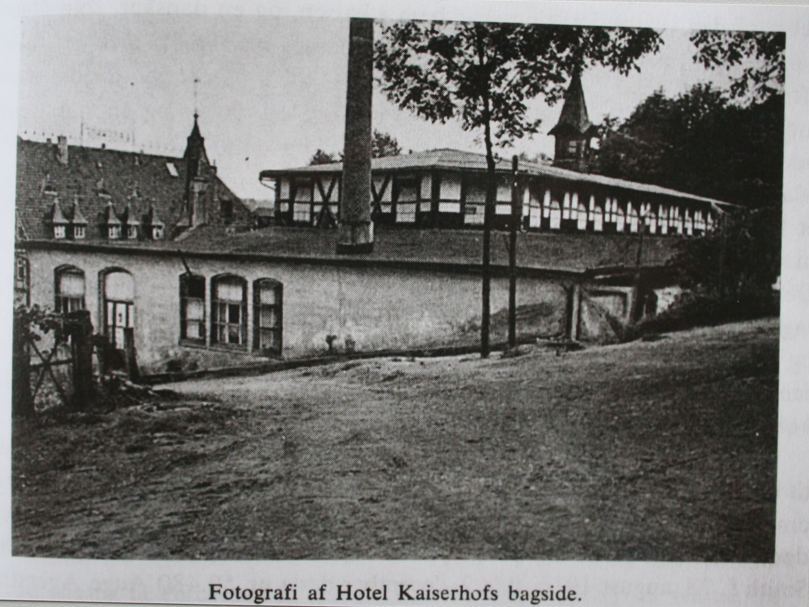

**Chapter Three: Barkhausen and Bauarbeit**

This chapter will look at the men’s concentration camp in Barkhausen and the inmates who supplied the labor for the Porta Westfalica projects. SS and prisoner leadership in the camp is described, noting the turbulent relationship that existed between the prisoners and their direct overseers, who were chosen from the rank of prisoners. Most of this chapter describes the life that existed for the prisoners, as they describe in memoirs and interviews. Attention is paid to descriptions of the Hotel Kaiserhof ballroom where the beds, roll call, and health clinic were located, the lack of hygiene, the food, work, death, and how prisoners were able to cope with inhumane conditions.

The two camps in Porta Westfalica, the men’s camp in the ballroom of the Hotel Kaiserhof in Barkhausen and the women’s camp in a field on the outskirts of Hausberge, were satellite camps of the Neuengamme concentration camp. Heinrich Himmler and Gauleiter Karl Kaufmann from Hamburg created the Neuengamme camp, just south and east of Hamburg, in December 1938, as an outsourcing camp of Sachsenhausen to accommodate the expected increase in prisoners from the expected war. The camp was given independent status as a grade two camp, a labor camp with hard labor and poor living conditions, in June 1940. Nearly 106,000 men women and children were interned in Neuengamme from 1938 to 1945; only 13,000 were Jews. German inmates totaled 9,200; 34,350 from the Soviet Union; 16,900 from Poland; 11,500 from France; 4,800 from Denmark; and 2,200 from Norway. Over 55,000 died in Neuengamme[1], a total of 51% over eight years. At Barkhausen, the death toll was over 44% in just six months.[2]

Many sub-camps, or satellite camps, were created throughout 1942 as the need for labor increased. By 1944, Neuengamme had over 60 satellite camps, springing up wherever an industry had enough demand for labor.[3] Two of these labor camps were located in Barkhausen and Hausberge, two towns surrounding the Jakobsberg and Wittekindsberg hills.

Commandant over all the Porta Westfalica camps, including Barkhausen, and Hausberge, was SS-Oberstumbannführer Herman Wicklein. Head of day-to-day command at Barkhausen was SS-Rottenführer Hermann Nau[4]. Diplom-Ingenieur Anton Pittracher was in charge of the construction work and the use of laborers.[5] Offices and boarding for the SS officers was across the river Weser from the labor camp, in an appropriated hotel, the Großer Kurfurst,[6] within view of the Dachs I entrance.

\[Figure 3-1. Hotel Großer Kurfürst was the headquarters for the local SS. Source: “Ansichtskarte / Postkarte Porta Westfalica, Arminsberg, Hotel Großer Kurfürst | Akpool.de.” Accessed September 11, 2015. http://www.akpool.de/ansichtskarten/184246-ansichtskarte-postkarte-porta-westfalica-arminsberg-hotel-grosser-kurfuerst.\]

Organization of KZ was the Nazi organization in miniature. On the lowest rung were the prisoners. A *Schieber* (pusher) would make sure the prisoners worked by beating prisoners with rubber truncheons, sticks and so forth. Overseeing the pushers were a series of foremen, who were in turn pressured by a band of *Kapos* (Kameradschafts-Polizei)[7]. These three levels of oversight meant that the prisoners managed themselves, leaving the SS and Luftwaffe guards with relatively little to do.[8]

\[Table 3-1. Hierarchy of prisoners and SS at KZ Porta Westfalica. Based on a chart by Rainer Fröbe, 1984.[9]\]

**Men’s Camp in Barkhausen**

The camp at Barkhausen consisted of 1500 men from 17 different nationalities. Differences in language and culture, coupled with the harsh and stressful conditions led to contentions among the prisoners. In that the work was for the air industry, the Luftwaffe was required to supply officers and enlisted men as camp guards. Only 159 guards managed the prisoners in camp and at the work site. "Order" was kept by a system of *Kapo*, who were fellow prisoners and usually German criminals from other concentration camps. They were expected to mistreat their fellow prisoners just as the SS did, and were demoted if they did not. Once demoted, they would not last long back in the ranks of their fellow prisoners.[10] They were also given more meat with their food, alcohol, and often gave the SS guards sexual favors, as well as taking partners from the pool of fellow prisoners.

The camp elder (*Lagerältester*), or head Kapo, at Barkhausen was a red haired, ill-tempered, brutal man with the nickname Schorsch; his real name was Georg Knögl. He was an excessive alcoholic, "a pub owner from Nuremberg and a criminal of the worst kind." [11]He would often trade food to get alcohol, and was unpredictable and brutal. "He was the master of life and death in the camp." Other capos (who wore a green triangle) were usually "criminal" inmates, and were in charge of the other "political" inmates (who wore a red triangle).[12]

The system and positions were a copy of the Neuengamme (and other concentration camp) systems for prisoners to self regulate.[13]

**Comparison of Prisoner Hierarchy**

|                                  |                       |
|----------------------------------|-----------------------|
| **Neuengamme**                   | **Porta Westfalica**  |
| Lagerältester (camp elder)       | Kapo                  |
| Blockältester (barrack elder)    | Vorarbeiter (foreman) |
| Stubendienst (barrack room duty) | Schieber (pusher)     |

\[Table 3-2. Table comparing the prisoner hierarchy between Neuengamme and Porta Westfalica.\]

Karbo recalled an incident with Georg Knögl, who he described as an “insane redheaded sadist.” Knögl would often go into a rage over anything. During this one instance he broke a slat from a bead over a prisoner's head, and then beat the prisoner's face with his rubber truncheon until it was a bloody pulp. Knögl then put the prisoner in a pillory and kicked him all over for fifteen minutes. Knögl then went to drink from his stash of alcohol, during which time another Kapo freed the prisoner before Knögl came back. This he did, writes Karbo, not for humane reasons because he was also sadistic, but because he had a homosexual relationship with him. Karbo mentions that homosexuality thrived in camp.[14]

The worst war criminal was Georg Gnoggle, nick name Schorsch. No exaggeration when he says that Georg was involved in some way with every beating that took place.

Once a Russian prisoner was accused of stealing bread. It was absolutely not clear if he had done it or not. He was brought to Georg who beat and kicked the prisoner so much that it was a horror to watch. But that was not enough for Schorsch. He continued the beating with a rubber truncheon, and then he used a board from a bed. The prisoner had to be carried out after the beating, and it was unknown what happened to him.

Georg also stole from their packages. After the SS took what was not allowed, Georg took whatever he wanted.

He was the evil spirit of the camp. Everyone was afraid of him, because he would just start beating any prisoner who came by.[15]

Many Kapos, Vorarbeiters and Schiebers were decent people who had been destroyed by the system. "We were always threatened by the Kapos, who had the task, so to speak of, exert a certain type of terror,” a survivor, Vincent Lind, recalled. “They could be so arrogantly friendly. But basically there was always the threat of a beating; which happened again and again.” Germans were the most common nationality of the Kapos, although Lind remembers a Czech and a Russian.[16]

Survivor Jørgen Diemer saw only Kapos and fellow prisoners give punishments, usually the German Kapos. The SS men would only smack prisoners. Almost all German prisoners in Barkhausen were criminals or gangsters. The Kapos were violent criminals and pimps, and even a robber and murderer. In Diemer’s view, they were all mentally ill.[17]

Very bad relationship with Kapos. Relationship with other nationalities was usually good, although friction existed, but often bad between political and non-political inmates. Kapos were mostly German, some Poles, and one Russian. Relationship was very bad. only a very few behaved decently.[18]

Arbeitskommando "Weserstollen", not as bad as Schorsch, but similar in many ways. He was a very good boxer and took it out on prisoners to keep in shape. One event where a German prisoner was accused of stealing an apple. Otto beat him until his face was unrecognizable. Otto was 30-35 years old, 180cm tall, slim, unusually long arms, probably red headed, sloping shoulders. Said he was in prison because he was a communist, but it didn't suit him. Came to camp near Christmas time 1944.[19]

Josef, Austrian criminal, 40-50 years old, 170cm tall, had an ape-face, sloped shoulders and very long arms, hunchback, he looked like a freak. Not only did he hit all the time, but he would have berserk like seizures. He would beat with anything he could get his hands on; iron bars, shovels, spades, etc. He didn't beat everyone, but picked out a victim that he beat every time he flew into a fit of rage. Christensen was unfortunately one of those victims.

On the first day in the work command, Christensen mentioned to a comrade that they were in the worst command because they had to work out in the open. Otto overheard and he received his first beating. Not an exaggeration to say he got a beating every day. Christensen gave no reason to be beat, but was beat without reason.

He would beat so many people and send them to the infirmary, that he received beatings from the SS because he "zu viele Gefangene kaputt geshlagen". Christensen heard about an incident the day after his punishment. He had been forbidden to beat anybody, at least as hard as he had in the past. As they were coming back from the worksite, he began to have a fit, but he just stood there at first with hands in his pockets and his face turned ever redder. Finally, he exploded, grabbed a shovel and ran into the nearby forest where he beat a tree until he was calm again.[20]

Kapo Fritz of Camp Commando: Soweit ich weiß, stammt Kapo Fritz aus Hamburg und war ursprünglich von der Gestapo wegen seiner politischen Überzeugung (Kommunismus) festgenommen worden. 3 Wochen lang habe ich im Lagerkommando gearbeitet und hatte dort die Möglichkeit, die humane Behandlung zu sehen, die Kapo Fritz den Gefangenen erwies. Verschiedentlich, wenn Kapo Fritz zweifellos Order hatte, nach dem Abendessen einige Häftlinge wegen bestimmter vorausgegangener Diebstähle zu verhören, wurde ich als Dolmetscher herangezogen, und für mich hat bei einer Reihe von Gelegenheiten nicht der Schatten eines Zweifels bestanden, dass einige Gefangene sich unter den dort herrschenden Verhältnissen schwerer Vergehen (Diebstahl von Lebensmitteln bei Häftlingskameraden) schuldig gemacht hatten, aber Kapo Fritz wollte keine Bestrafung vornehmen und stellte es für mich so dar, als wolle er den Vertrauensmännern innerhalb der einzelnen Nationen Bescheid geben, dass sie die notwendige Bestrafung vornähmen. Für mich steht Kapo Fritz als geradlinger Mensch da, der, seiner Gefangenschaft zum Trotz, in keiner Weise den Glauben an menschliche Rechschaffenheit und Humanität verloren hat.[21]

Another humane individual was the camp clerk, Mr. Magnussen. Zachariassen described Mr. Magnussen with high praise.

> As soon as the Danish deportees arrived at the Porta satellite camp, we were introduced to the camp clerk, Mr. Magnussen from Flensburg, and had some knowledge of the Danish language. In the six months of our stay in Porta, Mr. Magnussen was a good and helpful friend to many prisoners, not the least of which the Danes, and it was with great concern when all of the Danes left as part of Graf Bernadottes operation on March 19, 1945, that we could not bring Mr. Magnussen with us, who we knew to be a man on our same wavelength.
>
> In the hardest times for us Danes, as it seemed that every hope was out of the question, as we saw many of our compatriots cower, Magnussen had a particularly strong need to help us through the darkest points, and since Magnussen was in the camp before and after us, I don’t doubt, that he is able to provide more enlightening information. (Zachariassen, 1947, 5.)

Work on the camp in Barkhausen began as early as March 1944, when prisoners from Buchenwald (mostly from the Soviet Union and Poland) were brought in to convert the banquet hall behind the Hotel Kaiserhof into a concentration camp. It was planned that 1500 prisoners were to assist professional German miners brought in from the Saar for the purpose of creating an underground factory in the Wittekindsberg and Jakobsberg hills. The Hotel Kaiserhof restaurant was still serving the local population even as it was a concentration camp.[22] The camp was surrounded by barbed wire, 3 meters high, with two machine gun towers on the outside. The yard was small and unpaved so that when all 1500 prisoners were outside, they were "packed like herring in a can" and treading through 5 cm of mud that soaked through their clothing.[23]

\[Figure 3-2. Hotel Kaiserhof in 2009. Source: TUBS. *Deutsch: Hotel Kaiserhof in Porta Westfalica, Kreis Minden-Lübbecke, Nordrhein-Westfalen*, November 20, 2009. Own work This photograph was taken with a Canon Digital IXUS 500. https://commons.wikimedia.org/wiki/File:Porta\_Westfalica,\_2009-Nov\_059.jpg.\]

\[Figure 3-3. Hotel Kaiserhof from the rear, ca. 1945. Source: KZ-Gedenkstätte Neuengamme. *Fotografi Af Hotel Kaiserhofs Bagside.*, n.d. Pictures II 67b 1945 Befreiung. KZ-Gedenkstätte Neuengamme (Hamburg).\]

**Prisoners**

Prisoners consisted of prisoners of war, political enemies, resistance fighters, criminals and the asocial. While Soviet and Polish prisoners outnumbered the other ethnic and national groups by far, most of the prisoner accounts available are from Danish prisoners, about 13% of the total number of prisoners. Soviet inmates were predominantly prisoners of war. French, Czech, and Hungarian inmates were mostly political prisoners. Danish prisoners were almost all political prisoners who had been captured in Denmark as part of the active resistance against the Third Reich. Some were homosexuals or just in the right place at the wrong time and taken prisoner by Nazis in Denmark.

One of the main reasons anything about prison life is known today about the camps in Porta Westfalica is because of the writings and actions of former prisoners. Most prolific have been prisoners from France and Denmark. Memoirs and post-war trips to their former prisons kept some information within public reach. Before 1943 the Danish government insisted on, and were allowed to keep, political, asocial and other prisoners of Nazis in prisons within Danish boarders. Danish leaders wanted to keep their citizens out of Germany. As resistance movements increased, though, Nazi leaders began to break their agreement with Denmark and began to move some prisoners to German camps, where they could then do anything they wanted with the prisoners. Life in the Danish prisons was not easy, as there were interrogations, torture, and the like, but prisoners were generally given clean bedding, toilets, and sufficient food.[24]

The first large deportation of Danish prisoners was in the fall of 1943. Danish "political prisoners" usually communists, were taken to Stutthof near Danzig. Resistance fighters, Danish and Norwegian, were taken to Sachsenhausen. After this, the Danish insisted on keeping Danish prisoners in Denmark, and built a special prison for Nazi use in Frøslev. It was opened on August 13, 1944, but only in use for a few weeks before the Germans again broke agreements and deported 200 prisoners to Germany.[25] These 200 prisoners were transported from the prison to the train station by truck, so they would not have to walk and be seen by the public. They were then transported to the Neuengamme concentration camp near Hamburg by train. En route to Neuengamme, they survived an Allied bombing raid on Hamburg where prisoners heard debris hitting their train cars. Once they arrived in Neungamme they were stripped of clothes and any personal items, including wedding rings.[26] Their heads and pubic hair were shorn with blunt clippers, officially to delouse the prisoners, but the intended purpose was to further dehumanize, disparage, discourage, and demotivate. New prisoners were given ill-fitting and dirty prison garb, and a number beginning with 50 (50123, 50245, etc). Neuengamme was a terrible prison with diseased and dying men and women crammed into barracks.

While in Neuengamme news of work camps circulated, and many Danish prisoners, who were relatively healthy compared to other prisoners who had been in camps much longer, decided to join the work groups in hopes of a better situation. They thought the Nazis meant for them to work, and would therefore treat the prisoners better. Little did they know that "Vernichtung durch Arbeit" (death by work) was one of the main purposes of labor the camps. On September 18, 1944, nearly 200 prisoners, including 98 Danish prisoners who had come from Frøslev, left for the work camp at Barkhausen. Prisoners were packed into four cattle cars, 50 men to a wagon, 25 on each side, with the doors locked, and only an old jam bucket for toilet. They had to sit on the floor with legs apart, and another person sitting between his legs, keeping that position for the 42-hour trip to Porta Westfalica. Two SS guards with submachine guns and whips kept watch inside the car at all times. After arriving at the train station in Porta Westfalica, they crossed a footbridge over the Weser River and arrived at a beautiful timber framed hotel, Hotel Kaiserhof. Some thought they had perhaps made a wise choice if they were to be lodged in a posh hotel. Rather than enter the front door, they were marched around to the back of the hotel, to a run down ballroom. Survivor Jørgen Kieler remembered seeing the latin words "Hic mortui vivunt" painted on the wall as they entered, “Here live the dead.[27]”

Kai Biørn Karbo came to Porta Westfalica on September 21, 1944 with a group of 99 Danish prisoners. They spent only two days and nights in Neuengamme, and then two more days and nights by train in a French cattle car on the way to Porta Westfalica. Karbo remembers the SS soldiers as "large nosed" men who would beat the prisoners if they moved, and would openly enjoy the looks of hunger on the prisoner's faces as they smoked cigarettes.[28]

When Jørgen Diemer, another Danish resistance fighter arrived, most likely at the same time as Kai Karbo, there were already 1300 men in the camp. Diemer arrived by train on Tuesday night. They were required to stay in train car until Wednesday morning, even though they had already traveled two days and nights, sitting on the floor.[29]

Axel Christian Hansen, another Danish resistance fighter, arrived with a later group on October 3, 1944.[30]

Dimitrij Iwanowitsch Zwagorskij, from the Ukraine, came to Porta Westfalica in a first wave of inmates from the Neuengamme camp.[31] A second transport came from Buchenwald.

Records from Soviet prisoners are very sparse. This section of the research has only two reports from Ukrainian prisoners, and their descriptions of prison life and work are rather sparse. Danish survivors often spoke fondly of Russian prisoners, though.

For example, Vincent Lind remarked that the Russians could sing beautifully, and they sang often. On Christmas Eve, they sang religious songs as well as a professional choir.[32]

Not all remembrances were good. One time, a Russian stole something from Lind. He followed and began a fight with the man, but was soon surrounded by twenty Russians. He left his things with the Russians.[33]

The camp at Barkhausen was an international community. According to Lind, the Danish worked well with the Russians, but it was harder to work with the Polish. A Georgian named Gregor was a pharmacist before the war, and while in Barkhausen he was in charge of the clinic. One could always go to him for something to help with the fleabites, remembered Lind. There was also a German who was sent to the Front in December 1944. Gregor had told Lind that there were many Russians in the beginning, but when Lind arrived there were only 2% of the Russians remaining. As the Germans withdrew from Ukraine the collaborators and young "half-criminals" (halbkriminelle), some of them 12 to 16 years old, came with them to Germany looking for work but were caught for criminal actions and sent to KZ where they died. Only 2% of them survived.[34]

Some discrimination existed between the different ethnicities, and there was even discrimination among the "antisocial" and "political" Danish prisoners. Antisocial prisoners were those who were picked up in Denmark, mainly as a result of German leaders fearing the Danish were collaborating with the Allies to allow them to invade Germany through Jütland. Antisocial prisoners were usually criminals, unemployed, homosexual, or people in the wrong place at the wrong time. They were distrusted and despised by the political prisoners, who were for the most part resistance fighters. The resistance fighters felt the antisocial prisoners were in prison without cause, they had not fought for their "right" to be in prison. This derision also lasted after the war, as groups that sought to remember and commemorate the past excluded the asocial prisoners; even calling their group "the 50 from Porta" referencing their numbering system which began with 50 while the asocial prisoners were numbered beginning with 54.[35]

**Inter-Prisoner Relationships**

Historian Jens-Christian Hansen notes that there were no illegal organizations among the prisoners as there were in other concentration camps. Prisoners were too exhausted from hard labor, 12-hour shifts every day, and to weak from malnourishment to orchestrate any sort of organized resistance or collaboration. All news from the outside was through rumors from those who worked with civilians.[36]

There were no illegal organizations under the prisoners. Prisoners followed the course of the war by organizing German newspapers, and following the war on a map that belonged to a Russian bed mate. Otherwise rumors came from radio broadcasts. I never had direct access to radio broadcasts.[37]

**Ballroom at Hotel Kaiserhof**

Two hundred inmates were brought in from Buchenwald to convert the ballroom of the Hotel Kaiserhof into a labor camp during March 1944. They built three- and four-story bunks, desks, benches, and added barbed wire to the windows. The hall measured 85x30 yards, windows were blacked out, and there was no heating. Bunks were kept on one side, four beds high, and the middle of the hall was used for roll call, meals, distribution of clothes, and other group activities. In the middle, hung over the rafters, was a noose where escapees or other rule breakers would be hanged. Kapos used a stage near one end of the ballroom. An area to one side of the stage was divided off as a makeshift infirmary, and staffed by a Czech dentist, a Georgian pharmacist and a Danish medical student (the aforementioned Jørgen Kieler).

Sleeping conditions were sickening. Bedding consisted of dirty, think blankets that were never washed and straw mattresses that were also never cleaned. Their food was often rotten, so inmates quickly developed dysentery and other illnesses that often left inmates too sick to leave their beds to relieve themselves. Toilets, but no toilet paper, showers and workshops were originally located in the hall, but moved to outside locations in December 1944 due to insufficient room inside as number of prisoners swelled. A new building was later added that had 15 showers and 26 water faucets, but this was still not enough for the number of prisoners living there. Until then, outside the hall was a small, enclosed courtyard with a two-meter high tube with holes out of which water would stream, as a sort of shower for the 1500 men.[38]

\[Figure 3-4. Diagram of Kaiserhof Banquet Hall as used for concentration camp. Drawn by author from description given by Jørgen Kieler in *Resistance Fighter: A Personal History of the Danish Resistance Movement, 1940-1945*. Jerusalem, Israel; Lynbrook, NY: Gefen Publishing House, 2007, 262.\]

\[Figure 3-5. The inside of the Hotel Kaiserhof hall or ballroom, facing the stage where the Kapos slept. Source: KZ-Gedenkstätte Neuengamme. *Hall in Kaiserhof Hotel*, n.d. Pictures II 67b 1945 Befreiung. KZ-Gedenkstätte Neuengamme (Hamburg).\]

Roll call was in the building because the courtyard was not big enough. Prisoners were lined up in five rows and counted.[39]

There was a bathroom in the yard for use during the day, but at night they were not allowed to go in the yard, so there was also a bathroom in the building.[40]

Axel Hansen recalled that they slept with only a very threadbare blanket, on thin straw mattresses, and slept in their shirts, using their clothes for a pillow. The air in the building was cold because there was no heat. Sleep lasted for 4 or 5 hours, broken by raids and roll call. “It was hell,” Hansen declared.[41]

Danish prisoners in Vincent Linds group were brought to Porta Westfalica and taken to the ballroom, given some coffee, bread and marmalade. Sitting on the four level beds they discovered the beds were covered in fleas. "Fleas! A swarm of fleas. The fleas had favorites, right?” recalled Lind. “And I was a favorite of the fleas. It was terrible! I was always full of it! And I killed hordes, but there were a million of them. And they do a lot of harm! And they itch! And you can get infected.”[42]

In October the number of Danish increased to 200, there were 800 Russians, and 500 others from different nationalities. There were only 700 beds and 500 straw mattresses, so there was always race to get bedding. Since the Danes worked mostly in the mine, they were last to camp and often had to sleep in their clothes on the bare boards of the bed. One couldn't be too picky when selecting a mattress or blanket because they were usually soaked in urine or covered in feces and always full of lice. Lice drove Karbo crazy the first few days, but then he grew used to them so that he hardly itched.[43]

Beds were four stories, 60 cm wide, normally sleeping 2 men to a bed, sometimes 3 or 4 (during a disinfection). 30 cm between beds. dirty woolen blankets. many had 2, some 1, some none, every night a different blanket.Slept on straw or cotton or nothing. Slept in underpants, under shirt, sweater, stockings. Were only allowed to have under pants and under shirt. About 1000 men slept in the hall. The air was cold and drafty, but nevertheless not very good. Slept with outer clothes on or under head. Normally slept from 10pm - 4:30am. Sleep was broken by needing to use the toilette, often raids, seldom night roll call, also often through mishandling or transportation.[44]

**The Prison Infirmary**

The infirmary was located off to the side of the stage, separated from the rest of the room by a screen. Medical care was primitive as the “doctor” on duty was a Czech dentist. Medication was primitive and nutrition was no better than that given to the other inmates. The irony of a health clinic in a labor camp designed to work people to death was not lost on the prisoners who went there as a last resort.

One day as Lind was in the infirmary with three other Danes, a nurse brought them a cup of milk. It was sour milk, but milk was something so seldom seen that they did not care if it was sour. As the nurse brought over the cup to the four sick men, all lying close together, he said "For the four Danes," and handed the cup to one inmate. Instead of passing the cup around, the first inmate drank the whole cup himself. Lind was paralyzed with astonishment. He and the man who drank the cup of milk were the only two of the four that survived. They met together every year after the war but neither of them ever spoke of that event.[45]

By the end of November the number of Danish deaths was troublesome for the Danes and also the SS. Jørgen Kieler, a Danish medical student, was reassigned to the clinic to stem the tide of dying Danes. The Czech dentist was in charge of the clinic, and a Russian pharmacist and an actual doctor from Poland were next in rank, followed by a French medical student and Jørgen Kieler. According to Karbo, the medical students were the best at providing care. Kieler brought organization, cleanliness, and health to the clinic. He saw that the beds were organized by sickness, bedding sanitized, and the floor cleaned. Shortly thereafter he was transferred to work in the mine. "A doctor who makes people well could not very well be tolerated in a extermination camp."[46]

Even the sick in the clinic were required to use the latrine in the yard, unless they were physically unable to, in which case there was a metal bucket with sharp edges. Originally the clinic was in a corner of the ballroom hall, next to the stage, separated from the rest of the room by a folding screen. A separate building was constructed in December, but there was no glass in the windows for a time, and no waiting room, so the sick waited outside in the cold and elements for some time before entering the building. All of these factors meant only the really sick ventured to the clinic.[47]

**Hygiene and Clothing**

Underpants, under shirt made of shirt material, foot wraps (as long as they held), striped pants, jacket, coat in winter, striped cap and in severe frost striped earmuffs and striped mittens, canvas boots.

Everything was without lining, but in the beginning good and clean. No shoelaces in the boots, I used steel wire.

The underclothes were changed a couple of times, the outer clothing never.

Never a chance to wash clothes.

I received wooden shoes, cap, scarf, sweater, stockings, gloves, underwear from Red Cross. Later came more in personal packages.

A jacket and coat were stolen. The coat was never returned.

Leather boots, later canvas shoes, lastly Red Cross shoes. The canvas boots were very bad.[48]

Personal Items: Soap, shreds of a scarf around the neck, paper yarn, paper from cement sacks. Later a pipe. Lastly a belt.

Cigarettes, food, spoon, knife, hand towel stolen from fellow prisoners. The guards stole when packages were handed out.

Traded Soap, hand towel, spoon, knife, cigarette for necessities.[49]

Possibility to wash: Appalling, generally there was no time and only little space for the most persistent.[50]

toilets were rough hewn wood latrines[51]

Axel Hansen described they hygienic conditions in Porta Westfalica as quite terrible. When prisoners arrived in Neuengamme their whole body was shaved with dull hand shears, and their heads were shaved. During his time in Porta Westfalica, Hansen had his head shaved with an ”Autostraße”, a reverse mohawk, three times and was never able to wash his hair.[52] Showers were done with cold water and loam for soap.[53]

Georg Knögl and other Kapos and prisoners with a position did not have their heads shaved.[54] Prisoners easily remembered Knögl because he had a shock of red curly hair.

Clothing consisted of wood shoes with synthetic material on the upper part, and the traditional striped prison clothes with a number on the chest and on the right thigh.[55]

The blue and white striped prison suit was kept the whole time and never changed or washed, but the undershirt and underwear were changed every three weeks.[56]

The camp in general was extremely dirty. Karbo remembers the floor being cleaned only once in six months, and only with cold water. There were only 21 faucets for 1500 men, and only 30 minutes allowed for washing. If a prisoner did somehow get soap, it was clay soap that only lasted a week. Only 500 bowls existed in the camp, and with 1500 men the bowls were used on average three times. No time was provided for washing the bowls, so a prisoner could easily get a bowl that had just been licked clean by a comrade with tuberculosis. The toilet situation was just as dismal, with toilets, floors, walls and ceilings in the lavatories covered in feces. The sick with dysentery used the same toilets as those who were not yet sick. The health clinic was thus always overloaded and four to five deaths a day were normal.[57]

The Red Cross sent two clothing packages to the Danish while they were interned in Barkhausen. The first package contained warm underwear. They were later required to trade the warm under shirt for a thinner blouse. They never saw the thick jacket or pants that were in the packets, but they were issued the sweater, socks, bandana, and ski cap.[58]

**The Daily Routine**

Karbo felt pretty good about the camp the first day; they only had to sleep two to a bed, the food was better than in Neuengamme, they were told they would work a 12 hour day, and the camp was located only 100 kilometers from the front which brought hope of a quick end to the war and liberation. On the first night a large block of prisoners were kicked out of their beds in order to make room for the new Danish prisoners; the following month Karbo’s group were themselves relocated for a new wave of Danish prisoners. Karbo remembers his first day that the Danish were full of curiosity, and a bit of oblivious enjoyment, and they sang as they marched to work.[59]

Prisoners were woken up at 4:30 am, and if not out of bed by 4:45, the Kapos would rouse them out of bed with shouting and yelling and beating with the wooden slats from the bed. Diemer saw many of these slats splintered across the backs of many prisoners.[60]

Most of a prisoner’s time was spent standing. Even just standing around was as much work as the body could sustain after the paltry and unwholesome food they were given, bad rye bread and beet soup. Prisoners were on their feet 15-16 hours a day on bad wooden clogs with flat soles.[61] When not at work, prisoners were often standing in lines. There were always long lines to get into the hall for supper. The front of the line was a dangerous place to be as prisoners fought and struggled to be first in line. Diemer remarks that the Danes generally preferred to wait instead of fight for the front, which meant an extra 45 minutes of standing in the cold and sometimes rain, wind, and snow in thin clothes. Diemer calculates that on top of the 12-hour workday, another three or four hours were waisted standing around in lines or for roll call. This led to only a half hour for breakfast and 45 minutes for supper, and roughly six hours on average for sleep.[62]

Hard labor and paltry, unhealthy food took a toll on the body. Diemer weighed 187 pounds when he entered the camps and 121 lbs when he left. Not only does such drastic weight loss make one more susceptible to the cold, but also it is painful to sit or lay down when there is no fat or muscle between bone and skin.[63]

There was never enough blankets or mattresses. Broken beds, ripped blankets and torn mattresses were not repaired. Kapos and their special friends took extra blankets.[64] Another big problem during the night was the need to use the restroom. Most men had to go up to six times at night. This meant getting dressed, putting shoes on, and walking outside to the outhouse. Sometimes prisoners could not make it. Diemer remembers once when a prisoner was not able to even make it out of the hall before he had to go. He was beaten and then forced to lick up his own urine. It happened a few times where prisoners would urinate into their bowls. Diemer makes it clear that these were not uncivilized men acting like pigs, but rather that these men were so trodden down that they did these things because of exhaustion and physical weakness. Terrible conditions in the camp brought civilized and cultured men to act in unsanitary and uncivilized ways.[65]

Prisoners usually slept two to a bed and were often required to sleep without blankets as collective punishment. After Diemer was released from the clinic, he spent the first four nights without a blanket and without a mattress because he and his bunk mate were too still too weak to hunt down and “obtain” a mattress to replace the mattress stolen from them while in the clinic.[66]

Danish prisoners only received mail periodically. Diemer received a packet of mail only once while in Porta, on February 7, 1945. He received three letters from October and November, a telegram from November 20 informing him of the birth of a son, and a postcard from December 13.[67] Hanson wrote four letters home, only one made it through, and he only received one letter from home.[68]

**Roll Call**

2 roll calls a day, lasting usually an hour, the longest lasting several hours[69]

**The Food**

Food was altogether insufficient. Only 1000 calories were offered in the form of a thin slice of bread (made from potatoes and oats) and coffee substitute for breakfast, thin stew or mulligan usually consisting of cabbage and carrots for lunch, and bread with some form of cold meat (sometimes ground meat from animals that had died in Allied air raids) for dinner. Spoons, bowls, and cups were in limited supply and were therefore shared, and rarely washed.[70]

If you were in the clinic, this could mean that two other inmates with different diseases used the bowl and spoon before you did, thereby likely infecting you with their illness.[71]

Hansen only recalls receiving two daily meals that consisted of one thin piece of rye bread and potato soup for breakfast and two thin pieces of rye bread and kohlrabi soup in the evening. Food was handed out in the hall where they slept, in the middle section that was left empty. Many prisoners would beg the cook for extra bread, which was dangerous, for it could be punishable by beating if caught by the Kapos.[72]

Type and quantity of daily nourishment: in the worst period 200 grams of daily bread, morning 100 grams or more of substitute coffee; lunch 3/4 liter soup, mainly stew; dinner 100 grams bread and margarine and often a spread; substitute tea.

Where did you eat: morning and evening in the camp, lunch at work site; I ate outside. about 6am, noon 7pm.

Utensils: spoon and self-made knife

shared the bowl, it was washed every meal, but shared with three people

Organized more food outside regular eating times, mainly bread

2 kg bread for a silk shirt. 1 slice for a cigarette[73]

two letters from home. two full letters and one empty envelope. Sent about five postcards home. All of them made it home. Received 2-3 meal packages and one clothing package.[74]

It was well known that the Danish prisoners had been transported to German concentration camps. In order to provide support for these prisoners, the Swedish and Danish Red Cross periodically sent packages to these prisoners. Packages were at the same time highly anticipated and despairingly disappointing. Danish prisoners were often picked on and specifically abused because they would receive Red Cross packages from Denmark. SS guards would raid the packages and use the leftovers to stir up enmity between the different nationalities. Wieslaw Kielar recounts how Russian and Hungarian prisoners would beat Danish prisoners nearly to death in order to get the remnants of their Red Cross packages.[75]

Red Cross packages consisted of cheese, wurst, butter, dried milk, fat, oats, crackers, pig meat in cans, sardines in tomato sauce, sugar, candy, cigarettes and tobacco. Prisoners rarely saw the contents of the packages, though, because they passed first through the hands of the prison camp hierarchy and were pilfered by SS leaders, SS guards and Kapos before reaching their intended prisoner. Usually, prisoners only got a piece of wurst and half a package of crackers from their entire Red Cross package. Daily rations usually consisted of 300 grams of bread a day and a liter of soup made from lukewarm water and a few pieces of beet and kohlrabi. Three times a week they received 20 grams of margarine. One exception was the Red Cross package at Christmas, when prisoners received half of the contents and the whole camp got porridge made from the oats in the packages.[76]

During his time in Porta, Diemer received only four Red-Cross packages, and of those packages only a quarter of the contents. Even though they received only a fraction of the contents, prisoners were required to sign for the entire contents of the package. This they did without rebellion because of the many stories they heard from inmates who had been there longer, particularly the Polish inmates, who related that if they were to refuse appointment as Kapo they were hanged. After several of these occurrences, no one refused appointment or anything else they were ordered to do.[77]

Lind recalled an incident where he confronted a comrade who took the contents of a Red Cross package from a dying man. "You can't do that; he's dying," said Lind. "Yeah, exactly" replied the man. Lind countered, "Yes, exactly because he's dying, that's why you can't do that." Recalling the event, Lind declared him a body snatcher.[78]

5 food packages from Red Cross. We only got a portion of the contents, the rest was taken out. 25-90% of the contents were missing. Food was kept safe in pants pockets. No Red Cross packages from September - November 1944.[79]

**The Work**

Most prisoners worked in the quarries, some of the weaker ones worked in the kitchens in the camps, and small groups of prisoners worked in various labor details in different locations throughout the towns and cities near Porta Westfalica. Every morning the prisoners scheduled to work in the mine were marched from the Hotel Kaiserhof across the Weser and into the quarry in Jakobsberg. At the end of their shift they were marched back. Prisoners also worked in the upper mine system in Jakobsberg, and built a funicular railway, a track and counterbalanced cars on the steep side of the Jakobsberg hill, and transported and installed factory machinery. At risk of death, some prisoners would sabotage the equipment as they installed it.[80]

The Danes began the first day’s work by putting their backs into it. They believed that their work would be seen as satisfactory if they all worked at a consistent steady pace and filled more mining cars than the other prisoners. They quickly learned, though, that for their survival the quality of work was not important, but only that one worked when observed.[81]

The day after the Danish prisoners arrived they were given jobs and assigned to work units. Most of the Danish prisoners were assigned to either break stone with picks and jackhammers, or load mining carts with the debris. Underground was cold and humid, and water dripped constantly from above, causing their clothing to become soaked.[82]

Jørgen Diemer was transferred to work in enlarging the system for Dachs I. He loaded mining carts with rocks and stones, and carried bricks and cement on his back and sand and gravel in handbarrows, a rectangular box with handles on either end for two people to carry. After some time, Diemer became sick with the flu and fever and was in the clinic for eight or ten days. Afterwards he was assigned to a work crew instructed to transfer bricks from an area where the Weser River had flooded its banks to higher ground. They had no gloves, so their fingers were bloody and raw after a few days work. They continued this work until the water rose high enough to cover the piles of bricks.[83]

In November, Diemer was assigned to a work crew that laid new tracks for the freight depot. This work was outside, twelve hours a day, during a time with heavy rain and wind. Prisoners would end the day soaked, have no clothes to change into at camp, so would sleep in damp clothes, only to begin the process again the next day. Many prisoners got sick, and Jørgen Staffeldt caught pleurisy, an inflammation of the lungs and chest cavity, and died Christmas day. Diemer also became sick, and after another short stint in the clinic, was assigned to a transportation crew to help unload the freight cars of sand, gravel, stone and cement. In the beginning, there was a lack of materials, so some prisoners were assigned to help machinists and other workers assemble the oil production machinery. This work was mostly tolerable because the workers were German civilians, and by this time were seemingly sick of the war and just biding their time until it ended. Civilian and prisoner alike only worked when in the presence of SS officers or other observers, this was called "working with the eyes." Diemer was chosen as site foreman, a position he was not happy with, but would have been shot had he refused. He consigned himself to the job, content with taking a place that a worse person could abuse.[84]

Lind recalls being taken to work in the tunnel the day after he arrived. It was actually interesting for Lind as a young man. He had heard of the underground factories before hand. His first job was as bricklayer and then machine builder (Machinenebauer). As bricklayer he carried many loads of yellow bricks, 400 meters into the tunnel. Lind recalled, ”As a bricklayer I had to carry or throw away so many bricks. A long row of them, a huge pile of yellow bricks. A row of prisoners, two bricks in the hand and toss them. And then throw farther. And so on." As machine builder Lind worked with a company of Luftwaffe soldiers. They were welding specialists, and Lind and other prisoners learned various skills from them. "They were nice people, and we knew that they couldn't help us, but they treated us kindly."[85]

Many civilians also worked in the underground factory. Some treated the prisoners with kindness because they knew how inhumanely they were treated, but others were inconsiderate and cruel. Lind remembers one interaction with a resident specialist who would say, "So, boy, you can't work or you don't want to work." Lind replied, "Well, we're really just slaves." To which the civilian replied, "Oh yeah, and what am I?" Such was the atmosphere in the underground works; a mixture of stress, hysteria and desperation.[86]

Karbo recalled that “our work consisted of breaking rock with shovel, pick, and jackhammer, and then to load the rubble into mining dump cars which were then transported elsewhere for dumping.” It was also cold and damp in the tunnel, so Karbo and the others began working hard to build up body heat. This the Kapos enjoyed, but as soon as they left, their fellow miners implored Karbo and the others to take it slowly or else they would wear themselves out. Indeed, Karbo learned that it was often better to take a few beatings from the Kapos or SS men for not working rather than die of hunger and over exertion.[87]

After Christmas, Karbo was relocated to a different work unit, this time in the *Großen Stollen* (big gallery) as a *Schieber* (pusher) where he encouraged those in his work squad to do their work, and didn't have to personally work. He also received a double portion of lunch. Because the work in this particular squad was so physically light, Karbo tried to get as many fellow Danes assigned to his unit, resulting in 9 of the 16 men were Danish. Karbo's new unit was assigned to assist German civilians as they installed large tanks and connecting pipes with the help of pulleys, and transferred oxygen and tanks of other gas. Karbo recalls the pleasure of working with civilians in this unit.[88]

After some weeks a group of Danes were assigned to a different work crew that worked at night to transport machinery for the Philips company of Holland. They quickly noticed that the machinery was mishandled when they were taken apart in Holland, and the Danes in Porta made sure they were mishandled even more in their reconstruction. Prisoners did what they could to break tubes, rip out wires, throw away small parts, and mess with alignments. It was much easier to sabotage at night, for not as many SS men patrolled at this time. After a short time this work detail was complete and they were assigned to other crews.[89]

Hansen recalled that his work shift was a 12-hour workday from 6 a.m. until 6 p.m., plus a one-hour walk from camp to the work site. Work was done every day, including weekends and holidays. "There was no difference between Sundays and weekdays,” although they did work only a half-day on Christmas day. They were of course not paid for their work, but they did receive 6 or 4 cigarettes for work, and a stick of tobacco, every 8 or 14 days.[90]

Nikolaij Sadowskij, a Ukrainian forced laborer who was sent to the camp for escaping his first work detail, described the different jobs that he was assigned to while in the Porta camp.

> I worked for a while in the clean up crew in a gallery. There was not just one. While one was being cleaned, concrete walls were hauled in.
>
> Later I was in the concrete crew. We had an old man, who didn't have any teeth any more. The old Emil, he was our Kapo. I don't know why he was in the camp. He was ancient! He had a squad of 60 men who only worked at night.
>
> So went it: What the others had cleared during the day, we would cover in concrete during the night. We had a concrete mixer and a service elevator. We would lift the mixed concrete up with the elevator and pour it out. There was scaffolding with boards. When we poured in the concrete, the others would pound on the boards. If we didn't then the concrete would flow into the middle of the scaffolding. We would compact and stamp the concrete so that there were no cracks in the wall. And when the concrete had hardened, then we would remove the boards and the concrete would be finished.
>
> We slept in the camp during the day. In the evening, when the others came back from work, we would leave to work through the night until morning to make concrete. In the mornings, the others would come and we could go. We were hounded back to camp.
>
> Once a civilian, he was not a prisoner, came from some city. He came into the gallery. He looked at how we had compacted and if the walls were smooth. He looked around and ran his finger over the wall. No. He didn't like something. Then he spoke with the manager of the place and then left. A day later, towards evening, some cars came, and they had barrels of liquid glass. Liquid glass. We each got a bucket full of the liquid glass and then we whitewashed the concrete walls with the liquid glass. The glass dried. And then we whitewashed a second time. And then he came again and said, "Oh, ja that is something else." And then in this gallery it was like a cabinet of mirrors. You could see yourself in the walls. Wonderful! And he said: "Jetzt ist es gut. Now we can set up the machinery to make oil from coal."
>
> One-day shift usually ended at 6 p.m. (Sadowskij, Nikolaij. Interview mit Nikolaij Sadowskij am 3.9.1993 in Kiew/Ukraine. Text, September 3, 1993. Archiv der KZ‑Gedenkstätte Neuengamme, 16.)

Sadowskij also recalled the quarry expansion process.

> There was a quarry across the river, but it was no longer used for the stone, they were in a hurry to get the rock out. They would drill in with big drills, pack the holes with explosives, and the prisoners would clean out the rubble.
>
> As many holes, as the foreman (Steiger), had made, we would wait on that many explosions. When all of the explosives had detonated, then we could go back in. There were holes in the ceiling for the gas and smoke and dust to escape. And after a while, after all of the dust had settled a bit, we were herded back in to clean up. Wagons were pushed in to us, little iron wagons, not very big, with a little steam engine. And the stone, a wet and very good sandstone, was brought out. It was used at a construction site somewhere. They were in such a hurry. They were building an oil refinery. In Germany at the time, oil was very scarce. They wanted to get oil from coal. This is why they built these boilers. And we cleaned up everything. And we built 13-meter high tanks, out of concrete. We built a square tank with walls out of cement. There was always some sort of German civil engineer there. They inspected and said "Ja, gut.” (Sadowskij, 1993, 15.)

Apparently, not all prisoners felt the camp was a living hell. Dimitrij Iwanowitsch

Zwagorskij, a 31 year old from Ukraine, was a demolition worker. He remembered that it was a “good camp, the lodging was fair, “Das war ein gutes lager, die Verpflegung war ordentlich.” His squad was mostly Germans. He had five comrades, two of whom were hanged; Seb, Rudi, and Hermann. Harri and Schulz were hanged. He remembers that a German civil engineer named Ribein led the work.[91]

Received 7 cigarettes per week for work, but not always, like when a commando was punished (like the entire month of February 45) or when I didn't work

Soap, knife, spoon, and hand towel = 1 cigarette; one bread ration = 3-8 cigarettes; 1 pair gloves = 3-6 cigarettes;[92]

Worked Saturdays and Sundays, many Sundays had to work especially hard, carry cement or cables. Usually worked longer on Sundays. Only holiday was Christmas day.[93]

**Visibility in the City**

Many prisoners recalled the bridge crossing the Weser. It was their first view when arriving in the train station on their first day. It was a crossing over point, from the hell of camp, to the hell of work. Prisoners went over the bridge ten at a time, for the bridge would sway even with so few walking across.[94]

A question that often arises when discussing Nazi concentration camps, is how much did German citizens know about the atrocities in the camps? In the case of the camps at Porta Westfalica, the citizens knew explicitly that thousands of men and women were kept in unsanitary conditions and were completely malnourished. Marianne Domke was 16 years old in 1944-45. She and a friend would walk across the footbridge in the mornings and would often pass the prisoners as they went from Hotel Kaiserhof to the tunnel entrance for their daily shift. Taking pity on the bedraggled and malnourished prisoners, Marianna felt compelled to help. Risking her life, for if caught the punishment would have been severe, she smuggled small amounts of bread to the prisoners as she passed by them on the bridge. It was something small, but it was something she could do. In 2010, Jørgen Kieler published a book about his time in the Danish resistance and his imprisonment in various concentration camps, including his time at Porta Westfalica. After reading Kielar’s book, Domke wrote to him, feeling she must have seen him on the bridge and perhaps even given him some bread. They continued correspondence via mail.[95]

Albert Münsterman, a retired Porta Westfalica city official, was a young boy in 1944 and 1945. He recalled that a large group of German civilian miners were brought to the area to work in the tunnels. The local citizens were imposed upon to provide housing for the miners, and Münsterman was forced to give up his bed to a miner.[96]

**Air Raids**

In the beginning the prisoners had no shelter from air raids. After some time, a small adit was excavated into the mountainside with the entrance in the prison yard. This was only used during the day, since most raids were during day light hours. This meant that those working the night shift were often robbed of precious sleep. There were weeks where they only got 24-28 hours of sleep. The night shift would often have to do work around the camp after their work shift before being allowed to sleep.[97]

A half dozen times in the shelters, never at night. Shelters were an underground factory in the mountain, one time an open gap in the woods, a single time in a gallery with civilian workers. It was not filled to capacity, but we were not there for our protection, but so that the armaments plant where we worked would not be compromised.[98]

**Christmas**

Work was cut short on Christmas Eve, and prisoners did not have to work on Christmas Day. Instead they focused efforts on eradicating the fleas from their beds. Lind mentions that they were somewhat happy for the fleas, for the fleas ate the lice, which could cause typhus. They took their blankets outside and dusted them DDT powder.[99]

At Christmastime, they received care packages from the Danish Red Cross. The packets contained oatmeal, crackers, crispbread, bread, cigarettes and a little bit of wurst, cheese, and sugar. Only a fraction of the contents reached the prisoners, as the SS scavenged from the packets first, and then the Kapos thereafter. What little did make it to the prisoners was eaten that day or else other inmates would steal the remainders.[100]

On Christmas Eve they got oatmeal porridge with Ovaltine. As Lind recalls, the Danish had first helpings, ate until they were full, and passed the remainder to the other prisoners until all had oatmeal porridge.[101]

**Violence**

Once in a while one would get punched by a Kapo or foreman for no reason. I never received arranged beatings. Most beatings were in the morning when you were the last to leave the hall, or at meal dispersal. Beatings came from Kapos, foremen, room service, camp police.[102]

Raids came often, on the way home from work, or at night, looking for cement bags, blankets or blanket pieces, knives, food, too many clothes, bowels.[103]

The nightly mishandlings, which I never took part in, were some of the most macabre forms of distraction.[104]

I saw many times how Nau beat the prisoners, in that he hit them with his fist where ever he could reach them and that he mostly punished prisoners during roll call.

Not sure if he was the one that ordered these punishments, but it was he who enforced them.

Saw Nau beat a Polish or Russian prisoner who was caught trying to escape. As he was brought back into camp, Nau went right to him and started beating and continued until he couldn't anymore. The same prisoner was sentenced to a punishment, which was carried out during roll call. To further punish the prisoner, the whole next night he was chained with an iron ring around his neck to a post at such a height so that he could neither stand up nor sit down.  The punishment was so repugnant and cruel that it is unimaginable that he survived the night.[105]

**Death**

25 were beat "kaputt geschlagen", 50 died, also one who died after a beating while chained at the neck "Halseisen". Dysentery patients were interned at the toilets.[106]

Between 25-30 prisoners tried to escape from Barkhausen. It is known that seven of them were recaptured and subsequently hanged. Historian Rainer Fröbe estimates that 500 to 600 inmates died at the Barkhausen camp. On March 25, 1945, only 983 prisoners were alive in Barkhausen.[107] Accurate numbers for and causes of deaths in Barkhausen are impossible to determine, as the records are no longer available. Deaths usually occurred after a prisoner was severely beaten by a Kapo. Others died after becoming sick.

About 220 Danes came to Porta, and 49 died there, with another 21 dying in Neuengamme within six months. Going to a concentration camp was more dangerous than going to war.[108]

Swagolskij noted that the Danish prisoners could not handle the conditions in camp as well as the other nationalities and died quickly.[109]

Lind tells how on Christmas Eve they had a Christmas tree with electric lights, and with the oatmeal porridge and half a day off of work that there was such a feeling of camaraderie. But one man was punished that day, and that event left an even deeper mark. As Lind recalls, hundreds of inmates stood around, not 10 meters from the Christmas tree, as the Kapos laid one inmate over a saw horse, his pants off, and whacked him in the end with a board or stick 15 or 25 times. They may have also beaten him up; afterwards he died. What is most disturbing to Lind is that there were hundreds of them there, and no one said a single thing, no one stopped the Kapos, who were fellow prisoners. "And we stood there, hundreds, and looked on. And we did nothing, no one said a word, no one said a word," Lind recalls. "When anyone had said a word, then he would have been punished. We stood there and watched; that also is part of the nightmare. A problem of the conscience. Intellectually it is easy, you couldn't do anything. But, psychologically..."[110]

Once a Dane used a bowl for a toilet. He had to go so many times at night, but was not allowed to use the toilet, so instead he urinated in a bowl. When he was found out he was punished severely. Before he was punished, a fellow prisoner who acted as translator, Herman Schlosser, sought to intervene. Herman spoke to the Kapos and suggested he count the beatings, since they often would give 30, or 40, or 50 whacks instead of just 25. They argued that it was an ordinary beating and there was no need for counting. Schlosser insisted, with the support of fellow inmates, on counting the beatings. Afterwards the Kapos took Schlosser outside and threw him in a cement basement where he stayed for three days until he died. "That's the same story," recalled Lind, "You try to find a solution, and then you stand there with all of the blame and you've accomplished nothing."[111]

The death of the first Danish prisoner sent a shock through all the Danish prisoners. Their spokesman had an abscess in his neck and the Czech doctor, who was a dentist in civilian life, insisted quite adamantly that the Danish prisoner not be sent to a real hospital in Minden, thereby sentencing him to death by asphyxiation. After this, deaths of Danish prisoners became a daily event, one to be met "regretfully with a shrug and perhaps mumbling that the poor guy had finally come to an end of suffering."[112]

Since there was no crematorium in Porta, the bodies of the dead were buried in a nearby cemetery. Often two corpses would be stuffed into a coffin, and sometimes a prisoner would have to literally stamp the bodies into one rough hewn-wood casket, which sometimes would break as the casket was dropped from the cart. The bodies would then be thrown in the open grave and covered up. There was no pastor present at the burials, and the only grave marker was a small sign with a number.[113]

Karbo did not witness any executions while in Barkhausen, although they did occur. He does note the terrible beatings that prisoners would receive for sometimes the most trivial things: laziness on the job, purchasing bread from inmates, or stealing potatoes from the cellar, etc. During these beatings, four Kapos would hold each hold an arm or leg of the prisoner as they were bent over a bench. A fifth Kapo would beat the back end of the prisoner with a stick or rubber truncheon. Often the Kapos would exchange places so that a fresh arm could carry out the beatings. At the end of the beatings the prisoner was usually unconscious, but up until then the prisoner would let out a scream that "shook us all to the bone."[114]

Conditions in the camp were so bad, that on the two free days they had, Christmas and New Years day, prisoners almost wished they were working instead. Diemer witnessed many times how a Kapo would punch a prisoner, and then really get into beating the man until he couldn't anymore; often another Kapo would take over. He saw Knögl continually kick a man in the stomach after he collapsed of exhaustion. The prisoner died that evening.[115]

Between Christmas and New Years, Lind was sick and in the clinic. He suffered a couple of weeks of unconsciousness where he was unaware of time and his surroundings. On the 15th of January transportation arrived from Neuengamme, a shipment of material or new inmates for work, and they would often take sick inmates back to Neuengamme. It was easier, they would say, to have the inmates die in Neuengamme where there was a crematorium. Lind's friend encouraged him to go to Neuengamme where there was hope of better and more food. Lind did not recall much from the trip except for lying next to a Belgian who he knew, and looking at the stars.[116]

The French and Danish are two countries that have kept the best records of their citizens who were in concentration camps. Combining the resources from the French “Livre-mémorial des déportés de France arrêtés par mesure de répression et dans certains cas par mesure de persécution: 1940-1945” and the compilation of death records from the KZ Neuengamme Archive results in a data set of over 280 individuals who died in the Barkhausen camp. French records are more complete, and list 170 fatalities among French prisoners.

Data on deaths of prisoners in Barkhausen are found in primarily two locations as of this writing. The KZ Neuengamme Archiv hosts a “Death Book” containing data on 23,393 individuals that died in the KZ Neuengamme or one of the satellite camps. This data is available online at http://www.kz-gedenkstaette-neuengamme.de/geschichte/totenbuch/die-toten-1940-1945/. A second data set was compiled by French researchers who, in 1995, became concerned at the lack of reliable numerical data on the number of deportees from France. With support from the French Secretary of State for Veterans Affairs and the Ministry of Defense, the researchers, including many history students from the University of Caen Basse-Normandy compiled a list of over 89,000 French citizens, including Jews and Gypsies, who were deported by the Nazis because of resistance, political prisoners, and hostages. This rich dataset, which includes name, birthdate, marital status, course of deportation, prison number, and death dates, is available online at: http://www.bddm.org/liv/index\_liv.php. Combining just the individuals matching those who were in a Porta Westfalica KZ from both sets of data left around 280 individuals.

The data was unusable for machine manipulation without the following clean up steps. First of all, the data from the French archive was highly abbreviated. For example, the column containing the locations of internment consisted of two or three letter abbreviations of location names. Elie Barioz, for example, had the locations “Wil, Ng (Po, Bar)” which, when cross-referenced, become “Wilhelmshaven, Neuengamme (Porta Westfalica, Porta Westfalica-Barkhausen)”. Many cells in the data contained seemingly random asterisks. It was quite frustrating to note that the French site did not include information on what the asterisk and other odd symbols meant. Another odd notation was the inclusion of numbers in parenthesis after some of the birth locations. Again the website provided no clues as to the meaning of the numbers. It was decided to delete the asterisks and numbers, losing any possible meaning they might have had. Another obvious task was to combine duplicates from both data sets, making sure to keep as much information from both records as possible.

Differing date formats were another issue that needed to be fixed. Each source used a different format, so standardizing on one format was necessary. It was decided to use the ISO 8601 standard, which requires the date to be written in the format Year-Month-Day. For example May 8, 1945 would be written as 1945-05-08.[117]

Nationality was another surprisingly difficult part of the data to fix. Current computer software references for maps and geographical manipulation use the definition of current countries. Data from the archives, though, used nations current to the time of creation. For example, some individuals were noted with the nationality of ‘Soviet Union (Ukraine)’. These needed to be brought to the present as ‘Ukraine’. More problematic were the individuals from ‘Czechoslovakia’. Presently, there is the Czech Republic and Slovakia. The question was, which present day nationality to pick? A column for birthplace potentially provided a way to solve the issue. This field did not always clarify the situation, though, as is seen in the case of Jan Siminski, identified as Czechcoslovakian in the data. He was born in the Polish town of Obersitz (German translation), so the birthplace does not clarify if his nationality was Czech or Slovakian. In the end each of these individuals was classified as belonging to the Czech Republic.

Translation of place names also needed to be addressed. City names in German, especially during the Third Reich, are different than current German names for the city, which are different than the English name of the city, which usually is different than what the inhabitants call the city. This is also an issue within the text of this research. It was decided to use the contemporary German name for cities, with current English translations where necessary.[118]

Data analysis and visuals creation was done using the free program, Tableau Public from http://www.tableau.com/. Tableau Public allows for very quick visuals, and a very easy creation process. Two data visualizations were created for this research; a map and a table. The first visualization was a map showing where the prisoners were from, their nationality. An interactive version of the map, hosted on the Tableau website, also shows the number of prisoners from each country by hovering the mouse over the country. The Tableau software makes simple to add the data from the archives and display the results on a map of Europe. The final result is a map with the countries highlighted in gradient colors. A highlighted country means there was at least one prisoner from that country. The darker the color, the more prisoners from that country died. This is a visually easy way to determine which nationalities were present in the camp.

While just a filled map with gradient colored countries is helpful, the information would be more complete, and more fully understandable, with a legend listing the countries and the number of dead from that country. Each row to be color coordinated with the map by using the same color scheme and number of steps as with the map. Below is a static image of the final result.[119]

\[Figure 3-6. Map showing location of prisoners, and table showing number of deaths per nationality.\]

Tableau has some limitations. With the results hosted only on their servers, there is the potential for lock down, meaning that the data and visualizations could be removed, deleted or restricted at the whim of the company. They also use proprietary, closed source code and applications, which further limits the usability by others. But there are many benefits; the default visualizations look great, it is very easy to create simple and powerful visualizations, the product is capable of producing very sophisticated statistical representations, the free and open source stats program R can be integrated, and the visualizations can be embedded into any website using Javascript.

The biggest benefit of using Tableau is the automatic link back to the original data source. I think the most needed shift in humanities (particularly the history profession), and the biggest benefit of “digital” capabilities for the humanities, is the ability to link to the source material. This makes it infinitely easier for readers and other scholars to follow the source trail in order to provide better and more accurate feedback.

**Coping**

Many survivors spoke about how they were able to survive the grueling and inhumane conditions in the camps.

Lind used humor as a way to cope with the terrors of labor camp. "Humor comes from below. Humorous literature, that comes from below. The classic humorists, Aristophanes and others, were all slaves. And it is a form of escape for them. A camouflage. When you laugh, then you can't feel the hunger. When you laugh, the memory is, as it were, lighter." Humor only lasted for so long though, as Lind describes, "When you are so tired and the conditions are so bad. I remember a day when a Dane, whom I was fond of, was taken by a group of Poles and Russians. They beat him. I could not do anything. And this crime, then is there no more humor."[120]

Often the only way to survive was to take care of oneself. Survival of the fittest applied in the camps. Lind recounts one time as the finished work in the tunnel at 6 p.m., and made room as the new work crew came into the tunnel, that suddenly the air raid alarms went off. The inmates had to stay in the tunnel until the alarm was over, which was OK by them, for it was much colder outside than inside. Lind noticed though, as the men huddled together, that the strongest and healthiest men stood in the middle, while the younger, sick and weakest of the group were pushed to the outside.[121]

With support and encouragement from a friend Lind was able to survive life in the camp. His friend advised Lind not to drink too much water, for it would make him sick in his present health, to eat bread slowly, and how to make a knife from a piece of metal he found. Ideas and support came from a deep desire to overcome, to outlive the terrible life at that time. They would talk about food, and how to prepare food as a way of overcoming the hunger. “It was a kind of eating,” Lind recalled. Fantasizing about life outside of camp and about family and home did not help everyone, though. One man had delusions that his father was preparing a large party for his anniversary, and he was supposed to get ready in fancy clothes. He ran here and there trying to get ready, for which the Kapos beat him. He said he was getting sick from the story of home. Three days later he died.[122]

Diemer remarked on the feeling of isolation that came from being uprooted from his home without any personal belongings and placed in a foreign location. There was a feeling of panic as he realized that he was held securely in a place that cannot be escaped. The food also messed with the brain. It was impossible to concentrate on one thing. Even when trying to focus on his wife and children, he would notice a moment later that his thoughts were somewhere else entirely.[123]

Karbo's last remarks were that his most indelible memory of his time at the Barkhausen camp was the way they haphazardly loaded the bodies of dead prisoners on carts. On the canvas covering was stamped the letters A.L.P. for *Arbeitslager Porta* (work camp Porta). Alp in German means a nightmare, and that is what the work camp Porta will always be for Karbo, a most terrible nightmare.[124]

After January 1945, Karbo noticed that civilian workers increasingly called in sick and eventually worked less than the prisoners. Daily orders would be given, countered and sent back and forth through so many channels that no work could be done. Karbo was convinced that after January 1945, the common German civilian no longer wanted war and no longer wanted the Nazis in power.[125]

Later in life, Diemer often thought about the concentration camp system and wondered if the ill treatment of prisoners sprang from the small minded cowardly and evil people who found power in a war torn land. He came to the conclusion, though, that the goal of the camps was actually to kill as many prisoners as possible through hunger, cold and exhaustion.[126] Diemer also lamented on the pain that was worse than physical suffering. There is a limit to the amount of pain a body can withstand, and then one becomes numb. Much more distressing was the inability to help others or even to get to know others because of the constant and very demanding life-threatening situation one was in.[127]

Danish and other Scandinavian prisoners were rescued on March 19, 1945 through the efforts of Count Folke Bernadotte of the Swedish Red Cross, who made arrangements with Himmler to bring all Scandinavian prisoners out of German prison camps.[128] Traveling in the iconic white buses, the Danish prisoners were transported back to Neuengamme, and from there by train to Denmark. Other prisoners were not so lucky. Ten days later the SS deported the remaining prisoners before the American and British forces arrived. Prisoners traveled by train to Brunswick (Braunschweig) where they were divided into two groups. The first group, with Hermann Nau, travelled to Wöbbelin via Brunswick (Braunschweig), Fallersleben (Wolfenbüttel, Wolfsburg), Salzwedel, and Ludwigslust. The second group got to Wöbbelin by way of Schandelah, Beendort, Magdeburg, Stendal, Wittenberge and Ludwigslust; a trip which lasted two weeks. Some prisoners were then sent back to Neuengamme, while others were sent on to Lübeck where they were put on ships to be sent to Nazi controlled Norway. These prisoners were most likely killed when the British air forces sank the ships (the Cap Arcona, and Thielbeck), thinking they were carrying Nazi officials trying to flee Germany. Of the 7,800 prisoners on the two ships, only 400 were saved.[129]

After the War, Georg Knögl and Hermann Nau were tried and convicted in France for crimes against humanity due to their killing and brutal treatment of prisoners, and subsequently were put to death. The SS camp leader, Herman Wicklein, was never punished, though legal proceedings lasted until 1970; in the end there was not enough evidence to convict him of killing prisoners, even thought he was responsible for everything that went on at the camp.[130]

[1] Kieler, *Resistance Fighter*, 253.

[2] Ibid., 113.

[3] Schulte, *Konzentrationslager im Rheinland und in Westfalen 1933-1945. Zwischen zentraler Steuerung und regionaler Initiative*, 134.

[4] Kieler, *Resistance Fighter*, 261.

[5] Schulte, *Konzentrationslager im Rheinland und in Westfalen 1933-1945. Zwischen zentraler Steuerung und regionaler Initiative*, 138.

[6] The hotel remains standing today and functions as a brothel.

[7] Translated as camaraderie police. The term could also come from the Italian *il capo*, meaning boss or chief.

[8] Meynert and Klönne, *Verdrängte Geschichte*, 299–300.

[9] Fröbe, “Die Organisation des Einsatzes von KZ-Häftlingen bei Bauvorhaben der Amtgruppe C des SS-WVHA (Kammler-Stab) am Beispiel Porta Westfalica.” A larger version of the file is available at http://nazitunnels.org/files/ConcentrationCampHierarchy.png

[10] Kieler, *Resistance Fighter*, 255.

[11] Meynert and Klönne, *Verdrängte Geschichte*, 299.

[12] Ibid., 229.

[13] Kieler, *Resistance Fighter*, 255.

[14] Meynert and Klönne, *Verdrängte Geschichte*, 304.

[15] Christensen, “Fragebogen und Bericht von Aage Holger Christensen,” 9.

[16] Lind, Interview mit Vincent Lind 24./25.8.91 in Odense, 46–47.

[17] Meynert and Klönne, *Verdrängte Geschichte*, 314.

[18] Christensen, “Fragebogen und Bericht von Aage Holger Christensen,” 6.

[19] Ibid., 10.

[20] Ibid.

[21] Zachariassen, “Auszug aus dem Fragebogen und Persönlicher Bericht von Arne Zachariassen,” 5.

[22] Kieler, *Resistance Fighter*, 258.

[23] Meynert and Klönne, *Verdrängte Geschichte*, 299.

[24] Hansen, “Dänische Häftlinge im KZ-Außenlager Porta Westfalica-Barkhausen,” 1.

[25] Ibid.

[26] Kieler, *Resistance Fighter*, 253.

[27] Hansen, “Dänische Häftlinge im KZ-Außenlager Porta Westfalica-Barkhausen,” 2. and Kieler, *Resistance Fighter*, 259.

[28] Meynert and Klönne, *Verdrängte Geschichte*, 298.

[29] Ibid., 310.

[30] Hansen, “Fragebogen für das dänische Konzentrationslagerweißbuch Axel Christian Hansen,” 2.

[31] Zwagolskij, “Schreiben von Dimitrij Iwanowitsch Zwagolskij.”

[32] Lind, Interview mit Vincent Lind 24./25.8.91 in Odense, 80.

[33] Ibid., 83.

[34] Ibid., 79.

[35] Hansen, “Dänische Häftlinge im KZ-Außenlager Porta Westfalica-Barkhausen,” 7. See also Hansen, “Fragebogen für das dänische Konzentrationslagerweißbuch Axel Christian Hansen,” 6.

[36] Hansen, “Fragebogen für das dänische Konzentrationslagerweißbuch Axel Christian Hansen,” 6.

[37]  Christensen, “Fragebogen und Bericht von Aage Holger Christensen,” 6.

[38] Hansen, “Dänische Häftlinge im KZ-Außenlager Porta Westfalica-Barkhausen,” 5. and Kieler, *Resistance Fighter*, 262.

[39] Sadowskij, Interview mit Nikolaij Sadowskij am 3.9.1993 in Kiew/Ukraine, 15.

[40] Ibid.

[41] Hansen, “Fragebogen für das dänische Konzentrationslagerweißbuch Axel Christian Hansen,” 4.

[42] Lind, Interview mit Vincent Lind 24./25.8.91 in Odense, 43–44.

[43] Meynert and Klönne, *Verdrängte Geschichte*, 300.

[44]  Christensen, “Fragebogen und Bericht von Aage Holger Christensen,” 4.

[45] Lind, Interview mit Vincent Lind 24./25.8.91 in Odense, 85.

[46] Meynert and Klönne, *Verdrängte Geschichte*, 302–303.

[47] Ibid., 316.

[48]  Christensen, “Fragebogen und Bericht von Aage Holger Christensen,” 2.

[49]  Ibid.

[50]  Ibid., 3.

[51]  Ibid.

[52] Hansen, “Fragebogen für das dänische Konzentrationslagerweißbuch Axel Christian Hansen,” 3.

[53] Ibid.

[54] Meynert and Klönne, *Verdrängte Geschichte*, 304.

[55] Ibid., 299.

[56] Hansen, “Fragebogen für das dänische Konzentrationslagerweißbuch Axel Christian Hansen,” 2.

[57] Meynert and Klönne, *Verdrängte Geschichte*, 301–302.

[58] Ibid., 317.

[59] Ibid., 300.

[60] Ibid., 312.

[61] Ibid.

[62] Ibid., 313.

[63] Ibid., 314.

[64] Ibid., 315.

[65] Ibid.

[66] Ibid., 317.

[67] Ibid., 318.

[68] Hansen, “Fragebogen für das dänische Konzentrationslagerweißbuch Axel Christian Hansen,” 6.

[69]  Christensen, “Fragebogen und Bericht von Aage Holger Christensen,” 3.

[70] Hansen, “Dänische Häftlinge im KZ-Außenlager Porta Westfalica-Barkhausen,” 5. See also Meynert and Klönne, *Verdrängte Geschichte*, 316.

[71] Meynert and Klönne, *Verdrängte Geschichte*, 316.

[72] Hansen, “Fragebogen für das dänische Konzentrationslagerweißbuch Axel Christian Hansen,” 3.

[73]  Christensen, “Fragebogen und Bericht von Aage Holger Christensen,” 3.

[74]  Ibid., 6.

[75] Hansen, “Dänische Häftlinge im KZ-Außenlager Porta Westfalica-Barkhausen,” 6.

[76] Meynert and Klönne, *Verdrängte Geschichte*, 304. See also Hansen, “Fragebogen für das dänische Konzentrationslagerweißbuch Axel Christian Hansen,” 7.

[77] Meynert and Klönne, *Verdrängte Geschichte*, 316.

[78] Lind, Interview mit Vincent Lind 24./25.8.91 in Odense, 86.

[79]  Christensen, “Fragebogen und Bericht von Aage Holger Christensen,” 7.

[80] Hansen, “Dänische Häftlinge im KZ-Außenlager Porta Westfalica-Barkhausen,” 8.

[81] Meynert and Klönne, *Verdrängte Geschichte*, 311.

[82] Ibid., 310.

[83] Ibid., 311.

[84] Ibid., 312.

[85] Lind, Interview mit Vincent Lind 24./25.8.91 in Odense, 45–46.

[86] Ibid., 47.

[87] Meynert and Klönne, *Verdrängte Geschichte*, 300.

[88] Ibid., 305. See also Hansen, “Fragebogen für das dänische Konzentrationslagerweißbuch Axel Christian Hansen,” 6.

[89] Meynert and Klönne, *Verdrängte Geschichte*, 311.

[90] Hansen, “Fragebogen für das dänische Konzentrationslagerweißbuch Axel Christian Hansen,” 4.

[91] Zwagolskij, “Schreiben von Dimitrij Iwanowitsch Zwagolskij.”

[92]  Christensen, “Fragebogen und Bericht von Aage Holger Christensen,” 4.

[93]  Ibid., 6.

[94] Sadowskij, Interview mit Nikolaij Sadowskij am 3.9.1993 in Kiew/Ukraine, 15.

[95] Recounted to author in May 2015 by Marianna Domke. Story also retold at a commemoration in Porta Westfalica, 2014 and available on line at http://www.gedenkstaette-porta.de/?portfolio=beitrag-von-marianne-domke.

[96] This story was personally recounted to the author in Summer 2013.

[97] Meynert and Klönne, *Verdrängte Geschichte*, 315.

[98]  Christensen, “Fragebogen und Bericht von Aage Holger Christensen,” 3.

[99] Lind, Interview mit Vincent Lind 24./25.8.91 in Odense, 80.

[100] Ibid., 81.

[101] Ibid., 92.

[102]  Christensen, “Fragebogen und Bericht von Aage Holger Christensen,” 3.

[103]  Ibid.

[104]  Ibid., 5.

[105]  Ibid., 9.

[106]  Ibid., 7.

[107] Schulte, *Konzentrationslager im Rheinland und in Westfalen 1933-1945. Zwischen zentraler Steuerung und regionaler Initiative*, 140–141.

[108] Meynert and Klönne, *Verdrängte Geschichte*, 316.

[109] Zwagolskij, “Schreiben von Dimitrij Iwanowitsch Zwagolskij.”

[110] Lind, Interview mit Vincent Lind 24./25.8.91 in Odense, 93.

[111] Ibid., 95.

[112] Meynert and Klönne, *Verdrängte Geschichte*, 302.

[113] Ibid., 302, 317.

[114] Ibid., 303.

[115] Ibid., 318.

[116] Lind, Interview mit Vincent Lind 24./25.8.91 in Odense, 97.

[117] “ISO 8601.”

[118] Chicago Manual of Style, 16th Edition, 8.43 “For historical works, writers and editors should attempt to use the form of names appropriate to the period under discussion.”

[119] The interactive version of the map can be found at https://public.tableau.com/profile/ammon.shepherd\#!/vizhome/DeathsbyNationalityMap/DeathsbyNationalityMap.

[120] Lind, Interview mit Vincent Lind 24./25.8.91 in Odense, 84.

[121] Ibid., 96.

[122] Ibid., 76–78.

[123] Meynert and Klönne, *Verdrängte Geschichte*, 318.

[124] Ibid., 308.

[125] Ibid., 306.

[126] Ibid., 313.

[127] Ibid., 314.

[128] Christensen, “Fragebogen und Bericht von Aage Holger Christensen.” Many other Danish survivors recount their being rescued by the Swedish Red Cross, all on this date as well.

[129] Hansen, “Dänische Häftlinge im KZ-Außenlager Porta Westfalica-Barkhausen,” 9. See also Meynert and Klönne, *Verdrängte Geschichte*, 307.

[130] Hansen, “Dänische Häftlinge im KZ-Außenlager Porta Westfalica-Barkhausen,” 10.
