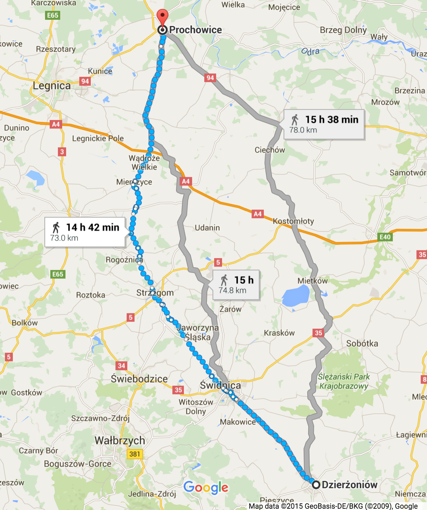
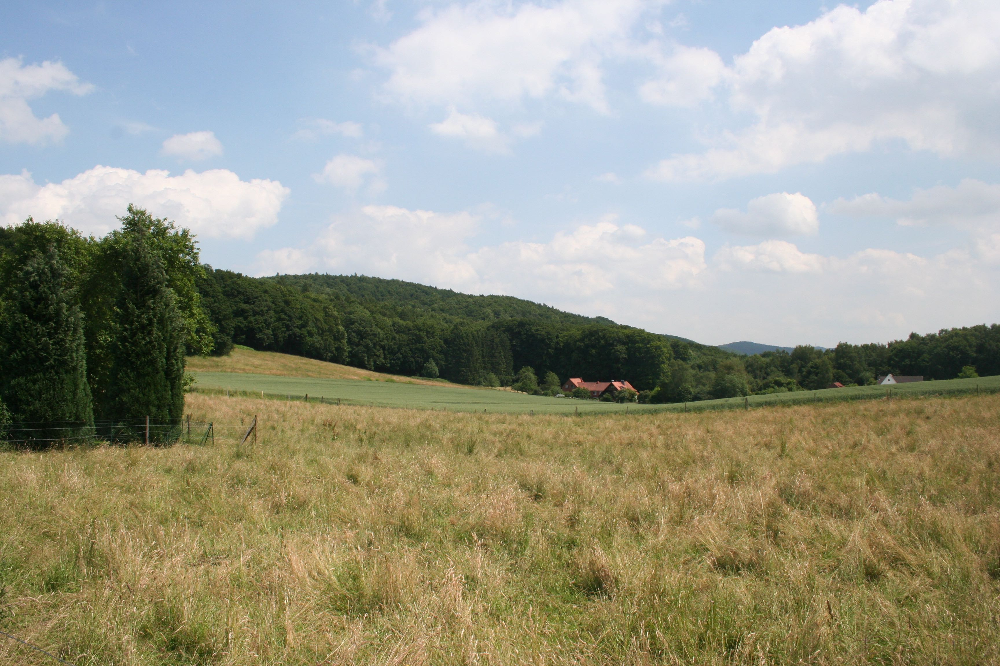
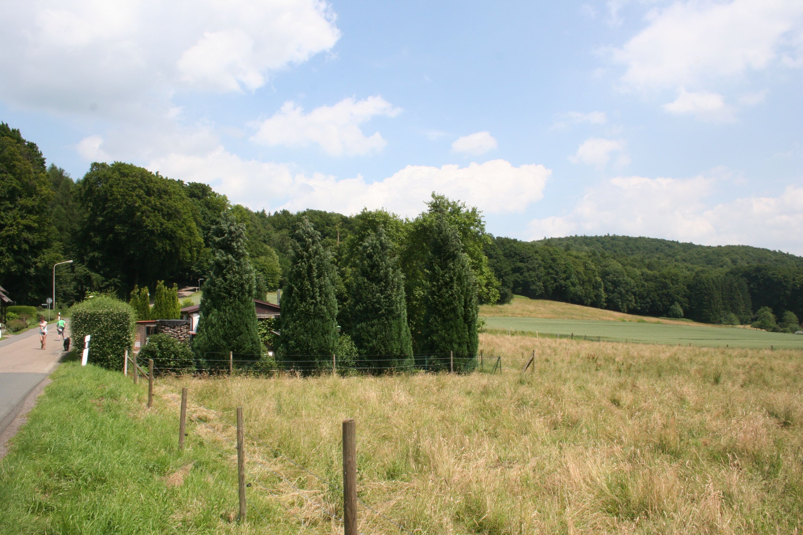
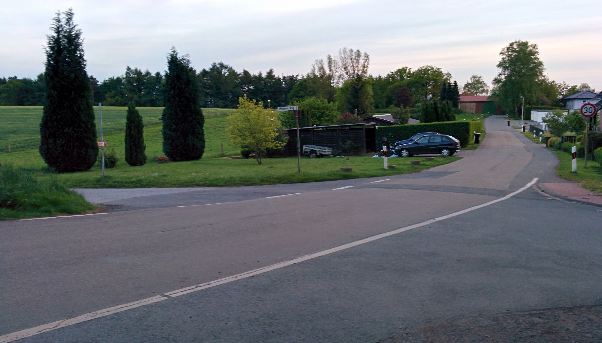
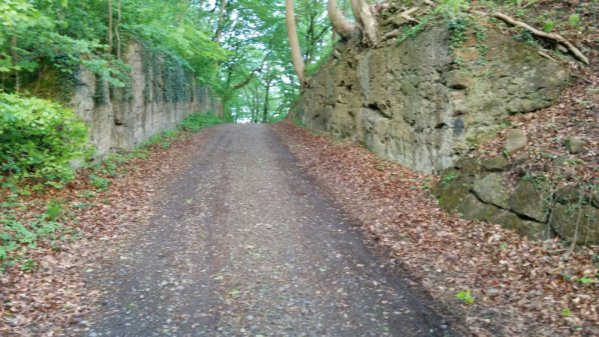

**Chapter Four: Women in Hausberge**

Nestled against the southern edge of Jakobsberg, about 1.5 miles east of the Weser River, lies the town of Hausberge. In September 1944 a small camp with two or three barracks was built on the eastern outskirts of town to house 150-200 men. In total about 170 men were interned here over the winter of 1944 to 1945.[1] No records or accounts exist regarding the men housed in this camp at this time, or about the work they did. Ostensibly, they were to work in the Hammerwerke or Dachs I factories. In February and March 1945, the purpose of the camp was changed to house about 1000 women. The women worked in the Hammerwerke section of the upper tunnel making transistor tubes for radio guidance systems. About half of the women were Jews from the Netherlands, and had worked for Phillips Radio Valve factory’s labor camp, Herzogenbusch in Vught, The Netherlands before being transferred to Auschwitz and then to Hausberge. The other half of the women were Jews from Hungary, Poland and Czechoslovakia who had made their way to Hausberge through various ghettos and concentration camps including Auschwitz, and were only spared the gas chambers because they were selected as fit to work. Most women were only in this camp for about four weeks. The camp conditions were the same as in the other camps in Porta Westfalica, very little food, insufficient sanitary conditions, and abusive Kapos and SS guards, but the physical work was much lighter.[2]

This chapter describes the experiences of women prisoners as expressed in interviews from the 1990s and in some cases from personal accounts given shortly after the war. Their time in Hausberge was only through March 1945, most of the women arriving between March 1-4 and leaving April 1. Recollections are limited, but a picture of life while at the Hausberge camp and work in the Hammerwerke emerges through descriptions of the camp, work, food, death, and interactions with guards and civilians.

**Transportation to Porta Westfalica**

From the middle of 1943, the Dutch Philips electronics company used Jewish women from the Herzogenbusch concentration camp in Vught, The Netherlands as laborers. In June 1944 these women were transported to Auschwitz. Most of these women were spared the death camp of Auschwitz by intervention of the Philips company, who argued that the women were integral for the continued production of radio valves. These women were sent to work in the Langenbielau (Reichenbach, present-day Dzierżoniów, Poland) camp. From September to December 1944, more women from Auschwitz were selected as capable of work and sent to the Reichenbach camp.[3]

In Auschwitz, the women were asked if they had worked in various companies in order to find those skilled in needed industries. Klári Sztehlo, a 22 year old Jewish girl from Budapest, Hungary was in Auschwitz at this time. She recalled that SS guards inquired who had worked at the Vereinigten Glühlampenfabriken (United Lightbulb Factory) in Ujpest. Her friends Zsuzsa Farago and Rozsa, who were also in that at that time, had worked there before interment in Auschwitz. Sztehlo’s friends had told her to respond that she had worked at the factory if she were ever asked, thinking it would be better to transfer to a labor camp or factory, than to stay in Auschwitz and wait for the gas chambers. After selecting the women who responded, the SS put them into a separate barrack[4] where they were later transferred to a factory and labor camp in Reichenbach. Sztehlo recalled that in Reichenbach they worked in two or three shifts with German civilians, who were not allowed to speak to the prisoners.[5]

After a bombing raid near the end of 1944 and the threat of the Russian army in early 1945, the camp was shut down at the end of February and about 1000 women were forced to march 93 miles (150 km) over four days across country to Trautenau in the Sudetenland (present day Trutnov, Czech Republic).[6]

One 24 year old Hungarian women from Budapest, known only by the initials L. A., wrote a deposition on February 11, 1946, in which she recalled the trek.

> At around the end of February the city became a war zone because of the Russian approach. The work in the factory was stopped and restarted over and over again. The streets were filled with escaping German caravans heading west. On February 18 all prisoners of the Telefunken factory camp set off on foot. There were approximately a thousand of us, all women. We walked for four days; all we got was a loaf of bread weighing 1.2 kilograms. On the first night we were accommodated in a coal mine in Neurode; we spent the second night in the barn of a cottage, and then the third one in Niederadelsbach, a beautiful little town. We met French and English POWs here. They were very kind to us; they distributed their suppers among us. We learned a lot from them on the status of the war.
>
> On the whole way we met escaping German groups proceeding in the same direction as we did. It was a truly interesting picture. All the trains were running westbound; they were carrying soldiers and weapons. Prisoners were also driven into that direction wherever we marched. The Soviet POWs had huge “SU” signs painted on their backs. On the evening of the fourth day we arrived in Trautenau (in the Sudetenland). We were put into a factory destroyed by the bombardments and we were not allowed to exit for four days. It was a filthy, disgusting camp; it was teeming with lice. Polish prisoners ruled the place, even the kitchen. Here I received the smallest amount of food during my camp life: half a liter of dirty water soup in the morning with potato peels here and there. In the afternoon we got five decagrams of bread and three or four pieces of potato in the evening. That was all.
>
> The roughest part of our escape started only here. We were put onto open coal carts on February 22 in the depths of winter. We had quite nice weather during the first days of our travel, therefore we did not find it very tragic that we had no roof above our heads, but later it became very cold and it was snowing and raining. Sixty of us were crammed into one small car. Everything was covered with soot and dirt; washing ourselves was of course out of the question. During the night there was constant fighting for space. There were awful scenes; many wanted to jump out. (A, L. “Recollections on the Holocaust - Protocol Nr. 3645,”)

Particularly interesting about this account is the sense of chaos among the different groups in the area, and that their trek was not made in isolation. The other accounts of this march do not reflect the sense that they met with any other people along the way. L. A. describes their group of 1000 women as one of many groups on the move to the West as the Russian front moved closer. Her account also provides a more accurate map of where the women marched. Most other accounts state simply that they marched from Reichenbach and ended up in Porta Westfalica. L. A. makes it clear where the women reseted each night. The first night was spent in a coal mine in Neurode, which is the present-day town of Nowa Ruda, Poland. The second night was spent in a barn in an unnamed location. The third town of the march she calls Niederadelsbach. In attempting to find the present day location of this town, one can separate the Nieder, meaning lower, to come up with the town name of Adelsbach, which was a town in the Sudentenland and is present-day Struga, Poland. Trautenau has become present-day Trutnov, Czech Republic.

\[Figure 4.1. Possible route of the march from Reichenbach (present-day Dzierżoniów, Poland) to Trautenau (present-day Trutnov, Czech Republic) as described by L. A.\]

The only other woman to talk in detail about locations during the march was Eva Gescheid, a 19 year old Jew from Salgotarjan, Hungary who wrote a deposition on July 5, 1945. In the report she noted that the prisoners received only 3 pounds (1.5 kg) of bread for 5 days; often they would sleep in stalls at night, and SS-guards beat them along the way. After five days of marching they reached the town of Parschwitz (present-day Prochowice, Poland), where they were left for two days with nothing to eat, and only 2 pounds (1 kg) of bread for every 6 people for the following two days. Fortunately the exhausted and malnourished women did not have to labor in this camp. Five days after arrival in Parschwitz, the women were loaded on the coal cars of a train, 65 people to a car. It was March and rain and snow showers left them cold and wet, with only a blanket for cover. They traveled for six days and nights on the train before finally arriving in Porta. Again they were left for two days without food.[7]

\[Figure 4.2. Possible route of the march from Reichenbach (present-day Dzierżoniów, Poland) to Parschwitz (present-day Prochowice, Poland) as described by Eva Gescheid.\]

Discrepancy exists between these two accounts. Both accounts were given soon after the events, Gescheid’s account is only about four months after, and the account from L. A. is eleven months later. The biggest notable difference is the two towns mentioned as the end point of the march, Parschwitz (present-day Prochowice, Poland) which is north of Reichenbach (present-day Dzierżoniów, Poland), and Trautenau (present-day Trutnov, Czech Republic) which is west of Reichenbach. So either one of the women is incorrect in the final location of the march, or there may have been two groups of women who marched from Reichenbach. Other women recalled specifically marching to Trautenau[8] or at least marching west,[9] and no others recalled Parschwitz. It seems unlikely that two different directions would be taken if the end destination (Porta Westfalica) was to be the same, although during the hectic and confusing time of civilian and camp evacuation and military retreat, the lack of train cars for transportation could have made the split of the women necessary. Both Gescheid and A. L. set the time of year at about the same time, March and February respectively, and both recount how it rained and snowed on them in the open train cars. Also, both mention that the train trip took six days.

Other women remember the march much differently, but their interviews are 50 years after the event. Ovitz recalls marching for weeks from Auschwitz directly to Porta with a group of 2000 women, only 500 or so of which made it to Porta.[10] Gescheid’s account being so much closer to the date of the event would lend most credence to her account, but most other accounts specifically name Trautenau as the final destination of the march. No other records, official or otherwise, shed light on the issue, so it must be concluded that two separate marches were conducted by the women from Reichenbach.

If both Gescheid and L. A.’s accounts are regarded with the same legitimacy, then the arrival date also shows that the women came in at least two different groups to Porta Westfalica. Eva Gescheid’s account, written only five months after the event, states that she arrived sometime in March 1945. All of the women were evacuated on April 1 because the US Army was getting close (they reached the other side of the Weser River on April 3) and Gescheid later writes that she was in Hausberge for only two weeks. This puts her arrival in mid-March.[11] Other accounts, including L. A., list the arrival date as March 1 or 3, 1945.[12]

During the trek the women were under the constant supervision of SS guards. Zsuzsa Farago, a 23-year-old Hungarian Jew, remembered the trek nearly 50 years later in an interview.

> That was very awful, because we had to go on foot, and go over high mountains. I had done much hiking since I was a small child, so I was prepared for it, but those who were not used to it... Along the way we made a stop at a coal station. We slept there in the coal yard. Then we were packed into train cars, open cars, it snowed, and we were covered in snow, and that is how we came to Porta. (Farago, Zsuzsa D. Gespräch mit Zsuzsa D Farago am 6.3.1992 in Budapest, 25.)

Miriam Brach, a 14 year old orthodox Jew from Czechoslovakia recalled an incident when they stopped by a lake one day. Water was very scare as the marched, so everyone rushed to get a drink. As they surged to the lake the women were literally beaten back by the SS guards to keep them from getting to the water. Only later did the prisoners find out that this seemingly brutal forced dehydration was not because the SS wanted to punish the prisoners, but because the water was dirty and would have made them all sick.[13]

Ester Ovitz, a 22 year old orthodox Jew from Seredné, Czechoslovakia remembers walking for weeks by foot in the cold and snow. Many nights they slept outside with little to cover them. Ovitz’s two younger sisters were also in this group of women. Often they felt like giving up, but Ovitz would threaten her sisters on the march that she would kill them rather than the Germans in order to keep them going. During the march they were given less to eat than while at Auschwitz. Whenever they found anything edible they would try to eat it. Ovitz also recalled a time where they found a cow along the way and tried to milk it. An SS guard woman intervened, and put a stop to the cow milking. Ovitz recalled that she was more upset of the milk spilling than the beating she got from the SS woman.[14]

After spending a few days in Trautenau, the women were loaded onto train cars, 50-60 per car, and sent to Porta Westfalica. Tobie Markowitz, a 21 year old orthodox Jew from Kerecky, Czechoslovakia, remembered that there was standing room only in the train cars. She also remembered that at one point the guards brought turnips for them to cook. Before the SS cooks could even begin to make food the inmates began stealing the turnips. Markowitz hid one in her pants. By the time the SS cook came to cook turnips they were all gone. As the SS guards were asking around for the whereabouts of the turnips, the one that Markowitz had stashed in her pants fell out; she got punished with a beating on the head.[15] Both Markowitz and 14 year old German Jew Ruth Herskovits-Gutmann recalled that their train was involved in an Allied bombing raid, during which the soldiers hid in the woods leaving the lives of the women on the train up to fate.[16]

Kitty Hart-Moxon, an 18 year old Jew from Bielsko, Poland remembered that they were allowed infrequent opportunities to forage for food, and relieving was done over the edge of the car as someone held on to them. When the trip finally ended, inmates knew where they were because there was a station sign that read Porta Westfalica.[17]

**Arrival of Inmates**

When the trains arrived at the Porta Westfalica train station, they were left on the train for a time. After two days on the train, the women were marched from the station to the camp, about 1.6 miles (2.5 km). Agnes Lukacs, a 24 year old Jew from Budapest, Hungary told about how the train stopped for a long time next to a cabbage field just outside of Porta Westfalica. Some of the women were able to get off the train and forage in the fields where they found savoy cabbage. The train stopped in Porta Westfalica soon after this stop and Lukacs recalled that they began to eat the cabbage on the way to from the train station to the camp “and the cabbage tasted so sweet… and on the way we ate these savoy cabbages that had snow on them. For us it was like eating ice cream.”[18]

L. A. wrote that everyone was exhausted after the trip. They were marched through the town and then up a seemingly endless road to a mountain. During the march to the camp they were caught in an air raid and were left standing in the trees.[19] Farago states that except for that first day when they arrived at the train station, they never again saw the town.[20]

**Women’s Camp at Hausberge**

The camp just outside of the town of Hausberge was very new; two women describe that construction on new barracks was still occurring at the camp when they arrived. A 19 year old Danish girl, known only by her initials T. L., wrote a deposition on January 28, 1947, and stated that as she was there, they were busy increasing the size of the barracks. The barracks would come in complete sections and only needed to be assembled.[21]

Papp recalled there being other prisoners there when they arrived, but was not certain. She mentioned the ability of the Germans to put things together at the last minute, giving the example of their barracks being thrown together in a short time.[22] Kitty Hart-Moxon recalled in a 1996 interview, that they marched through the forest after leaving the train until they came to a clearing where the camp was located. Hart-Moxon noted that there were already Dutch women in the camp who told the new arrivals that they were to work in a factory in a cave with them.[23]

Two women reflected on their surroundings, noting the beauty of the forest and the mountains, despite the terrible circumstance. Farago was able to see the beauty of the landscape around her even amidst the unsightly and dehumanizing life as a concentration camp prisoner and forced laborer. Farago described the area as “beautiful scenery, a fantastic landscape. And we were brought here every morning. And the surroundings were like in a fairytale story. And I imagined how nice it would be to return there as a free person. But then it never did happen.” Showing a great capacity to separate her circumstances from her surroundings, Farago even had thoughts of returning to the “beautiful path” they followed each day from the camp to the underground work site. She recalled that it was nearing spring while she was there, very large pussy willows on the trees, and picking a yellow flower for one of the inmates that was very sick at the time. Later in life she went as far as to seek out pictures of the area so that she might recall the location if she were ever to visit the area again.[24] While not a psychological analysis, it is interesting to ponder why Farago was able to separate in her mind at the time, the beauty of the landscape and the ugliness of the situation. Many other accounts describe only terror and unpleasantness. Was it because Farago had spent time walking in nature before her incarceration that she was aware of her surroundings in ways others were not?

Ágnes Lukács, a 24 year old Jew from Budapest, Hungary noted in a 1992 interview, that the area “was very beautiful. The Weser River flowing between the mountains… That was a very nice location. Down below flowed the Weser between the mountains through to the valley… I remember, when you looked back you could see the Weser, and you could see in the West where the river snaked through, it was very pretty.”[25]

Upon arrival, the women were assigned to two or three barracks. It is unclear if the beds in the barracks were two, three, or four level bunk beds. Most typically in the other camps in the area, the bunk beds were three levels. In any case, also in keeping with other camps, there was not enough beds for all of the inmates. L. A. wrote that the women fought over the beds upon arriving at the barracks the first day. They were assigned to sleep two to a bed.[26]

\[Figure 4.3. The camp for the women was on the outskirts of Hausberge, at the south-east intersection of Frettholzweg and Mindener Weg. The red line is the possible route the women took from the camp to the factory entrance. They most likely followed the existing roads through town to travel from the rail way station to the camp.\]

\[Figure 4.4. Aerial view of the Hausberge Camp, unknown date, courtesy of KZ-Gedenk- und Dokumentationsstätte Porta Westfalica.\]

\[Figure 4.5. The former women’s camp is currently an open field. Picture taken by the author, July 2013.\]

\[Figure 4.6. A single building remains of the camp, a former guard building. Picture taken by the author, July 2013.\]

\[Figure 4.7. The former guard building. Picture taken by the author, July 2015.\]

\[Figure 4.8. Part of the path taken by the women. Picture taken by the author, July 2015.\]

**Living Inside the Tunnels**

Not all women were housed in the barracks on the East end of Hausberge. A group of women and girls were bunked inside the mine. Brakah Vider, a 16 year old orthodox Jew from Vișeu de Sus, Romania, recalls riding in trucks to Porta Westfalica. They were greeted by black clad SS men with a “dead head” skull on their hats. Vider recalled being scared and not knowing what was going to happen to them. The girls were led down a small path to big iron doors in the side of the mountain. This group of girls and women would not be spending time in the camp, but spent their time there living in the tunnels of the underground factory.[27] Vider and Elizabeth Berweld, a 17 year old girl from Topolca, Hungary, recalled that there was no outside light because there were no windows and they did not know when it was day or night. They slept in the factory on three-level bunk beds and were let out only every two days for fresh air.[28]

**SS Guards and Kapos**

Reports about the guards and their treatment of the women inmates come only from two sources, Eva Gescheid and Zsuzsa Farago, with Farago being by far the most outspoken. Farago mentions that there were both men and women guards in the Hausberge camp and at the Hammerwerke underground factory.[29] Farago further related how they were much happier to have soldiers from the army as guards, especially those who were drafted from Hungary or spoke Hungarian. She recalled that these guards at least did not beat inmates without reason, whereas the SS guards would beat indiscriminately and seemingly at random. Women SS guards were even worse than the men, Farago insisted. The men were drafted into the SS, but the women had to volunteer, so they were more inclined to be of that nature that sought out violence and hatred.[30]

She also recalled that there were no Hungarian Kapos. This was a position that one sought out, accepting the methods that were used by the Kapos. They had to believe that the inmates were not human beings, but some kind of inferior race. “In other words,” remarked Farago, “whoever gave the impression to possess the least bit of helpfulness would not be able to endure such a task.[31]”

The guards stayed in a building inside the camp in Hausberge, but kept themselves separate from the inmates. As far as Farago knew, inmates did not clean or do laundry for the prison guards. For the most part, the Kapos were the ones to guard the inmates.[32] Eva Gescheid wrote simply, “the commander was an outspoken sadist who always had a stick with her, and would beat us indiscriminately.[33]”

Berweld recalled that she was once punished for trying to wash her clothes. She was taken outside and left naked in the snow for a time. Berweld was fearful that she would become sick, but nothing happened from her extreme exposure. Berweld also noted that nobody talked about punishments and they generally couldn’t see what happened to the others.[34]

**Fellow Prisoners**

An exact number of women prisoners is unavailable due to the lack of proper record keeping, but the most accurate resources state that by 25 March 1945, Philips had 967 women and 172 male prisoners working in Hammerwerke. Women were housed in the camp in Hausberge and the men were lodged in Barkhausen.[35] Most accounts available in this research are from Hungarian women or those who were from what is now the Czech Republic, although other nationalities were present in the camp, the most being from Holland. This research utilizes accounts from 8 Hungarians, 5 Czechs, 2 Germans, 2 women from the Netherlands, one woman from Poland, and one woman from Romania.

T. L. writes in her deposition that there were approximately 700 women in the camp, including 350 women from the Netherlands, about 40 political prisoners, and 350 Jewish women. There were men, wrote T. L., but they worked in the mine or constructing the camp. The remaining women were Polish, Hungarian, Czech, and a few Belgian and French.[36]

Farago and Susanne Burton, a 15 year old Jew from Budapest, Hungary, recalled that there was never a possibility to engage with people other than those in their work group. Work and camp were separated so that when inmates came from work they were counted and sent directly to their barrack.[37] Hart-Moxon recalled in her 1998 interview that there were other camps in the area that they did not know about until after the war, but they never saw or met the inmates from those camps.[38]

**Clothing**

Prisoners in the Hausberge camp wore the iconic concentration camp garb of striped pants and shirt. Farago recalled that the political prisoners had a triangle on their uniforms. Jews had a thick stripe on the back of their clothes so that they were visibly recognizable if they escaped; but, recalled Farago flatly, there was no chance of escape. Kapos, who had been in the camps for a longer period of time than others, had striped uniforms, which were also marked with a stripe or triangle. There was also a hat that went with the suit.[39]

**Work**

The first encounter of the underground factory was surely an awe inspiring moment. Kitty Hart-Moxon described in a 1996 interview that the day after their arrival in Hausberge, that they marched through the forest to the factory, where they could see nothing at all, and then there was just a great big opening in the side of the mountain.[40] She further stated that the walk took about two hours. Along the way they would gather acorns to supplement their meager rations, which were by that time almost non-existent.[41]

Once inside the factory, there were two ways to get to the proper floor. Dorothy Berliner, a 29 year old orthodox Jew from Sevlus, Czechoslovakia recalled that the girls would ride in a “rope elevator into a devilish big factory in the ground.”[42] Lili Spinger, a 14 year old Jew from Vyskovo nad Tisou, Czechoslovakia, also remarked on the elevator, recalling that they took it at least ten floors.[43] In reality there were only 9 floors in the Hammerwerke complex. The main entrance was on level seven, and the levels for assembly were on the third and fourth levels. Markowitz recalled that there were 72 steps to get to the factory level, and that there were a lot of civilians working there.[44] Farago also remembered that the women walked from the camp to the tunnel entrance, and then took the stairs to the factory floor.[45]

The halls in the different levels were modern inside with electricity, air and elevators. Many of the levels were guarded at all times.[46] Here they did similar work as they did in Reichenbach. Official reports state that the women prisoners were split into three groups working two 6 hour shifts and one 8 hour shift. Several of the women recalled their shift work lasting a full 12 hours each day.[47] Hart-Moxon notes that the German civilians worked much shorter hours, probably those mentioned by the official reports. Gescheid wrote that they rotated working a 12 hour day shift for a week, and then a 12 hour night shift the following week.[48]

Hart-Moxon noted that the work was not particularly difficult, in that it mainly consisted of sitting at tables doing hand work. The problem, she remembered, was the atmosphere, especially the air which was remarkably stuffy, something Gescheid also noted. At the end of their shifts, they would come out gasping for air. While there was sufficient lighting, the halls were cold because they were underground and unheated.[49]

None of the women were certain what they were actually producing at the factory. Hart-Moxon thought at the time that the factory belonged to Philips and was built to create munitions or something for aircraft. Very typically, the prisoners were never told what they were building nor why.[50]

Additionally, the girls from Holland who were supposed to be experts, did not have parts to complete their projects, so they sewed uniforms instead. Kitty and her group were doing intricate work, but they had no clue what they were doing or the right way to do it, so there was a lot of intentional and unintentional sabotage.[51]

Farago was uncertain wether radio tubes or lightbulbs were manufactured, mainly because the machinery was not completed so they never actually started production. She was left wondering why they were just cleaning in the factory instead of producing radio tubes. Their supervisors may have been told, she reflected in the 1992 interview, but that information never reached down to the inmates.[52] The reality was that the factory was not complete and there was a severe lack of materials, so that the inmates could not really produce anything. Often they would clean, but sometimes there was nothing for them to do, a sentiment also shared by Springer.[53]

In regards to the work done at Hammerwerke, Lukács explained that

> we had nothing to do there, for example, there were no resources available. The interesting thing is there were Dutch women with us. They had \[arrived\] before \[we\] had come into the camp, \[and they\] also worked in the Netherlands under German supervision. They had worked there in the Philips factory, and they recognized the production equipment of the Philips factory. So there we spent our time, we soldered and so forth, and if we did not work, then we crafted doll furniture made of wires. Everything was coming to an end. From time to time some supervisor of the factory would come for a visit, and then the foremen would run around desperately trying to make it look like everyone was diligently working. (Lukács, Ágnes. *USC Shoah Foundation Institute testimony of Ágnes Lukács*, n.d., 37.)

Juliette Cronheim, a 25 year old from Renkum, Netherlands, recalled in a 1995 interview that they went three flights of steps to get to the factory, and that they had the same exact benches as they did in Vught, which they new because they had scratched their names in the benches.[54] T. L. also recalled the same machinery and taking the stairs to the factory levels. “I remember passing by a door to a long hallway in the mountain, guarded by a supervisor. Later I learned that was where prisoners were killed. Including some women from the Netherlands that came to the camp after us.”[55] Leny Bromet, a 16 year old Jew from Amsterdam recalled that there were machines but nothing to do. She also noted that they were filmed during roll call one day.[56]

Györgyné Papp spoke about only working a couple of days in Porta, and how sickness or inability to work no longer left them with the fear of being exterminated.

> My sister Erzsi worked the whole time. I couldn’t stand because the four day march  before we came—and the shoes in size 40, made of wood or something, and were twice as big as my feet, had severely destroyed my feet so that it was really hard to stand. And since it wasn’t Auschwitz anymore, I perhaps wasn’t as fearful of any sickness meaning death, so I let the guard know that I couldn’t stand up. I don’t remember if I was treated medically, or bandaged and given smaller shoes… I could stay in the barracks. I remember that I was in some kind of sickroom. In any case, it was accepted, perhaps my feet were swollen and they could see that. I would have liked to go to work, because that means human interaction, but I was not able to. I don’t know how long it lasted until I could stand again, but when we left Porta I was able to join the group. (Papp, Györgyné. Gespräch mit Györgyné (Zsuzsa) Papp am 10.3.1992 in Budapest, 48.)

L. A. also wrote about the work at Hammerwerke, touching on all of the aspects mentioned previously by other inmates; lack of work, three shifts, and the young girls that worked there.

> Not everyone worked here; not much labour force was needed here. We worked in a factory similar to Telefunken. The factory was located inside the mountain, in a totally bomb-proof area. The whole factory was very interesting: the entrance was like that of a train tunnel, the work halls were located in clefts, the whole complex was seven-stories deep in the ground. Most of the machines were made by Phillips which made people working with us quite happy. Work basically meant going to the workshop at 7 am, sitting there for an hour, chatting, doing nothing. There was no material to work with and if there was a supervisor in the factory, the foremen got all excited and handed us finished pipes and ordered us to pretend working on them. There were three shifts; the night-shift crew spent the night in the factory. Young little girls spent days and nights underground and they did not even know when it was day or night. These 14-17-year-old little girls were quite naive: they were so proud that they were considered the best female workers in Germany. It was very interesting: the sleeves of their dresses were painted to different colors and there were yellow crosses on them as well. Soon they put the yellow cross on us too. The Dutch, Belgian and French Aryans who worked with us had a yellow “X” painted on their backs, the Jews a yellow “+”. There was no other difference. There were capacity exams in the factory: they were testing our sight and our manual skills. Workers were assigned according to the results. After three days of intensive working the activities stopped again. (A, L. “Recollections on the Holocaust - Protocol Nr. 3645,” )

Most interesting to note in the account from L. A. is the mention of capacity exams and the tests for sight and manual skills. No other accounts recall any sort of physical or mental skills test while at Porta Westfalica. Secondly, no other account mentions the attitude of the workers concerning their role in the German armaments production. It speaks to the Nazi ability to manipulate their prisoners, making them think they are of utmost importance, all the while treating them as slaves.

**Food**

While the work may have been surprisingly lax, the food and hygiene circumstances were all too familiar. L. A. wrote that things seemed to go well when they first arrived in the camp. The inmates received blankets, bowls, and spoons, but there was little food. The water system supplied the kitchen and the wash room, so they would shut off the taps to the wash room when the cooks were cooking in the kitchen. Bathing was limited to half an hour twice a day. Food was so scarce there that they picked up potato peels and ate them.[57] “We ate literally everything. It’s unimaginable what we ate; sorghum, millet, jam, black coffee.”[58] Food was a bowl of soup and 1 kg bread for 8 people. The women suffered agonizing hunger and were completely exhausted. They were under strict supervision and often called to roll call.[59]

Several of the women with interviews in this research were orthodox Jewish. Pesach that year lasted from March 29-April 4. Those who were orthodox and tried to keep their religious food restrictions found this time particularly difficult. Food rations were already meager, so giving up their allotment of bread could mean further hunger and even death. Fortunately, those who chose not to eat the leavened bread were able to trade with others for their potatoes and soup.[60]

**Death and Coping**

More survivors spoke about the will to survive than on the death that surrounded them, although several women expressed the hopelessness and fear that assailed them in the camp. Farago remembered that the hunger and cold were not the only things that led to sickness and death, stating that there were more reasons to die than reasons to live. Two of their group from Budapest died while in Porta Westfalica.[61] Sztehlo recalled that of the 30 of them at Porta, only a 1/3 survived their time there; so many gave up in Porta.[62] Papp spoke about how they lost a sense of being while in the camps. They were so preoccupied with daily survival that they had long forgotten that we were any kind of wife or bride or someone who was loved.[63] Some, like Burton, felt there was no sense of hope whatsoever.[64]

Other women found ways to cope. A strong network among fellow prisoners was an important factor in overcoming the hardships of prison life and work. Prisoners talked with each other quite a bit. “That was how we survived. Meaning, there were many people close together, and even when it was little things, everyone tried to strengthen the other, to share something good, something nice,” remembered Papp. “Cultural events” were organized in Auschwitz to make it feel life feel like “normal,” but there was no such organization in the smaller labor camps like Porta.[65]

If a family member was present, they provided a built in support system. Markowitz remembered that at one point her sister was sick and couldn't work. Others told her that her sister had to give up her shoes to workers because she couldn't work. They started to beat her sister but she didn’t give up her shoes. Markowitz was adamant that if she would have given up her shoes she would be dead.[66]

In this camp, as in other concentration camps, whoever made any outward sign of resistance was just committing suicide. Therefore there was little resistance given by prisoners. Personal resistance, or an inward defiance to the situation, a desire to survive, was something each individual had to have for herself. Support from others existed. Farago recalls that her little group of five friends looked out for each other. It was cold at roll call and they would have to stand there for hours, and what clothing they did have was thin and offered no protection from the elements. Farago's group would stand close together to offer warmth, with the weakest among them in the middle.[67]

Many died in Porta, even though it was known the war would soon end. Inmates were already physically weak, and many of the inmates died giving the last of their mental and physical reserves in trying to withstand the physical activities, the humiliation, and life in general. Sztehlo felt that her personal desire to overcome and withstand was perhaps rooted in the experience of surviving Auschwitz, and buoyed by the rumors that the war was almost over, she felt she had to try to survive at all costs.[68]

**Departure**

American troops advanced towards the Weser River in the last week of March. In a last desperate effort to save their labor force, the SS transported the women to other camps in the East on April 1. At roll call that day, the women were divided seemingly at random into two groups. One group was taken by train to another camp at Fallersleben.[69] The other group was taken into the forest and shot.[70]

Many of the Hungarian, Polish, and Czech prisoners were taken from Porta Westfalica to Fallersleben for a week, and then to Salzwedel for a week where liberation finally came on May 8, 1945.[71] Those from Germany or the Netherlands were sent to camps near Hamburg were they were liberated in early May.

Porta Westfalica was the last camp where the Herskovits-Gutmann sisters were together with their original group from Birkenau. They didn't stay in Porta Westfalica for long, and were soon loaded on another train. Eva and Ruth tried to stay together, but were not able to on this transfer. Although not in the same car, they were, in the end, on the same train. Ruth was loaded into a horse cart that was much too small for the number of women. The dying and more sick women were thrown onto the floor of the cart, and the "more healthy" women were literally forced to stand on top of them. They left Porta Westfalica on April 1, one month after arrival. They traveled to Bergen-Belsen, but were not wanted there, so were kept at a camp near a town called Beendorf. After several day there, they were sent further towards Hamburg, ending up near Padborg on May 1, 1945, finally out of Nazi control and liberated by the Danish Red Cross.[72]

Not much is known about camp life among the women inmates in Porta Westfalica. They came from various paths, but almost all through Auschwitz and Reichenbach to the camp in Hausberge. Presumed to be experts and manufacturing vacuum tubes for radio and radar systems, they were spared death in Auschwitz. Exact numbers of survivors or dead are not known as official documentation has not been found.

[1] KZ-Gedenkstätte Neuengamme, *Map of Neuengamme Sattelite Camps*.

[2] Bleton et al., *Das Leben ist schön!*, 9.

[3] Schulte, *Konzentrationslager im Rheinland und in Westfalen 1933-1945. Zwischen zentraler Steuerung und regionaler Initiative*, 144.

[4] Sztehlo, Gespräch mit Klári Sztehlo am 12.3.92 in Budapest, 9.

[5] Ibid., 16.

[6] Schulte, *Konzentrationslager im Rheinland und in Westfalen 1933-1945. Zwischen zentraler Steuerung und regionaler Initiative*, 144.

[7] Gescheid, “Protokoll von Eva Gescheid,” 2. and Springer, USC Shoah Foundation Institute testimony of Lili Springer, 1.

[8] Papp, Gespräch mit Györgyné (Zsuzsa) Papp am 10.3.1992 in Budapest, 40. and Herskovits-Gutmann, *Auswanderung vorläufig nicht möglich*.

[9] Farago, Gespräch mit Zsuzsa D Farago am 6.3.1992 in Budapest, 25.

[10] Ovitz, USC Shoah Foundation Institute testimony of Ester Ovitz, 1.

[11] Gescheid, “Protokoll von Eva Gescheid,” 2.

[12] A, “Recollections on the Holocaust - Protocol Nr. 3645,” 7., Hart-Moxon, Kitty Hart-Moxon interview with Imperial War Museum., Herskovits-Gutmann, *Auswanderung vorläufig nicht möglich*, 162. and Lukács, Gespräch mit Agnes Lukács am 8.3.92 in Budapest, 37.

[13] Brach, USC Shoah Foundation Institute testimony of Miriam Brach, 1.

[14] Ovitz, USC Shoah Foundation Institute testimony of Ester Ovitz, 1.

[15] Markowitz, USC Shoah Foundation Institute testimony of Tobie Markowitz, 1.

[16] Ibid. and Herskovits-Gutmann, *Auswanderung vorläufig nicht möglich*, 162.

[17] Hart-Moxon, Kitty Hart-Moxon interview with Imperial War Museum, reel 8, 28:40. and Hart-Moxon, USC Shoah Foundation Institute testimony of Kitty Hart-Moxon.

[18] Lukács, Gespräch mit Agnes Lukács am 8.3.92 in Budapest, 36.

[19] A, “Recollections on the Holocaust - Protocol Nr. 3645,” 7–8.

[20] Farago, Gespräch mit Zsuzsa D Farago am 6.3.1992 in Budapest, 44.

[21] L., Aussage von T. L. January 28, 1945, Amsterdam, 2.

[22] Papp, Gespräch mit Györgyné (Zsuzsa) Papp am 10.3.1992 in Budapest, 48.

[23] Hart-Moxon, Kitty Hart-Moxon interview with Imperial War Museum.

[24] Farago, Gespräch mit Zsuzsa D Farago am 6.3.1992 in Budapest, 24–26.

[25] Lukács, Gespräch mit Agnes Lukács am 8.3.92 in Budapest, 37.

[26] A, “Recollections on the Holocaust - Protocol Nr. 3645,” 7–8.

[27] Vider, USC Shoah Foundation Institute testimony of Brakhah Vider, segment 170.

[28] Ibid., segment 169. and Berweld, USC Shoah Foundation Institute testimony of Elisabeth Berwald, segment 22.

[29] Farago, Gespräch mit Zsuzsa D Farago am 6.3.1992 in Budapest, 46.

[30] Ibid., 45.

[31] Ibid., 29.

[32] Ibid., 46.

[33] Gescheid, “Protokoll von Eva Gescheid,” 2.

[34] Berweld, USC Shoah Foundation Institute testimony of Elisabeth Berwald.

[35] Schulte, *Konzentrationslager im Rheinland und in Westfalen 1933-1945. Zwischen zentraler Steuerung und regionaler Initiative*, 145.

[36] L., Aussage von T. L. January 28, 1945, Amsterdam, 2. and Sztehlo, Gespräch mit Klári Sztehlo am 12.3.92 in Budapest, 21.

[37] Farago, Gespräch mit Zsuzsa D Farago am 6.3.1992 in Budapest, 48., Burton, USC Shoah Foundation Institute testimony of Susanne Burton.

[38] Hart-Moxon, USC Shoah Foundation Institute testimony of Kitty Hart-Moxon.

[39] Farago, Gespräch mit Zsuzsa D Farago am 6.3.1992 in Budapest, 50.

[40] Hart-Moxon, Kitty Hart-Moxon interview with Imperial War Museum.

[41] Ibid.

[42] Berliner, USC Shoah Foundation Institute testimony of Dorothy Berliner.

[43] Springer, USC Shoah Foundation Institute testimony of Lili Springer.

[44] Markowitz, USC Shoah Foundation Institute testimony of Tobie Markowitz.

[45] Farago, Gespräch mit Zsuzsa D Farago am 6.3.1992 in Budapest, 29.

[46] Burton, USC Shoah Foundation Institute testimony of Susanne Burton.

[47] Ovitz, USC Shoah Foundation Institute testimony of Ester Ovitz. and Hart-Moxon, Kitty Hart-Moxon interview with Imperial War Museum.

[48] Gescheid, “Protokoll von Eva Gescheid.”

[49] Hart-Moxon, Kitty Hart-Moxon interview with Imperial War Museum.

[50] Ibid.

[51] Hart-Moxon, USC Shoah Foundation Institute testimony of Kitty Hart-Moxon.

[52] Farago, Gespräch mit Zsuzsa D Farago am 6.3.1992 in Budapest, 47.

[53] Ibid., 25., Springer, USC Shoah Foundation Institute testimony of Lili Springer.

[54] Cronheim, USC Shoah Foundation Institute testimony of Juliette Cronheim.

[55] L., Aussage von T. L. January 28, 1945, Amsterdam, 1.

[56] Bromet, USC Shoah Foundation Institute testimony of Leny Bromet.

[57] A, “Recollections on the Holocaust - Protocol Nr. 3645.”, Lukács, Gespräch mit Agnes Lukács am 8.3.92 in Budapest, 37.

[58] Sztehlo, Gespräch mit Klári Sztehlo am 12.3.92 in Budapest, 22.

[59] Gescheid, “Protokoll von Eva Gescheid,” 2.

[60] Berliner, USC Shoah Foundation Institute testimony of Dorothy Berliner., Vider, USC Shoah Foundation Institute testimony of Brakhah Vider.

[61] Farago, Gespräch mit Zsuzsa D Farago am 6.3.1992 in Budapest, 27.

[62] Sztehlo, Gespräch mit Klári Sztehlo am 12.3.92 in Budapest, 23.

[63] Papp, Gespräch mit Györgyné (Zsuzsa) Papp am 10.3.1992 in Budapest, 54.

[64] Burton, USC Shoah Foundation Institute testimony of Susanne Burton.

[65] Papp, Gespräch mit Györgyné (Zsuzsa) Papp am 10.3.1992 in Budapest, 48.

[66] Markowitz, USC Shoah Foundation Institute testimony of Tobie Markowitz.

[67] Farago, Gespräch mit Zsuzsa D Farago am 6.3.1992 in Budapest, 50.

[68] Sztehlo, Gespräch mit Klári Sztehlo am 12.3.92 in Budapest, 22.

[69] A, “Recollections on the Holocaust - Protocol Nr. 3645.”, Hart-Moxon, Kitty Hart-Moxon interview with Imperial War Museum., L., Aussage von T. L. January 28, 1945, Amsterdam., Lukács, Gespräch mit Agnes Lukács am 8.3.92 in Budapest, 37.

[70] Hart-Moxon, USC Shoah Foundation Institute testimony of Kitty Hart-Moxon.

[71] Gescheid, “Protokoll von Eva Gescheid.”

[72] Herskovits-Gutmann, *Auswanderung vorläufig nicht möglich*, 162–168.
