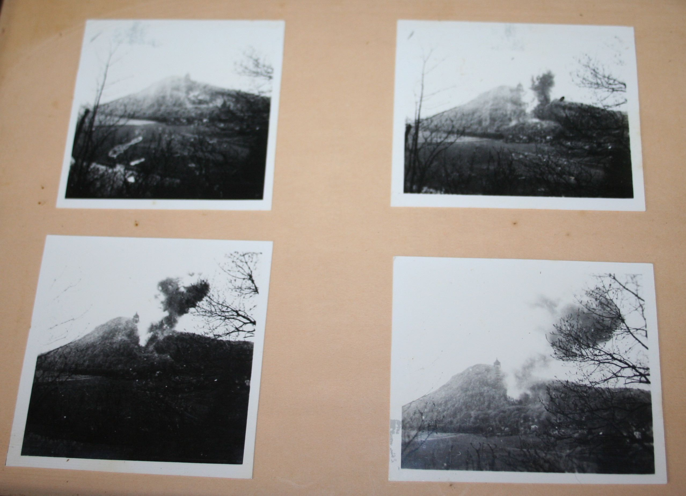
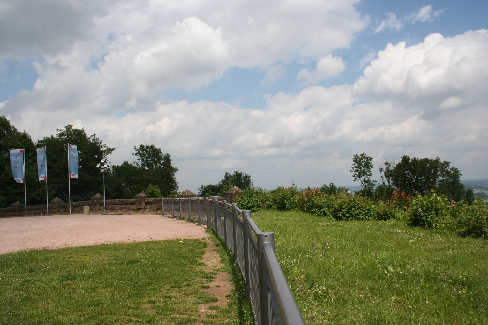
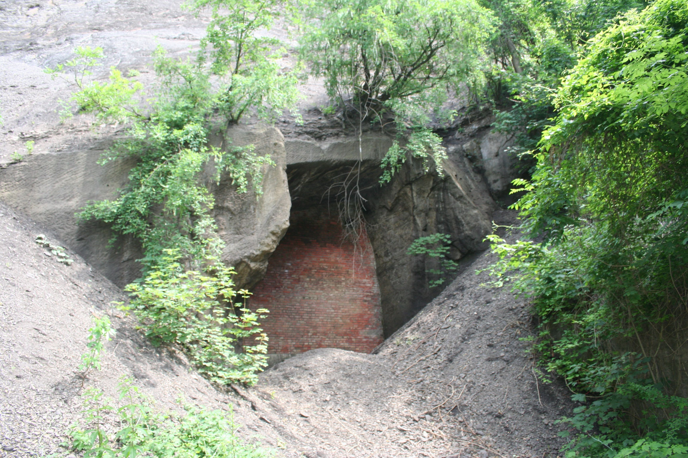
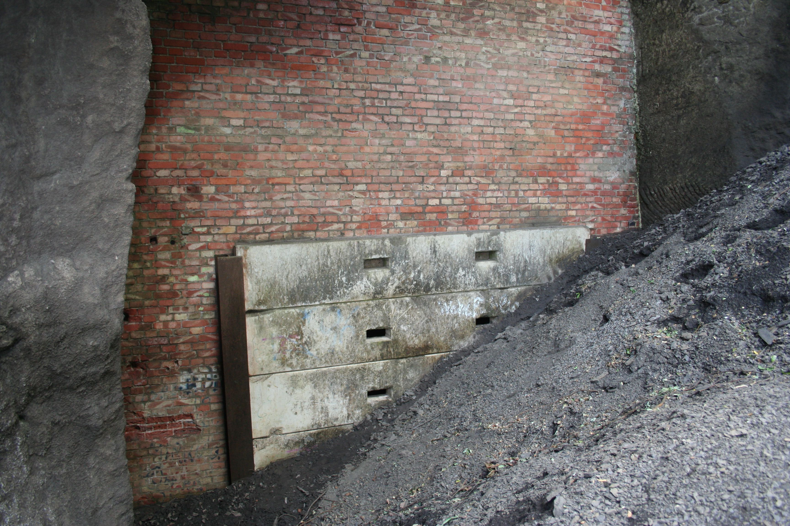
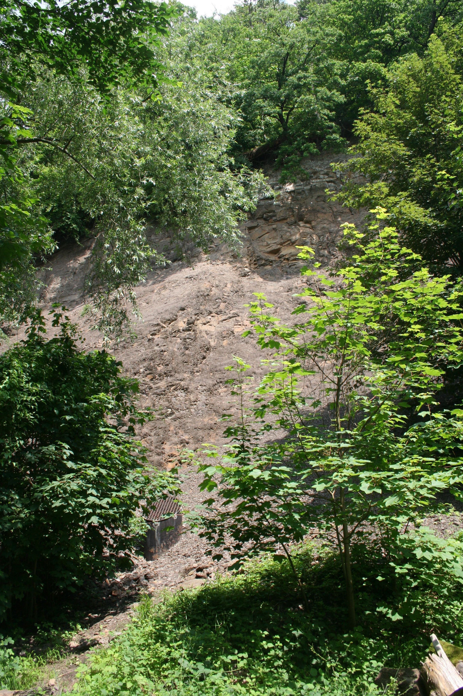
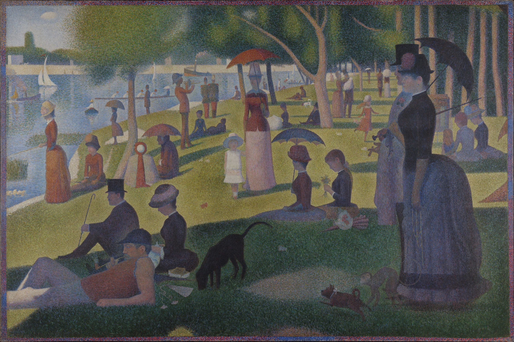

**Conclusion: Meanings, Memories, Movements**

On April 4, 1945, the United States 5th Armored Division reached the west bank of the Weser River. After several small skirmishes they reached the north side of the Wittekindsberg. The British 6th Airborne Division and the 3rd Armored Brigade arrived on the north side of the city of Minden at the same time. Bridges in the area were destroyed by the fleeing German army, so it wasn’t until three days later, on April 7, that Allied forces crossed the Weser River at this point.[1] While the after action reports and other official records do not mention the prison camps in Barkhausen and Hausberge, they do note that on April 2, just two days before reaching Porta Westfalica, that they over ran seventeen German prison camps.[2]

**Post War Porta Westfalica**

Not much is known about what happened to the machinery or the civilian and forced laborers of the underground factories between 1945 and 1948. Occupation of the area fell under British control, and machinery was either confiscated by the British Occupation forces or returned to the businesses. Presumably civilian laborers returned home.

According to Allied Occupational post-war demilitarization plans all German military installations that could be used for rearmament purposes were to be dismantled, destroyed and made unusable. All underground dispersal locations fell under this directive and were to be destroyed by use of explosives. In 1946 the entrance to the underground factory in the Wittekindsberg was collapsed. The entrance was successfully sealed and only minor damage was caused to the wall surrounding the Kaiser Wilhelm monument above.

\[Figure Conclusion-1. Images of exploding the entrance in Wittekindsberg. Source: Photos courtesy of the Barkhausen Schützenverein, which is located directly in front of the former entrance.\]

\[Figure Conclusion-2. Missing section of the monument wall. Source: Picture by the author, 2013.\]

The fate of the Jakobsberg entrances was not decided until a few years later. A letter dated May 22, 1948, sent by British Disarmament Branch 911/Disarm/42 HERFORD, notified the city of Minden that the tunnel systems in the Jakobsberg were to be destroyed by explosives. The citizens of Minden and the surrounding areas were extremely concerned about the proposed plan of demolition. The fear was that if the entrances were collapsed that the entire integrity of the mountain side would be compromised and a massive landslide would destroy homes, businesses and major transportation resources. In mid-June of 1948, the Liquidation Office in the Financial Department of Minden compiled several letters that were sent to the British Occupying forces officer stationed in Minden.[3] The opening letter, from the Liquidation office, described the reasoning to halt the explosions that were planned for later that year.

> The catastrophal \[sic\] affects, arising from a blowing of the adits, as the result of blocking up the railway and the thorough-fare with huge masses of earth and stones through a fall of the mountain and landslip, have been described by experts in appendixes 1 – 3. The railway- line, which is strategically important for the Occupying Force and indispensable for the providing and conveyance of passengers would be lamed for a longer time. Other catastrophal consequences are described in appendix 3.
>
> *Therefore I beg you urgently to disregard the blowing up, and in case of need to bold the entrances of the adits by concrete walls and to make the useless.* \[*Sic*\] (Original emphasis.)

The letters further argued that parts of the tunnel could affectively be used as storage spaces or garages, citing the company Industrie- und Handelskammer Bielefeld, which had already expressed interest in the space. A further argument noted that the water reservoirs located on the sides and top of the hill supplied necessary water for the towns of Hausberge, Neesen and Lerbeck as well as for the nearby rail road, concluding that these structures had no military purposes.

Appendix 1, written by Director Gerrisch of the Reichsbahn Operation Office, prescribed three reasons why the tunnel systems under Jakobsberg should not be destroyed. The fist point argued that the mountain-side was too close to the road and the hotel “Großer Kurfürst” for them to survive an explosion. They were so close to the mountain, that a wall had already been constructed to keep the occasional rock slides from damaging the road and hotel. A second point argued that the geology of the mountain was such that any explosion would cause the mountain-side to slide, inevitably covering the road and four-track railroad. Weeks of hard work with large machinery would be required to clear such a landslide, and the financial loss would be incalculable. Finally, the inevitable landslide would destroy gas and electric lines which would take years to replace.

The second appendix took into consideration the inspection of engineer-in-chief Martin Haupt, employed by the British military government to oversee the dismantling of machinery throughout the tunnel system. Haupt’s analysis was that there were nearly twenty-thousand square meters of usable space in the tunnel systems. Haupt also noted that the blasting of the tunnel system would cause the hillside to slide, covering the nearby road. A more practical and just as effective method to discourage use of the tunnel systems would be to place large concrete blocks in front of the tunnel entrances. Haupt closed his letter with the statement that “various experts of the Disarmament Branch HQ Mil. Gov. 714, Düsseldorf, and the Geologischen Landesamtes Düsseldorf, professor Kegel, are said to come to the same results.”

Appendix 3 addressed the concerns of the citizens of Hausberge, located at the foot of the Jakobsberg, and detailed the effects that the impending explosion of the tunnel systems would have on their community. “As we have learned, the military government intends to blow up the tunnel and other chambers in the Jakobsberg, in order to make them unsuitable for military purposes,” wrote director of the board (Amtsdirektor) Caase of Hausberge on June 17, 1948. “With this news,” continued Caase, “the populations of the nearby and surrounding areas are deeply alarmed, because the explosions could cause inestimable danger and damage.” This plea from Hausberge’s town council was followed by a suggestion to either block the tunnel entrances with strong concrete walls, or by using only small, controlled explosions. According to the experts consulted by the council, indiscriminately blowing up the whole of the tunnel system would cause the entire mountain to shift, resulting in large landslides. Such landslides would certainly block the only state road from Minden to Hausberge, which also connected to the highway (Reichsautobahn) and led to the southern highlands and cities of Rinteln and Hamelin. This major road also contained the following underground cables and services:

1.  The 25,000 Volt main supply cable to Meißen and Bad-Oeynhausen.

2.  The 6,000 Volt supply cable between Hausberge, Holzhausen, and Vennebeck.

3.  A radio and telegraph cable for the German Postoffice (Reichspost).

4.  The main gas line between Hamm and Hannover.

5.  The water line from Hausberge for the communities Neesen, Lerbeck and the national railway (Reichsbahn).

The letter further stated that the four-track Reichsbahn connecting Hamm and Hannover would be put in danger, and also listed a number of buildings that would be totally destroyed, were the tunnel systems to be exploded. The list included:

1.  The old train station.

2.  The saloon “Schönen Aussicth“ am Bergabhange (on the mountain side).

3.  The hotel “Großer Kurfürst“, which at that time was a teacher training institute.

4.  The post office of Porta.

A list of buildings that would be considerably damaged was also included.

1.  The train station in Porta.

2.  The inn “Haus zum Berge“, owned by innkeeper Winter, from Neesen.

3.  The administration building of the glass factory.

4.  The family home owned by the Reichsbahn on the main street.

5.  The inn “Düker” in Neesen.

Further, the letter explained, the explosion of the tunnel system would destroy many other assets to the local communities such as a 700 cbm water container and a further five water tanks that would be able to supplement the main water supply for the towns of Hausberge, Neesen and Lerbeck, as well as the Reichsbahn. Finally, the blasting of the tunnel system would completely destroy the beautiful and world-renown scenic views of the Porta Westfalica that was visited by thousands each year.[4]

British officers seemed to take these please into consideration, and in the end the tunnel systems in Jakobsberg were not destroyed. Instead the entrance to the Dachs I, or lower system, was blocked with a metal gate and large concrete blocks. The entrance to Hammerwerke, or the upper system, was detonated, leaving only a small ventilation shaft as a marker.

\[Figure Conclusion-3. Entrance to the former Dachs I underground factory. Source: Picture by the author, 2013.\]

\[Figure Conclusion-4. The large entrance is bricked in and a smaller entrance closed with large cement blocks. Additionally, a large mound of gravel makes entrance to the tunnel system difficult. Source: Picture by the author, 2013.\]

\[Figure Conclusion-5. Entrance to the former Hammerwerke underground factory. Source: Picture by the author, 2013.\]

From the 1950s to the present the tunnel systems have been closed to the public, but often visited by adventurous individuals illegally through hidden entrances. Visits by former inmates prompted numerous news paper articles in the local paper, the Mindener Tageblatt, and public openings of the tunnel in Jakobsberg. In 2009, the city of Porta Westfalica officially recognized the former concentration camps with a monument to the former inmates and the establishment of the Concentration Camp Memorial and Documentation Center of Porta Westfalica (KZ-Gedenk- und Dokumentationsstätte Porta Westfalica). Since 2009, the organization has collected documents and sponsored events to commemorate and remember the former camp inmates. On May 18, 2014, the town of Porta Westfalica held a commemoration event which included speeches by researchers, eye witnesses, and relatives of former prisoners. After the event information boards were placed at various points of remembrance, including the entrances to Dachs I and Hammerwerke. From May 8 to May 10, 2015, the town of Porta Westfalica sponsored an event to commemorate the 70 year anniversary of the end of World War II. The three day event included a concert performed by the local music school, an all day conference where researchers (including the author) and relatives of former prisoners spoke, a reading and discussion by Jennifer Teege, a special church service, and a guided tour of the Dachs I system. This was the first time in over 20 years that the tunnel system was opened to the public. In September of 2015, eight *Stolpersteine* (literally stumbling blocks, or stepping stones) were laid in remembrance of Regina, Gustav, Friedrich und Helmut Spangenthal, and Justin, Irmgard und Mathel Susi Maiersowie Henny Honi who were all deported from Huasberge in December 1941.

**Memories and Vergangenheitsbewältigung**

In the post-war years, particularly the first three decades, the memory of the underground factories, concentration camps and laborers faded from collective memory in Porta Westfalica. The 80s saw numerous newspaper articles, and visits by survivors in the 90s and early 2000s caused the past to come back to the present. Every person, community, and nation must in some way deal with their past. For the Germany of today, their *Vergangenheitsbewältigung* sifts most prevalently through World War 2. So many layers must be explored, so many levels understood: the rise of Nazi control, implicit cooperation by citizens, anti-Semitism, concentration camps, the final solution, forced labor, bombing of citizens, destruction of life and property, post-war rebuilding, etc. One purpose of doing history is to remember the past, the people, events, and conditions that led to the present, and thereby inform the present. But what if remembering harbors the hate from the past to fuel present contentions? How can history, remembering the past, help?

Györgyné Papp spoke in her 1992 interview about how she visited Auschwitz-Berkenau in the 1960s and how it brought to mind many memories she had forgotten. She never intentionally tried to forget the memories of her time at Berkenau, but realized that it would be no kind of life to live constantly with those memories. “It was strange to imagine that one could survive such a thing,” recalled Papp, “but we survived it.”[5] Bringing back memories was painful and uncomfortable. Papp had survived, but in order to keep living she had to forget.

In a 1992 interview, Klari Neumann conveyed how hard it was to work through the past 40 years when being constantly reminded of the past. She expressed a confusion and uncomfortableness at the constant issues people have by things that happened so long ago, and wondered if it wouldn’t be better to draw a line that the past can’t cross. As an example, she told how two of her sons married German women and her sister’s daughter married a German and lives there.[6] Neumann felt that there should be a time to draw a line around the past so that it cannot harm and taint the present. Her two sons and niece are examples of forgetting the hatred that existed between Germans and Jews, and building a new society.

In these two cases, forgetting help heal over wounds from the past and let the participants move from a classification of victim to survivor, to ordinary person. Forgetting the past was exactly what Papp and Neumann needed in order to build new lives without constant mental and emotional anguish and without crippling hate and malice. For others, the opposite is true. In order to make a new life, the old one must be understood, organized, and categorized. Wrongs must be righted, and justice must be served and reparations made as much as possible. Completion and closure is needed before being able to move on.

Albertus (Bertus) de Raaf and his older brother Albert (Ab) were prisoners in Barkhausen. Albertus died on December 10, 1944, due to sickness from cold and malnourishment, and was buried in Lerbeck’s cemetery on December 12, 1944. Ab survived, as did a friend Jans Hof. Ab’s son, also named Albertus (Bert) was told about Bertus while he was young, so much so that he felt a great kinship with his deceased uncle. When Bert’s father, Ab, passed away, Bert made a promise to himself that he would bring Ab’s brother Bertus back to the Netherlands to be buried next to his brother. In 2009 arrangements were made to work with Porta Westfalica in ascertaining exactly where Bertus was buried. With the help of records kept by the cemetery groundskeeper at the time, they were able to locate the remains of Bertus, and forensic DNA testing later confirmed the bones to be those of Bertus. In 2009 Bert and his aunt Marchien, along with her husband and daughter, and their friend Jans Hof, recovered the remains of Bertus from the Lerbeck cemetery. Then they took Bertus’s remains to all of the camps where Bertus had been imprisoned during 1944, in effect making his journey in reverse, finally to be buried in Denmark next to his brother.[7]

In 2011, Jørgen Kieler, a former inmate, wrote a letter to the city of Porta Westfalica. In the letter, Kieler described three visits he had made to the Hotel Kaiserhof while traveling through the area on business. During his first visit in 1970 he was poorly received and told he was not wanted on the premises; this happened in 1977 as well, the second time he visited. In January 2005 he visited a third time and got to know the owner, who had inherited the hotel from her grandfather. This time he received a much warmer welcome. During this visit, the current owner told Kieler that the hotel was used during the war and housed SS officers and others, and that the restaurant was open and used all the while the prisoners were kept in the theater hall.

Kieler recounted the significance of the latin phrase “HIC MORTUI VIVUNT,” literally “here live the dead,” which was written with coal on the white-washed wall near the prisoner’s entrance. Kieler explained that the phrase can help deal with the past in two ways. Firstly, it reminds us of the Muselmänner, of the living death that humans were subjected to in the prison camps. Kieler described how after a while in the camps time seemed to lose all meaning and he lived in an eternity of hunger, cold, infection, inhumane working conditions and torture without beginning or end. The phrase should have a second meaning for humanity, cautioned Kieler. It should not only remind us of the Muselmänner, but it should always warn humanity that our hearts must not become filled with hatred and bitterness. The torturers lost any right to forgiveness, expounded Kieler, but we lose our strength if we fill our hearts with hatred and bitterness.[8]

In a letter to Elie Wiesel, Kieler expressed similar thoughts. “We lose our strength if we allow our hearts to be filled with bitterness and hatred, and we lose our moral rights if revenge becomes our ultimate goal.” The purpose for remembering, implored Kieler, is to “turn the history of our past, our memories, into a strong weapon to be used in the continuous fight for human rights.”[9]

Some people require forgetting in order to make a new life, and others require actively remembering and commemorating to live on. Can remembering and forgetting co-exist in the present? It seems that those who need the past to be forgotten, or at least a line drawn around the past to provide a clean break, should be allowed that measure of management. Likewise it is not impossible nor impractical for those who need commemoration and remembrance to create those options for properly dealing with the past.

A common form of Holocaust commemoration is to build a museum and organize an archive to honor those who died and suffered. The largest memorial commemorating forced laborers at an underground factory in Germany is near Nordhausen, at the Mittelbau-Dora Concentration Camp Memorial. In a 2013 interview with the author, Jens-Christian Wagner, the director of the memorial, discussed the importance of memorials and the purpose they have in contemporary Germany. He spoke on the many different meanings of “Gedenkstätte,” how there are political, social, emotional and economic meanings and reasons for creating a monument or memorial site. One interesting, and sad, fact is that much of the financial support for the memorials throughout Germany that commemorate the Holocaust is provided by survivors or their relatives. The victims are paying for their own suffering to be remembered, implying that the perpetrators hold no lasting responsibility for their actions. Dr. Wagner also noted how it was not until 1998 that a German Bundesregierung took national responsibility for their Nazi past in the form of financially supporting memorials and monuments. Before then, “cultural” aspects of the national past were left to local and state governments.

One question asked of Dr. Wagner was how many memorials are needed. He replied that it is impossible to construct one at each location where people were unjustly kept prisoner, forced to do labor, or executed. It should be enough to use one or two locations as an example, as in the case with Auschwitz and Dachau. Sites with multi-regional, or national importance, though, should be funded by the national government. Local population and authorities should determine what is adequate and appropriate for monuments or memorials in their area. Dr. Wagner warned that care must also be taken due to issues that can arise when there is good intent, but no input from survivors or those who were affected. He was adamant, though, that something should be done. He further discussed that the reason for Holocaust memorials in Germany should be for social history, and only as it relates to the concentration camp inmates. The use of forced labor can never be separated from the technological and scientific discoveries made by the Nazi engineers and scientists. For example, you can’t separate the technical aspects of the V-weapons and tunnel building from the forced laborers who suffered inhumanely to manufacture the rockets and excavate the tunnels.

There is a problem even nowadays with people seeking to clear the Nazis of wrongdoing, looking to find Nazi secret weapons or proof of Nazi creation of an atomic bomb. Dr. Wagner was quite emphatic that the German war production and armament program was a fantasy. The only thing the projects produced was the death of thousands. The role of the memorial at Mittelbau-Dora is to show how completely fantastic and impractical the plans were that the Nazis had made. There is no way to separate their extravagant plans from the reality that what they did was mistreat, torture, and kill people. Everything they did in Mittlebau-Dora was well documented and well known. There were no secret atomic bombs there, or at any of the other tunnel projects.

Also discussed was the looming issue that within 10 years, all of the living Holocaust survivors will be dead. In the past, survivors successfully lobbied to have the German national government fund some memorials, but within 10 years they will all be gone and the leverage they could extend will no longer exist. One question that arose was, what happens when nobody feels responsible for the history? In the 1990s and early 2000s there was a “bloom” of memorials as the government and citizens came to a “reawakening” of the horrors perpetrated during World War II. During that time there was finally a political party in power that wanted to take the responsibility for dealing with the past. Dr. Wagner also discussed that *how* the past is remembered is a generational issue. The question that memorials should answer is: For the youth of today, what connection do they have with the past, and why does it matter? For teenagers today, World War II is as far in the past as the Middle Ages. The Mittelbau-Dora Concentration Camp Memorial tries to teach the visiting youth that the societal structure that created World War II, with racial hatred, radical political ideologies, and class separation still exist in their society, just as they did in the 1930s. Further, the choices their grandparents or great-grandparents made over these same issues is what lead them to a society that allowed such atrocities as the Holocaust to exist. The question then becomes, how do we learn from that past? Or, getting more to the heart of the matter, how do we deal with the “others” in our society? How do we deal with differences of culture and class, religion and gender, and a host of other issues in our society? When youth realize that they face the same issues, as did their ancestors who allowed for fascism, then the past is no longer distant. It is relevant to them and the situations they face now, and becomes a learning tool to shape their future.

**Movements**

One of the unique aspects of this dissertation project is that it explores the confluence of new media with historical writing. This project is greatly enhanced by many digital aspects including creating an online repository of primary sources, and a website and blog for public and peer feed back as the dissertation is being written. An online repository, website, and online forum, provide research and sources to the public and scholars alike. Even in the early stages of the dissertation research process, the presence and availability of a dissertation website have instigated correspondence with interested non-scholarly individuals.

One important question in the historical profession is how and when a dissertation should be made available to other scholars. In July 2013 the American Historical Association officially supported[10] the option for recent PhD graduates to embargo their work for several years to allow them time to complete their research in book form. The statement argues that new historians could be at a serious disadvantage if required to grant public access to their newly completed dissertation. While I have not yet published a scholarly piece, I do know that my research has only positively benefited from being out in the open. The process of writing this dissertation, then, is an open experiment to see how helpful or hurtful publicizing not only the dissertation, but the also the research and writing process, will be for future publication. I suspect that the more exposure to and conversation about my research I get, the better it will become.

Not much has changed over the hundreds of years that our modern society has been researching and writing history. Modern technology offers historians an increased opportunity to present sources, seek for collaboration, and thereby create more accurate accounts of the past. Evolutions and revolutions within the age of computers, specifically the way software is developed and disseminated, can be applicable to the way history can be done. A growing philosophy of software development is the Open Source movement. Within this philosophy, the underlying code of applications is open and available, freely accessible without cost or restriction.[11] Many wonderful programs are written using this ethos, such as the GNU/Linux operating system that powers the majority of servers making up the Internet and World Wide Web. Software such as Apache, PHP, MySQL, HTML, CSS, WordPress, Drupal, Ruby, Python, and Perl, all of which are web applications and services upon which the World Wide Web is built, and even the operating systems on Android smart phones[12] are all built under the Open Source mantra. Our modern lifestyle exists because of Open Source ideals and the software built within that framework.[13] The historical profession can, and should, learn from this community ethos. One mantra from the Open Source community states in essence, the more people look at the code the quicker problems can be recognized and fixed.[14] I believe the same principle can be applied to doing historical research. Many researchers, not just scholars or professionals, but amateurs and any interested individuals, can put together a more accurate picture of the past than just one person. History is made by a multitude of people’s choices and actions, it’s absurd to think that one person can interpret and analyze them by him or herself. In that vein of thought, this dissertation seeks the input and collaboration of any interested individual to supply sources, critiques, improvements and suggestions for the formation of this work. As with any collaborative work, there needs to be one individual with ultimate authority to say when changes should end, and such a position is held by the writer of this work.

If we look to technology, specifically software programs, for guidance and inspiration, we see that many large, powerful, open source projects are built in part by free, volunteer labor. Why can’t history be the same? Wikipedia, as Roy Rosenzweig has argued[15] for example, is both open source software and an open edited encyclopedia. The users control each other and the result is a generally truthful record, on par with Encyclopedia Britannica.[16] A further look at other academic fields, especially the sciences, shows that collaboration is not only beneficial but absolutely required. No physicist would dare publish a paper in a journal with just his own name attached. A PhD in math is only granted after several co-written papers have been published. Scholarship in the sciences is benefited by and dependent upon multiple authors in order to provide the most accurate and available knowledge. History work could do well to learn from these examples, and this dissertation is an attempt to facilitate such a collaborative work, but acknowledges the limitations placed by adhering to strict timelines and restrictive department regulations. In the end, this work is mostly a traditional history dissertation, but with aspirations to break the mold.

In the process of researching materials and sources for the dissertation several experiences have proven, to the author at least, the importance of open historical work. The first experience occurred in September 2013, when the research was still in a nascent form. After a month long research trip in June 2013, several posts were uploaded to the website set up in November 2010 for chronicling the process of writing this dissertation, and providing the actual text and resources in an open format. One blog post recounted the time and findings after spending a couple of days in Porta Westfalica. In September 2013, a descendant of a survivor from the Hausberge Camp made contact through the website, seeking more information and people with whom to talk. This descendant was already in Germany, attempting to visit the locations where his mother was kept as a Jewish concentration camp inmate and forced laborer. Information was given, and this man was able to learn more about his mother's life in the Hausberge Camp. Two years later, in May 2015, the author was able to meet this descendant and two siblings at an event in Porta Westfalica, commemorating the end of World War II 70 years before.

A second experience was similar in that information began with contact through the dissertation website. In this case, an individual related information about living in the area as a young child. The website has proven a great place to facilitate discussion and engage with those interested in the specific topic of the research. Over 60 comments ranging from encouragement to links to other data sources show that publishing research on the Web is a productive way to encourage and foster a community and improve the research.

**Meaning**

Many of the sources were interviews of survivors many, many years after the event. With so much time in between the event and so much of a different life lived in between, it is difficult to remember details of events, times, locations, and emotions. Historians, governments and activists should be anxious and active in recording the experiences of victims and survivors, perpetrators and eyewitnesses as soon after the experience as possible. If possible and permissible, they should be reinterviewed some years after as well, in order to gain their insight after they have had some time to process the events. In this way those who wish not to remember may do so, but their experiences can help those who need them.

Micro-histories, or studying a single location or finite period of time, lend understanding to the larger aspect they represent. This research on two concentration camps and two underground factories, limited in time to 1944 and 1945, and limited in geography to the townships of Barkhausen and Hausberge in present day Porta Westfalica, provide a lens on the history and issues of Germany as a whole. The case of Porta Westfalica is representative of how Germany must deal with its past continually, and what to do with history as it emerges. How Porta Westfalica deals with the memories and locations provides an example of how all of Germany as a nation and other towns and cities in Germany are dealing with similar issues. Remembering this past can critically influence current political and social issues happening in Germany right now, in the year 2016. As thousands of refugees from Syria seek asylum, Germany has the opportunity to set the course on how to deal with this situation with the past as a filter to enlighten and guide their path.

\[Figure Conclusion-6. Georges Seurat, A Sunday on La Grande Jatte, 1884. Source: Seurat, Georges. *A Sunday Afternoon on the Island of La Grande Jatte*. Oil on canvas, 1886 1884. Wikipedia. https://en.wikipedia.org/wiki/A\_Sunday\_Afternoon\_on\_the\_Island\_of\_La\_Grande\_Jatte. \]

Pointillism is an artistic technique that creates an image from many small dots of pigment. This can be used as a metaphor for doing humanities research that uses large data sets. Many data points help us see the bigger picture. In many cases, each of these data points represent a person’s existence. When working with thousands and millions of records the danger exists of removing the human element. Research that focuses on the small scale, focusing on a single dot, or a small area of dots, provides needed information and perspective to a larger picture of history. If any of the dots are missing, then the picture is incomplete. This research project has tried to focus on a few dots in order to better understand the larger picture that is World War II. A comparatively small number of individuals feature in this research through their own writings or through interviews conducted by other researchers. To keep the human focus, each time an experience or a quote is referenced the individual is named with other identifying information. In this way, this research hopes to keep the human in humanities research.

[1] CG 5th Armored Division, “After Action April 1945.”

[2] Ibid.

[3] Vahle, “Subject: Demolition of the Establishment of the Jakobsberg; List ‘A’, Item 5 and 6 – 817 C/N -.”

[4] Amtsdirektor, “Betr. Sprengung der Stollen und Hohlräume im Jakobsberg an der Porta-Westfalicia.”

[5] Papp, Gespräch mit Györgyné (Zsuzsa) Papp am 10.3.1992 in Budapest, 53.

[6] Sztehlo, Gespräch mit Klári Sztehlo am 12.3.92 in Budapest, 33.

[7] Story told by Babette Lissner, and in a magazine style booklet published by [www.share2day.nl](http://www.share2day.nl/)

[8] Kieler, “Jørgen Kieler - Grüsse an Porta Westfalica,” 2.

[9] Stræde, *De nazistiske koncentrationslejre*, 42–43.

[10] http://blog.historians.org/2013/07/american-historical-association-statement-on-policies-regarding-the-embargoing-of-completed-history-phd-dissertations/

[11] Known in the Open Source community as “free as in beer” and “free as in speech”, respectively, implying that no money need be exchanged in order to see the code, and no restrictions are placed on modifying and further distributing the code.

[12] Android is actually just a trimmed down and specialized version of the GNU/Linux operating system. According to statistics for 2015, over 82% of all smartphones are using the Android operating system. “IDC.”3

[13] See the Open Source Initiative website for details on the definition of Open Source. http://opensource.org/docs/osd

[14] Known as the “many eyes” law or “Linus’s Law”. http://en.wikipedia.org/wiki/Linus%27s\_Law

[15] Rosenzweig, “Can History Be Open Source?”

[16] Ibid., 129.
