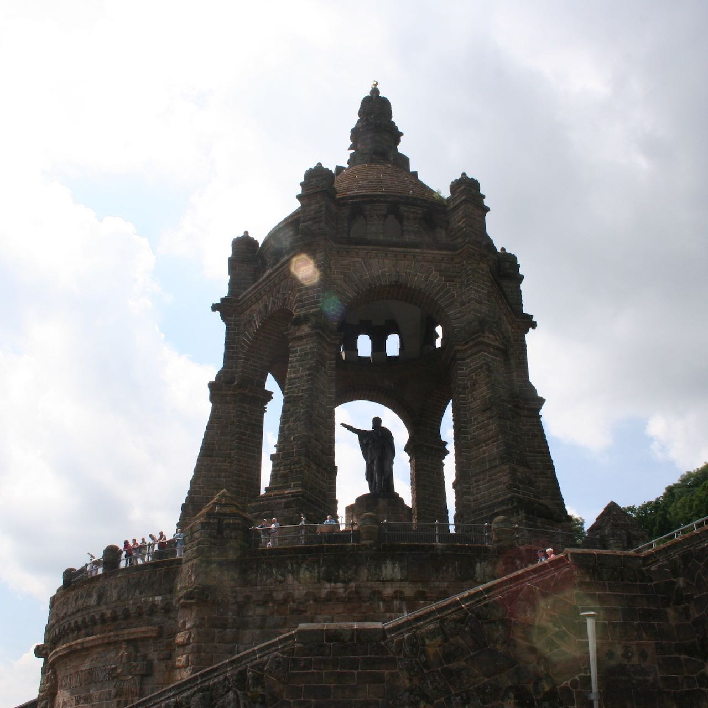

**INTRODUCTION: IT STARTED WITH SANDSTONE**

Sitting atop the Wittekindsberg hill in the town of Porta Westfalica, in North Rhine-Westphalia, Germany, is a massive monument to an equally massive historical figure of nineteenth-century Germany. Built from 1892-1896, a large bronze statue of William I stands within a gazebo made from sandstone taken from the very hill upon which it rests. Dedicated to the memory of *Wilhelm dem Grossen*, this monument stands for some today as a symbol of German unity. Remnants of an even more recent, yet more divisive German past exist entombed under the monument.

Mining during the nineteenth century left large, open mines in the Wittekindsberg and Jakobsberg hills which are situated on opposite banks of the Weser River from one another. Virtually unused throughout the early twentieth century, the mines found use again in the final years of World War II. Beginning in 1942, concerted efforts were made by the German government to protect the increasingly targeted aircraft industry, and later oil and fuel refineries, by relocating factories to physically separate locations, and in some cases into underground facilities. Forced laborers from nearby concentration camps supplied the labor to convert existing mines into factories or carve new workspaces from the cold, unforgiving stone. One such project was located in the unused mines in Porta Westfalica’s hills, with labor supplied mainly by the inmates from the Neuengamme Concentration Camp near Hamburg and POWs from Russia and Poland. Stone once used to commemorate and memorialize the unification of fragmented German kingdoms was now discarded in favor of the underground space; just as the lives and humanity of inmates was discarded for the labor they could provide.

*Figure i.1. The Kaiser Wilhelm Denkmal, 2013. Photo by the author.*

This dissertation is unique in providing a deep description and analysis of a heretofore understudied underground factory and labor camp in Nazi-era Porta Westfalica. Nearly all scholarly narratives about the numerous underground dispersal and relocation projects throughout Germany, France, Austria, Poland and the present day Czech Republic are written in German. To date, there are only two publications written in English.[1] Some projects are mentioned briefly in several books, most notably those detailing the history of a particular business that was scheduled to move to underground facilities.[2] These works deal with the underground dispersal and relocation projects from both the Nazi as well as a business perspective, but mainly focus on the history of the business and only tangentially narrate the history of the forced laborers. This research increases the English scholarship relating to the history of underground relocation projects by uncovering the history of the businesses and factories that were relocated to Porta Westfalica’s underground space, and the concentration camp inmates used as force labor to supply the work of converting mines to factory space and work the machinery in the factories.

Secondly, interviews from over thirty former forced laborers describe the inhumane treatment and unhygienic living conditions that male and female prisoners endured, and the work in the mines and the living conditions at the camps. This research reveals the conditions prisoners from many European nations faced as force laborers, and adds to a large body of Holocaust research which increases understanding of what life was like in forced labor camps. A comparative study of the interviews and reports from men and women survivors of Porta Westfalica’s labor camps shows the gendered way in which camp and work life were remembered, and makes the argument that male survivors focused more on the work and violent aspects of camp life, and female survivors focused more on work and descriptions of the camp and Porta Westfalica.

Finally, the research materials, the primary and secondary sources, as well as the scholarly writing process, are open to the public through the use of an online repository and scholarly website. Primary sources are reproduced in digital format, made available on the website, and are referenced with HTTP hyperlinks in the footnotes. It is believed that better research is created when the process of research and analysis and the sources upon which that research is based are open, available, and actively collaborated on.

**Historiography**

**Works about German Businesses**

There are a plethora of works detailing the history of German economy and businesses in Nazi Germany, which provide needed context and understanding about the German economy, issues faced, and options available to German businesses throughout the war.[3] This research uses such works to understand the need for and decisions of businesses and the Nazi government to disperse factories into caves, tunnels, and mines. Neil Gregor’s work on Daimler-Benz provides an example discussing the reasons why a company such as Daimler-Benz would consider dispersing and relocating factories in the first place, let alone to underground locations.

Personal accounts from businessmen, civilian workers, or government officers directly associated with the projects at Porta Westfalica were not uncovered during this research, so details of the technical and bureaucratic involvement of businesses, factories, and civilian workers are supplied by government and post-war military documents. Some insight is gained through survivor accounts that recall specific individuals and organizations. This research would be greatly benefitted with a more in-depth look at the business leaders, companies, and civilian workers that were relocated to and worked in the underground spaces at Porta Westfalica.

**Works About Dispersal Projects**

A growing number of research exists about individual underground dispersal and relocation projects. Of nineteen known works specifically about an underground relocation project, only two are in English.[4] Notable are the works by Jens-Christain Wagner, director of the Mittelbau-Dora Concentration Camp Memorial, Bertrand Perz, Rainer Fröbe, and Christine Glauning. Many more works exist in Polish, French and Czech, but due to lack of knowledge of these languages and time constraints, these books can only be mentioned, and their research left uncovered. Most of these works include a short synopsis of the Nazi organizations and German businesses that were involved in the respective project, but don’t fully explain the relationship between the various government groups that held interest in and developed plans to move factories underground.

Daniel Uziel’s recent work, *Arming the Luftwaffe: The German Aviation Industry in World War II*, finishes where an earlier work of almost the same name left off (Edward Homze’s, *Arming the Luftwaffe: The Reich Air Ministry and the German Aircraft Industry, 1919-39*), and includes the first work in English to describe and present the government involvement with the underground projects as a whole. The Luftwaffe was intimately involved in the building of underground factories, not only because they participated in the organization, staffing and oversight of many of the projects, but because their airplanes, fuel, and spare parts were to be built there. Uziel describes with clarity the often confusing national organizational structure that existed in order to move airplane manufacturing to underground locations.[5] Using sources from the *Bundesarchiv* as well as captured documents in the US National Archives, Uziel is able to piece together the many issues between the competing interest groups between Göring, Speer and Himmler, which resulted in the formation of the Jägerstab, a short-term committee which included a combination of efforts by the Reich Air Ministry and the Reich Ministry for Armaments and War Production to increase production and relocate factories to underground locations bypassing bureaucratic red-tape by allowing their orders to go through immediately. While Uriel’s work limits the discussion of projects to those central to Luftwaffe concerns, it provides an excellent foundation for understanding the political and business aspects of underground relocation projects.

Of the two English works on underground factories, Claus Reuter’s, *Reimahg, from Sandpit to Armament Factory: History of Hitler’s Secret Underground Factory: with a Short History of the Me 262 and Fw 190*, is the oldest, but is poorly written.[6] The book seems to consist of a jumble of thoughts, rather than a coherent narrative on the underground project, includes many grammatically incorrect sentences, and a few sentiments that show presentism. Reuter also is unnecessarily negative towards other historians and their methodology and results.

A more scholarly work in English is the book *St. Georgen - Gusen - Mauthausen: Concentration Camp Mauthausen Reconsidered*, authored by Rudolf Haunschmied, Jan-Ruth Mills, and Siegi Witzany-Durda, a survivor of the forced labor camp.[7] This work takes a much more objective historical approach in the research and includes numerous sources previously unpublished. Along with narrating the history of the concentration camp and projects at Gusen, Austria and the relationship to the more well known Mauthausen, the authors argue that the concentration camp at Gusen was in fact larger than the project at Mauthausen, and was an independent camp, not a sub-camp of the St. Georgen-Gusen-Mauthausen complex, as was previously understood. By uncovering the true nature of the Gusen camp, the authors hope to fill in aspects of the still incomplete historical narrative and provide a groundwork for future historians to more easily understand the “function and operation of Concentration Camp ‘Mauthausen’ as the trifurcated system of the two concentration camps at Gusen and Mauthausen with infrastructure and administrational headquarters at St. Georgen/Gusen.”[8] The work also deciphers the many complex code names that were used to keep the project secret from the public and the enemy during the war which now may confuse those researching the projects.

One argument that the authors make early on, is that the use of forced laborers served the dual and complimentary purpose of ridding the Nazi party of political enemies and what they believed to be racially impure people while simultaneously rebuilding the physical world to their design. In the early days after the Anschluss in Austria, write the authors, Himmler was already making visits to project sites in Mauthausen and Gusen to assess the availability, quality, and quantity of resources (stone, sand, space for laborers) to enact the already long held business and building plans of the Waffen SS. Relying on works by Jochen Thies and Michael Thad Allen, the authors show that plans to remake and redevelop several cities in the Reich were in place as early as 1925, and that business and economics were as much a part of the decision to enslave political dissidents and the “racially impure” as was the desire to simply remove them from the world.[9] They argue that the Final Solution was based on an economic reconstruction plan for the Third Reich, as much as it was based on anti-Semitic and racial beliefs. The authors argue that racial ideology provided the (warped) logic to satisfy the need by claiming a large portion of the European population as less than human, and therefore appropriate for enslavement, thus providing a large and relatively free labor source.[10]

Regardless of the possible reasons for using forced labor, the authors desire to show that killing inmates was still a goal of the SS, as seen in the multiple acts of senseless beatings, malnourishment, brutal working and living conditions, and every opportunity taken by SS guards to shoot concentration camp inmates.[11] As an ultimate goal, this book brings to light the experience of thousands of individuals who were killed by exhaustion, disease and starvation at the Gusen Concentration Camp.

An unconventional source for historical works about underground factories is found on the World Wide Web. In particular, this research notes four websites with content specifically relating to the tunnel projects at Porta Westfalica.[12] Many other websites provide information regarding other dispersal projects, and were created by individuals and groups at an amateur level, as well as professional sites run by memorial groups located at project sites. Pages on city and county websites that address their history of concentration camps and tunnel sites are also of interest.[13]

**Works about Porta Westfalica**

Only four scholarly works have been written or published about the dispersal project and forced labor camps at Porta Westfalica. A dissertation in 1984 written by Reinhold Blanke-Bohne at the University of Bremen, *Die unterirdische Verlagerung von Rüstungsbetrieben und die Außenlager des KZ Neuengamme in Porta Westfalica bei Minden*, is the most extensive and most thoroughly researched. Blanke-Bohne’s dissertation provides a scaffold upon which the chapter describing the creation of the tunnel project at Porta Westfalica is built. A 2006 masters thesis by Thomas Lange also exists.[14]

Several book chapters exist and focus on the forced laborers in the Porta Westfalica camps. Rainer Fröbe, a historian in Hannover, has extensive knowledge of the camps and factories that were at Porta Westfalica, and has published books and book chapters relating to concentration camps in North Rhine-Westphalia and Lower Saxony.[15] A chapter from a book edited by Jan Erik Schulte includes a chapter by the author about the concentration camps at Porta Westfalica.[16] Excerpts from an as-yet-unfinished dissertation by Jens-Christian Hansen, are published in a Danish book, and detail the camp for men in the Hotel Kaiserhof in Barkhausen.[17]

Books by Jochen Bergmann, are written with the intent to prove that the projects at Porta Westfalica were involved in creating atomic weapons, and perpetual energy devices, and are therefore only tangentially important. The only real scholarly benefit of Bergmann’s books are the color photographs of the tunnel systems which he visited in the 1980s.[18]

**Works by Survivors**

A large and ever growing bibliography on the lives and experiences of those who suffered through the Holocaust currently exists. Because study and training in the nuances of Holocaust research has not been done, this work does not seek to be a Holocaust study, but rather more a social and technical history of the underground factories and the labor force used to create the work spaces. Memoirs and interviews of concentration camp members are used to present the view of the forced laborers.

Several books written by survivors of the concentration camps at Porta Westfalica are used in this research. *“Das Leben ist schön!”: Uberlebensstrategien eines Häftlings im KZ Porta* by Pierre Bleton, provides the earliest published account of inmate life in Porta’s concentration camp. The first and most immediate benefit of this work is the very brief, introductory explanation of the camps and tunnel projects at Porta Westfalica, which describe the location of the concentration camps and project sites, the type of work carried out by the laborers, the number of inmates, and the companies that were supposed to occupy the underground factories when completed. This memoir of Pierre Bleton is an extraction and translation from Bleton’s complete memoir in French, which covers his entire experiences in the various concentration camps throughout the war.

*“Das Leben ist schön!”: Uberlebensstrategien eines Häftlings im KZ Porta* was the product of seven students and their teacher at the Municipal High School Porta Westfalica as an entry in the national school competition for civic education. Work on the text was followed by articles in the local newspaper to bring attention to the experiences of the concentration camp inmates, and the organization of a seminar that included Hermann Langbein, a fellow prisoner and prolific writer of his experiences, as guest. They also confronted the local government to be more proactive in accepting their city’s heritage with the creation of an informative brochure about the camps and inmates, a section of which was to include an excerpt from Pierre Bleton’s memoir, for the city to distribute.

After translations of Bleton’s memoir for the brochure returned an unexpected “irritatingly optimistic” outlook on his experiences, the students felt that the text did not deserve to be shrunk to eight pages of a small brochure. They therefore proceeded to raise funds to turn the translation, with accompanying review of the memoir by historian Rainer Fröbe, into the present book. In a very mature realization of their generations role in coming to terms with their heritage, these young adults wrote how this work had changed their lives.

> Why did we engage in the Nazi past, here and elsewhere, for one and a half years? Perhaps out of fear of repeating the past? Or out of uneasiness caused by confronting the question of how we might have behaved at that time? Don’t we act just as cowardly in similar, seemingly innocent situations? None of us has the right to claim he would have acted differently than the majority of the population—namely, do nothing! If we can’t be sure that we would have acted differently, we can’t be sure of a repetition, then for the sake of the future we must deal with this past.[19]

In practical terms, the students determined that they could not, sit idly by when comments were made about the “merits” of the Nazi regime, or, as one student experienced, allow students to go unchallenged when saying that a disabled student should be “gassed.” The students changed through this experience; they became more aware, even hypersensitive to their national past and the issues involved in living with that past. Can a society, they ask, become too cautious of the adaptation of small but unnecessary restrictions of freedom and responsibility, to adapting to “immutable constraints” and to silence? *“Das Leben ist schön”* is a valuable book for the remembrances of a survivor, the critical analysis of the memories by Rainer Fröbe and the insights gained through the group of students who organized the publication of this work.

*Survival in the Organization: Gunnar Hjelholt Looks Back at the Concentration Camp from an Organizational Perspective*, by Benedicte Madsen and Søren Willert is a book about the remembrances of psychologist Gunnar Hjelholt who survived the labor camp at Porta Westfalica and his thoughts on the concentration camp system as an organization from the viewpoint of an applied social psychologist.[20] It is light in the sense that the issues and events are not discussed or probed in any real depth. In interview format, the authors pose questions, and Hjelholt’s responses are given. No further inquiry or explanation is given on most accounts. Not intending to be a scholarly treatise on the Nazi concentration camp organization, the book only briefly touches on Hjelholt’s professional knowledge of the psychology of large groups and systems. In only a few short paragraphs do we see Hjelholt’s analysis of the Nazi concentration camps as a system, and that only to say that, all inhumanity aside, it was a nearly perfect system of organization in that the members regulated themselves. “The concentration camp system is clear, transparent, and effective,” Hjelholt explained. “It controls itself using the oppositions found between the various groups, vertically and horizontally in the system. Every position is connected to privileges.”[21] The inmates themselves were the ones who enforced the rules of the system. The opposition between national groups within the inmates and between the inmates and their captors kept the system stable and productive. This small book (really more like a transcript of an interview through letters) provides more questions than answers, and simply exists as a brief glimpse or gateway into the deeper philosophical and psychological discussions that could be had about the organizational structure of concentration camps under the Nazi regime.

More recent works by survivors have been published including *Auswanderung vorläufig nicht möglich: die Geschichte der Familie Herskovits aus Hannover* by Ruth Herskovits-Gutmann which includes only a few memories about her time in Prota Westfalica, *Anus mundi: fünf Jahre Auschwitz* by Wieslaw Kielar, and *Resistance Fighter: A Personal History of the Danish Resistance Movement, 1940-1945* by Jørgen Kieler.[22] This dissertation also utilizes the written transcripts from interviews and government questionnaires which have not been utilized in other research nor published.[23]

**Works on Digital History**

Digital history is still in a nascent form, yet several books have been written to address the issues and options available for doing history in a digital age.[24] This research makes use of the knowledge these and other works provide, and is presented as an example of how to write and present history using digital tools. Foundational books, like Cohen and Rosenzweig for putting historical content on the World Wide Web, and Gitelman for arguing that questions about how to use new media are answered in the ways old media was adopted, are supplemented by a plethora of articles and blog posts. The number of influential scholars who elaborate, debate, argue for and against, and think about and share digital humanities, and even digital history specifically, are too numerous to mention. They have in many ways influenced this research, most specifically in opening new paths for visualization, representation, quantifying and exploration what is possible outside of a traditional text monograph.

**Methodology**

**Memory**

Dealing with memory is an important aspect of historical research. Many historians have and continually grapple with the issues inherent with historical research and memory. When dealing with Germany’s past and the Holocaust, memory becomes even more contentious. Works by Saul Friedländer, Rudy Koshar, Alon Confino and others define how this research approaches the use of survivor accounts.[25]

Three chapters of this work are based on memoirs, interviews, and written reports of survivors. They utilize the memory of the survivors to reconstruct a representation of life as an inmate in the Porta Westfalica camps, and the work done in the factories and mines. Glaringly absent from this reconstruction are memories of German civilians, civilian workers, and German guards, because so few records exist from those who lived in this time and place, even from survivors of forced labor.

This work uses several methodologies typical of historical work, but also seeks to incorporate ideas from different fields such as geography and the computer sciences. This research takes the approach of a micro-history to illuminate Germany’s use of underground relocation projects. It would be much too big a project to catalog and narrate in any meaningful detail all of the more than thirty underground dispersal projects undertaken by the Waffen SS and the Jägerstab and Geilenbergstab, let alone the many other similar projects not controlled by this branch of the Nazis. Of necessity, then, this research focuses on one single project in Porta Westfalica.

**Visualizations**

Usage of graphs and maps enhance the understanding of gender differences between how male and female survivors recalled their experiences in Porta Westfalica. It is hoped that through this use of technology, the project shows how our understanding of the past is augmented and enhanced by forms of new media in that new ways of looking at data require historians to ask different questions and perhaps come to different conclusions. Information about the digital aspects of the project, including analytical and scholarly writing, as well as digitized source materials, are available at http://nazitunnels.org/.

What does new media and digitization provide to historical research? Does it enhance or provide a different experience, or way to research that wasn’t there before? Some historians, such as David Staley, argue that history can and should be told through other mediums besides linear sequential text. Just as the vibrations of sound are altered depending on what medium they travel through (air, water, wood, etc), the result of putting history through a different media would produce a different way of understanding that history.[26] Most historians, insist Staley, use computers “to laterally transfer textual culture from paper to screen.” This, he says, is like using a car only to park.

Other sciences, like architects, use computers not to show pictures of their buildings as a two dimensional blue print, but to design and create multiple levels of abstraction for understanding and developing a building.[27] They use the technology of the computer to enhance and understand their plans in new and different ways. Images or diagrams can represent data, history, and information in different and sometimes better ways than just words. Images and diagrams enhance the analysis and provide information in much quicker and in more succinct ways.[28] The old adage that a picture is worth a thousand words is applicable to historical research. “Where writing emphasizes sequence, unidimensionality, and linear chains,” argues Staley, “visualization enables simultaneity, structure, and association.”[29] When viewing a diagram or image, the observer is able to comprehend multiple scenarios, time frames, and associations. With text, each explanation must be taken in one section at a time. Visuals, as it were, allow the observer to process multiple paragraphs in one glance.

In a recent blog post, historian Fred Gibbs noted the need for historians (and humanities scholars in general) to be conversant and critical of visualizations. Visualizations are increasingly computed, not just designed, and as such have inherent arguments. These nuances of visualizations need to be recognized and addressed by the creators (historians and other humanities scholars) and understood and critiqued by the consumers (other scholars). “Visual criticism is not a digital \[humanities\] problem, it is a \[humanities\] problem.”[30] In other words, Gibbs believes that it is incumbent on all humanities scholars to familiarize themselves just as much with the nuances and scholarly arguments that can be made with visualizations as they currently are with written text. Too often charts and graphs are taken at face value at the peril of scrutinizing the data behind the visualization, or even how the data was gathered. How the code is written that generates the visualization, the color scheme, the size and shape of the representations all have inherit arguments that should be learned in order to be critiqued. For example, displaying a map of a location may seem innocuous, but the type of map in itself has a built-in bias; the map is most likely based off a Western ideological way of thinking about space and representation.

Maps also provide a metaphor for thinking differently about history, as well as furnish historians with an alternative to the textual narrative. Geography professor John Pickles, in his work *A History of Spaces*, describes the many different levels with which to use maps. While speaking to geographers, his remarks show how historians can view and interpret maps in unique ways. “At one level, the map and the mapping exercise can be seen as the careful scaling and coding of worldly objects and spaces for particular purposes,” states Pickles, “the topographic map enables accurate assay of and navigation through the landscape; the geological map identifies regions of similar surface and subsurface rock, along with boundary features such as faults and fracture zones; the architectural plan identifies the inner and outer spaces of built objects to guide the builder, lawyer and owner; and the street map identifies property boundaries, public infrastructure and official names for buildings, streets, and public and some private spaces.”[31] When this information is viewed in relation with time, it becomes valuable for those who study the past. Indeed, Pickles shows that maps form a way to see what is important and unimportant to the cartographer during that time. Just as historians must decide what information is most important to include in their writings, a cartographer must decide what icons and information, what lines and spaces, are most important to his or her story.

What is historical writing but attempting to recreate past realities with words? Cartography is very similar. Cartographers try to recreate reality through symbols; lines, shapes and images. It is interesting to note that the history profession was not included in Pickle’s list of fields that are increasingly seeing the importance of maps in their study. Maps provide a “new analytics and a new view of modeling reality.” He continues, “It is comparatively easy to visualize maps as representation models of the real world, but it is important to realize that they are also conceptual models containing the essence of some generalization about reality. In that role, maps are useful analytical tools which help investigators to see the real world in a new light, or even to allow them an entirely new view of reality.”[32] Writing history is precisely what Pickles defines as maps, albeit historians seek to simulate a past reality. Maps can provide, just as they do for cartographers, an analytical tool for seeing past realities in a new light. One way maps help shed this new light is by allowing historians to discover new relationships.[33]

This research makes use of visuals in the form of charts, diagrams and maps. Maps in chapter four compare two possible marches made by female prisoners on their way to Porta Westfalica. They provide a visual and more impactful display of distance traveled than mere numbers or words in text. Charts in chapter five allow for a much easier way to compare the accounts of events and locations within the camps. Specifically, the charts and scatter plot showed a difference in how men and women looked at their experiences by their focus on events. More importantly, the charts and the data that forms these charts is available for critique via an open and accessible website.[34]

**Open Source History**

Our modern society benefits from the results of the Open Source software community (much of the Internet and smart phone software runs on Open Source software), where the underlying code is available for all to see, use, redistribute, and improve upon. Historical scholarship can benefit from a similar open model. Two supporting aspects, two sides of the same coin, seem to make an Open Source project successful; availability and collaboration. The code must be available for others to work with it, and improvement happens when many people work on the same code. The same two aspects are critical for open scholarly work. This project will focus on only one side of the coin, making the resources and research available. All of the research and resources used in this research are made available at an accompanying website and online repository. To facilitate the link between the work and the sources, all footnotes that reference a primary source contain an HTTP link to the corresponding primary source in the online repository. Research and analysis are improved when other researchers can see the source of arguments and information and provide corroboration or contradiction. Making the sources available online and providing a link to the sources eliminates the need for collaborators to do much of the time and labor intensive work of locating the primary source for themselves, a process that often discourages fellow researchers to cross check the original argument. This dissertation stands as an example of a new model of scholarship, with open and available sources, and argues the value of an open source model of scholarship.

An excellent example of open historical research is found in online discussion forums; usually created by enthusiastic individuals who have an interest in World War II history. The process of doing history, piecing together a narrative of the past from facts found in documents, is seen on such forums. On one such forum, hosted at [axishistory.com](http://axishistory.com/), has very thoughtful and academic discussions. A discussion board dedicated to uncovering the effects of area bombing in Germany prior to 1944 provides such an example. Forum users fill eight pages, containing 115 posts of discussion, to debate whether the allied bombings had any effect on German war production prior to 1944.[35] As is usually the case in such open online forums, the discussions are littered with concrete evidence and fact based arguments, but also include nitpicking about semantics and petty passionate personal attacks against perceived opponents. These discussions show that the history being researched is relevant to modern times and to a wider audience than the academic scholar. While not extensively used in this work, there are at least six websites which focus on the underground factories at Porta Westfalica.[36]

**Sources**

This research builds a narrative based on primary documents found in the Provincial Archives of North Rhine-Westfalia Department of East Westphalia-Lippe in Detmold, and transcripts from interviews of twenty-one survivors found in the Neuengamme Concentration Camp Memorial Archive and the USC Shoah Foundation interview repository, as well as military and civil records from the National Archives in Berlin-Lichterfelde, the municipal archives in Minden, the National Archives in Great Britain, and the National Archives in the United States.

Major support for this research came from a generous Hunt Fellowship from the American Council on Germany, which funded a successful research trip to Germany during the summer of 2013. Unfortunately, this trip was limited to only 28 days. A final research trip was funded by the University of Virginia Library in May 2015 to present preliminary research on the inmates in Porta Westfalica at an event commemorating the 70-year anniversary of the end of the war. Vital connections were made with fellow researchers, descendants of survivors, and even eye witnesses to the atrocities of 1944-45. This visit was pivotal in order to gain a greater understanding of the scope and organization of the Nazi project to move factories underground. The incompleteness of this research is acknowledged, compared to what could have been accomplished about this topic. As all research in effect is, this is an incomplete history, but it is the history that can be written with the sources and time available. This work functions more like the sketch of a single branch from a tree, rather than a detail of every branch and leaf, and will serve as a structure or framework upon which to construct a more accurate account, hopefully in collaboration with other interested scholars and individuals. The limitations and exclusions of this work are acknowledged.

**Chapter Outlines**

Chapter one discusses the wartime events and government decisions that led to the use of underground relocation programs. This chapter relies heavily on secondary sources for describing the wartime bombing practices leading to Big Week in February 1944, which became a pivotal turning point in German strategy, and the Nazi response to Big Week as they moved from an offensive military position to a decided defensive reactionary position. The different options considered and used for protecting German factories from Allied bombing are also briefly discussed in this chapter. This chapter ends with a look at the use of forced labor in Germany, again relying on secondary material to layout some of the events and decisions made by Nazi leadership that lead to the creation of the underground factories at Porta Westfalica, the concentration camps constructed nearby, and use of concentration camp prisoners for labor. While not original in research, this chapter provides essential background for understanding the reasoning behind support for the underground relocation programs.

Chapter two moves the research from the secondary to the primary sources surrounding the businesses and physical aspects of the underground spaces at Porta Westfalica. This chapter relies mainly on two documents created shortly after the war by the United States Strategic Bombing Survey and the Combined Intelligence Objectives Sub-Committee. Official records from the businesses and the German government were either destroyed as the Allied forces approached the area, or remain undiscovered in unknown repositories or locations. This chapter begins by describing the landscape of underground relocation projects concurrently being developed with the projects at Porta Westfalica and then moves to a detailed description of the technical aspects of Porta Westfalica’s three underground factory systems.

Chapter three focuses on the experiences of the men who worked predominantly in the Dachs I system and were imprisoned at the Kaiserhof Hotel in Barkhausen (a district of present day Porta Westfalica), and near the entrances to the tunnels. This chapter utilizes experiences from survivors to piece together the prisoner hierarchy, the life as a forced laborer, and the work, camp life, acts of violence, deaths, and mental and physical health of the prisoners.

Chapter four relates the experiences of the women prisoners who were encamped either in Hausberge or inside the Hammerwerke underground systems, and worked exclusively in the Hammerwerke factories. This chapter also relies on survivor testimonies taken during interviews in the 1990s, and a few legal depositions written shortly after the war in 1945.

Chapter five looks at the geo-spatial elements embedded within the interviews and testimonials of the men and women survivors. Focusing on the places mentioned by survivors exposes not only the places and events most mentioned, but also a distinct gender difference in the types of places and events that were recalled.

The dissertation ends with a short epilogue to the inmates and to the town of Porta Westfalica as the Allied forces advanced on the town in April 1945, and the fate of the tunnels since the end of the war. In several of the interviews survivors contemplate the lessons that they have learned and hope that others learn from their experiences. These reflections, combined with thoughts while discussing the role of monuments and commemorative museums and archives with Dr. Jens-Christian Wagner from the Mittelbau-Dora Concentration Camp Memorial Archive provide a context to place the role of this study in a larger German and global history.

[1] Rudolf A. Haunschmied, Jan-Ruth Mills, and Siegi Witzany-Durda, *St. Georgen - Gusen - Mauthausen: Concentration Camp Mauthausen Reconsidered* (BoD – Books on Demand, 2007). and Claus Reuter, *Reimahg, from Sandpit to Armament Factory : History of Hitler’s Secret Underground Factory : With a Short History of the Me 262 and Fw 190* (S.l.: s.n., 1998).

[2] Just a few examples: Bernard P Bellon, *Mercedes in Peace and War: German Automobile Workers, 1903- 1945* (New York: Columbia University Press, 1990); Edwin Black, *IBM and the Holocaust: The Strategic Alliance Between Nazi Germany and America’s Most Powerful Corporation*, 1st ed (New York: Crown Publishers, 2001); Neil Gregor, *Daimler-Benz in the Third Reich* (New Haven, CT: Yale University Press, 1998); Peter Hayes, *Industry and Ideology: IG Farben in the Nazi Era* (Cambridge \[Cambridgeshire\]: Cambridge University Press, 1987); Diarmuid Jeffreys, *Hell’s Cartel: IG Farben and the Making of Hitler’s War Machine* (New York, NY: Metropolitan Books/ Henry Holt, 2010); Hans Pohl, *Die Daimler-Benz AG in Den Jahren 1933 Bis 1945: Eine Dokumentation* (Stuttgart: Franz Steiner Verlag Wiesbaden, 1986); Henry Ashby Turner, *General Motors and the Nazis: The Struggle for Control of Opel, Europe’s Biggest Carmaker* (New Haven: Yale University Press, 2005).

[3] Just a few are listed here. Michael Thad Allen, “The Banality of Evil Reconsidered: SS Mid-Level Managers of Extermination through Work,” *Central European History* 30, no. 2 (1997): 253–94; Michael Thad Allen, *The Business of Genocide: The SS, Slave Labor, and the Concentration Camps* (Chapel Hill, N.C: University of North Carolina Press, 2002); Bellon, *Mercedes in Peace and War*; A. R. L Gurland, *The Fate of Small Business in Nazi Germany* (New York: H. Fertig, 1975); Jeffreys, *Hell’s Cartel*; Francis R Nicosia and Jonathan Huener, *Business and Industry in Nazi Germany* (New York: Berghahn Books, 2004).

[4] Alfons Baier and Dieter Freitag, “Das ‘Doggerwerk’ bei Happurg (Nürnberger Land): zur Geschichte und Geologie einer unterirdischen Rüstungsfabrik,” 1996; Marc Bartuschka, *Unter Zurückstellung aller möglichen Bedenken : Die NS-Betriebsgruppe “Reichsmarschall Hermann Göring”; (REIMAHG) und der Zwangsarbeitereinsatz 1944/1945* (Göttingen, Niedersachs: Wallstein, 2011); Florian Freund, *Arbeitslager Zement. Das Konzentrationslager Ebensee Und Die Raketenrüstung.* (Wien, 1989); Christine Glauning, *Entgrenzung Und KZ-System: Das Unternehmen “Wüste” Und Das Konzentrationslager in Bisingen 1944/45*, Reihe Geschichte Der Konzentrationslager 1933-1945, Bd. 7 (Berlin: Metropol, 2006); Markus Gleichmann and Karl-Heinz Bock, *Düsenjäger über dem Walpersberg : die Geschichte des unterirdischen Flugzeugwerkes “REIMAHG” bei Kahla/Thüringen : \[ein Buch zur Geschichte des Freistaates Thüringen und des Zweiten Weltkrieges\]* (Zella-Mehlis: Heinrich-Jung-Verlagsgesellschaft, 2009); Haunschmied, Mills, and Witzany-Durda, *St. Georgen - Gusen - Mauthausen*; Jiří Křivský, *Richard - Unterirdische Fabrik Und Konzentrationslager Bei Litoměřice : Mahnmal Terezín* (Terezín: Památník Terezín, 1967); Tobias Markowitsch and Kattrin Zwick, *Goldfisch und Zebra: die Geschichte des Konzentrationslagers Neckarelz-Aussenkommando des KZ Natzweiler-Struthof* (St. Ingbert: Röhrig, 2011); Klaus W Muller, *Deckname Lachs: Die Geschichte Der Unterirdischen Fertigung Der Me 262 Im Walpersberg Bei Kahla 1944-45*, 2. uberarbeitete Aufl (Heinrich-Jung-Verlagsgesellschaft, 1995); Norbert Ortgies and Ursula Wilm-Chemnitz, *Tage im Tunnel (German Edition)* (Books On Demand, 2001); Bertrand Perz, *Projekt Quarz: Steyr-Daimler-Puch Und Das Konzentrationslager Melk*, Industrie, Zwangsarbeit Und Konzentrationslager in Österreich (Wien: Verlag für Gesellschaftskritik, 1991); Reuter, *Reimahg, from Sandpit to Armament Factory*; Jens-Christian Wagner, *Produktion Des Todes: Das KZ Mittelbau-Dora* (Göttingen: Wallstein, 2001).

[5] Daniel Uziel, *Arming the Luftwaffe: The German Aviation Industry in World War II* (McFarland, 2011), see pages 74–84 for the creation of different offices, and 120–125 about offices specific to underground relocation.

[6] Reuter, *Reimahg, from Sandpit to Armament Factory*.

[7] Haunschmied, Mills, and Witzany-Durda, *St. Georgen - Gusen - Mauthausen*.

[8] Ibid., 14.

[9] Ibid., 45–48.

[10] Ibid., 47.

[11] Ibid., 49.

[12] http://www.u-verlagerungen.portaforum.de/index.html, http://forum.portaforum.de/, http://www.porta.bergmann82.de/, http://www.gedenkstaette-porta.de

[13] The following is a list of websites that range in quality from personal pages to professional memorial locations. All sites were active as of March 4, 2016. http://www.schlier.at/arge-schlier\_004.htm, http://www.ddahlke.de/reportagen/porta.html, http://forum.axishistory.com/, http://home.arcor.de/denkmalstollen/home.htm, http://www.porta.bergmann82.de/, http://www.u-verlagerungen.portaforum.de/index.html, http://ecc.pima.edu/~gusen/, http://www.halberstadt.de/de/gedenkstaette-langenstein-zwieberge.html, http://www.geheimprojekte.at/, http://www.untertage-übertage.de/, http://www.7grad.org/index.html, http://www.dora.de/, http://www.kz-denk-neckarelz.de/00a\_goldfi/goldfisch.htm, http://www.gusen.org/, http://mauthausen-memorial.at/, http://www.thirdreichruins.com/, http://www.monument-mauthausen.org/Accueil.html, http://forum.portaforum.de/, http://www.team-bunkersachsen.de/, http://www.unterirdisch-forum.de/forum/index.php, https://de.wikipedia.org/w/index.php?title=U-Verlagerung&oldid=146538804, http://www.kz-gedenkstaette-neuengamme.de/

[14] Thomas Friedrich Lange, “Die Konzentrationslager an der Porta Westfalica” (Masters Thesis, University of Hannover, 2006), KZ-Gedenkstätte Neuengamme (Hamburg). Thanks to Thomas Lange for the nice copy of the thesis.

[15] Pierre Bleton et al., *“Das Leben ist schön!”: Uberlebensstrategien eines Häftlings im KZ Porta* (Bielefeld: AJZ Verlag, 1987); Rainer Fröbe, “Die Organisation des Einsatzes von KZ-Häftlingen bei Bauvorhaben der Amtgruppe C des SS-WVHA (Kammler-Stab) am Beispiel Porta Westfalica,” February 1984, Ng 6.4.67, KZ-Gedenkstätte Neuengamme (Hamburg); Rainer Fröbe, *“Vernichtung durch Arbeit”?: KZ-Häftlinge in Rüstungsbetrieben an der Porta Westfalica in den letzten Monaten des Zweiten Weltkriegs* (\[Bielefeld\]: AJZ, 1986); Rainer Fröbe, *Der Arbeitseinsatz von KZ-Häftlingen und die Perspektive der Industrie, 1943-1945.* (Hamburg: VSA-Verlag, 1991); Joachim Meynert and Arno Klönne, *Verdrängte Geschichte: Verfolgung und Vernichtung in Ostwestfalen 1933-1945* (Bielefeld: AJZ, 1986).

[16] Jan Erik Schulte, ed., *Konzentrationslager im Rheinland und in Westfalen 1933-1945. Zwischen zentraler Steuerung und regionaler Initiative*, Auflage: 1., Aufl. (Paderborn: Schöningh Paderborn, 2005).

[17] Therkel Stræde, *De nazistiske koncentrationslejre: studier og bibliografi*, University of Southern Denmark studies in history and social sciences, v. 375 (Odense: Syddansk Universitetsforlag, 2009), http://collections.ushmm.org/search/catalog/bib149834.

[18] Jochen Bergmann, *Porta Westfalica Underground Pictures* (epubli, 2009); Jochen Bergmann, *Der unterirdische Krieg an der Porta Westfalica* (epubli, 2011).

[19] Bleton et al., *Das Leben ist schön!*, 77–78.

[20] Benedicte Madsen and Søren Willert, *Survival in the Organization: Gunnar Hjelholt Looks Back at the Concentration Camp from an Organizational Perspective* (Aarhus \[Denmark\]; Oakville, Conn.: Aarhus University Press, 1996).

[21] Ibid., 86.

[22] Ruth Herskovits-Gutmann, *Auswanderung vorläufig nicht möglich: die Geschichte der Familie Herskovits aus Hannover* (Göttingen: Wallstein, 2002); Wieslaw Kielar, *Anus mundi : fünf Jahre Auschwitz*, Ungekürzte Ausg., 8. Aufl., Fischer Taschenbücher ; (Frankfurt am Main: Fischer, 2001); Jørgen Kieler, *Resistance Fighter: A Personal History of the Danish Resistance Movement, 1940-1945* (Jerusalem, Israel; Lynbrook, NY: Gefen Publishing House, 2007).

[23] L A, “Recollections on the Holocaust - Protocol Nr. 3645,” February 11, 1946, Protocol Nr. 3645, National Committee for Attending Deportees (DEGOB), http://degob.org/index.php?showjk=3645; Dorothy Berliner, USC Shoah Foundation Institute testimony of Dorothy Berliner, September 28, 1995, VHA Interview Code:5075, USC Shoah Foundation Visual History Archive, https://sfi.usc.edu/vha; Elizabeth Berweld, USC Shoah Foundation Institute testimony of Elisabeth Berwald, November 18, 1994, VHA Interview Code:264, USC Shoah Foundation Visual History Archive, https://sfi.usc.edu/vha; Miriam Brach, USC Shoah Foundation Institute testimony of Miriam Brach, January 17, 1996, VHA Interview Code:10935, USC Shoah Foundation Visual History Archive, https://sfi.usc.edu/vha; Leny Bromet, USC Shoah Foundation Institute testimony of Leny Bromet, digital audio, March 1, 1995, VHA Interview Code:1183, USC Shoah Foundation Visual History Archive, https://sfi.usc.edu/vha; Susanne Burton, USC Shoah Foundation Institute testimony of Susanne Burton, digital audio, August 13, 1996, VHA Interview Code:18472, USC Shoah Foundation Visual History Archive, https://sfi.usc.edu/vha; Aage Holger Christensen, “Fragebogen und Bericht von Aage Holger Christensen,” June 6, 1947, Kommunalarchiv der Stadt Minden; Juliette Cronheim, USC Shoah Foundation Institute testimony of Juliette Cronheim, October 19, 1995, VHA Interview Code:5054, USC Shoah Foundation Visual History Archive, https://sfi.usc.edu/vha; Zsuzsa D Farago, Gespräch mit Zsuzsa D Farago am 6.3.1992 in Budapest, Text, March 6, 1992, 1516, Archiv der KZ‑Gedenkstätte Neuengamme; Eva Gescheid, “Protokoll von Eva Gescheid,” July 5, 1945, 301, Archiv der KZ‑Gedenkstätte Neuengamme; Kitty Hart-Moxon, Kitty Hart-Moxon interview with Imperial War Museum, digital audio, April 1996, Imperial War Museum, http://www.iwm.org.uk/collections/item/object/80016100; Kitty Hart-Moxon, USC Shoah Foundation Institute testimony of Kitty Hart-Moxon, June 9, 1998, VHA Interview Code: 45132, USC Shoah Foundation Visual History Archive, https://sfi.usc.edu/vha; Kitty Hart-Moxon, Interview with Kitty Hart-Moxon, audio, 1999, Imperial War Museum, http://www.iwm.org.uk/collections/item/object/80019885; Kaj Björn Karbo, “Fragebogen und Bericht von Kaj Björn Karbo,” June 3, 1947, Kommunalarchiv der Stadt Minden; Jørgen Kieler, “Jørgen Kieler - Grüsse an Porta Westfalica,” March 12, 2011, KZ-Gedenk- und Dokumentationsstätte Porta Westfalica; T. L., Aussage von T. L. January 28, 1945, Amsterdam, Text, January 28, 1947, 539, Archiv der KZ‑Gedenkstätte Neuengamme; Vincent Lind, Interview mit Vincent Lind 24./25.8.91 in Odense, Text, September 24, 1991, 1547, Archiv der KZ‑Gedenkstätte Neuengamme; Ágnes Lukács, *USC Shoah Foundation Institute testimony of Ágnes Lukács*, n.d.; Tobie Markowitz, USC Shoah Foundation Institute testimony of Tobie Markowitz, February 26, 1996, VHA Interview Code: 12456, USC Shoah Foundation Visual History Archive, https://sfi.usc.edu/vha; Ester Ovitz, USC Shoah Foundation Institute testimony of Ester Ovitz, digital audio, March 18, 1998, VHA Interview Code:41976, USC Shoah Foundation Visual History Archive, https://sfi.usc.edu/vha; Györgyné Papp, Gespräch mit Györgyné (Zsuzsa) Papp am 10.3.1992 in Budapest, Text, March 10, 1992, 1574, Archiv der KZ‑Gedenkstätte Neuengamme; Jens Godske Pedersen, “Fragebogen von Jens Godske Pedersen,” June 1947, Kommunalarchiv der Stadt Minden; Charlie Jörgen August Rasmussen, “Bericht von Charlie Jörgen August Rasmussen,” June 6, 1947, Kommunalarchiv der Stadt Minden; Nikolaij Sadowskij, Interview mit Nikolaij Sadowskij am 3.9.1993 in Kiew/Ukraine, Text, September 3, 1993, Archiv der KZ‑Gedenkstätte Neuengamme; Lili Springer, USC Shoah Foundation Institute testimony of Lili Springer, digital audio, November 19, 1996, VHA Interview Code:22910, USC Shoah Foundation Visual History Archive, https://sfi.usc.edu/vha; Erik Sundö, “Bericht von Erik Sundö,” June 4, 1947, Kommunalarchiv der Stadt Minden; Klári Sztehlo, Gespräch mit Klári Sztehlo am 12.3.92 in Budapest, Text, March 12, 1992, 1610, Archiv der KZ‑Gedenkstätte Neuengamme; Carl Wilhelm Taxbro, “Fragebogen von Carl Wilhelm Taxbro,” June 1947, Kommunalarchiv der Stadt Minden; Brakhah Vider, USC Shoah Foundation Institute testimony of Brakhah Vider, April 22, 1999, VHA Interview Code: 49724, USC Shoah Foundation Visual History Archive, https://sfi.usc.edu/vha; Knud Weise, “Fragebogen und Bericht von Knud Weise,” September 14, 1946, Kommunalarchiv der Stadt Minden; Arne Zachariassen, “Auszug aus dem Fragebogen und Persönlicher Bericht von Arne Zachariassen,” June 6, 1947, Kommunalarchiv der Stadt Minden; Dimitrij Iwanowitsch Zwagolskij, “Schreiben von Dimitrij Iwanowitsch Zwagolskij,” January 16, 1999, 1472, Archiv der KZ‑Gedenkstätte Neuengamme.

[24] Christine L Borgman, *Scholarship in the Digital Age: Information, Infrastructure, and the Internet* (Cambridge, Mass: MIT Press, 2007); Daniel J Cohen and Roy Rosenzweig, *Digital History: A Guide to Gathering, Preserving, and Presenting the Past on the Web* (Philadelphia: University of Pennsylvania Press, 2006); Jack Dougherty and Kristen Nawrotzki, “Writing History in the Digital Age,” *Writing History in the Digital Age*, May 22, 2011, http://writinghistory.trincoll.edu/; Lisa Gitelman, *Always Already New: Media, History and the Data of Culture* (Cambridge, Mass: MIT Press, 2006); T. Mills Kelly, *Teaching History in the Digital Age*, 2013, http://hdl.handle.net/2027/spo.12146032.0001.001; Roy Rosenzweig, *Clio Wired: The Future of the Past in the Digital Age* (New York: Columbia University Press, 2011); David J Staley, *Computers, Visualization, and History: How New Technology Will Transform Our Understanding of the Past*, History, Humanities, and New Technology (Armonk, N.Y: M.E. Sharpe, 2003).

[25] Ulrich Baer, “To Give Memory a Place: Holocaust Photography and the Landscape Tradition,” *Representations*, no. 69 (January 1, 2000): 38–62, doi:10.2307/2902900; Alon Confino and Peter Fritzsche, *The Work of Memory: New Directions in the Study of German Society and Culture* (Urbana: University of Illinois Press, 2002); Alon Confino, “Collective Memory and Cultural History: Problems of Method,” *The American Historical Review* 102, no. 5 (1997): 1386–1403, doi:10.2307/2171069; Alon Confino, “Telling about Germany: Narratives of Memory and Culture,” *The Journal of Modern History* 76, no. 2 (2004): 389–416, doi:10.1086/422934; Alon Confino, “Fantasies about the Jews: Cultural Reflections on the Holocaust,” *History and Memory* 17, no. 1–2 (2005): 296–322, doi:10.2979/his.2005.17.1-2.296; Alon Confino, *Germany as a Culture of Remembrance: Promises and Limits of Writing History* (Chapel Hill: University of North Carolina Press, 2006); Alon Confino, “Narrative Form and Historical Sensation: On Saul Friedländer’s ‘The Years of Extermination,’” *History and Theory* 48, no. 3 (2009): 199–219; Saul Friedländer, *When Memory Comes* (New York : Noonday Press :, 1991), http://search.lib.virginia.edu/catalog/u2124710; Saul Friedlander, “Trauma, Transference and ‘Working through’ in Writing the History of the ‘Shoah,’” *History and Memory* 4, no. 1 (1992): 39–59; Saul Friedländer, *Memory, History, and the Extermination of the Jews of Europe* (Indiana University Press, 1993); Saul Friedländer, “History, Memory, and the Historian: Dilemmas and Responsibilities,” *New German Critique*, no. 80 (2000): 3–15, doi:10.2307/488629; Mary Rachel Gould and Rachel E. Silverman, “Stumbling upon History: Collective Memory and the Urban Landscape,” *GeoJournal* 78, no. 5 (January 1, 2013): 791–801; Rudy Koshar, *Germany’s Transient Pasts: Preservation and National Memory in the Twentieth Century* (Chapel Hill: University of North Carolina Press, 1998); Rudy Koshar, *From Monuments to Traces: Artifacts of German Memory, 1870-1990*, Weimar and Now 24 (Berkeley: University of California Press, 2000); Robert N. Kraft, “Archival Memory: Representations of the Holocaust in Oral Testimony,” *Poetics Today* 27, no. 2 (July 1, 2006): 311–30; Dominick LaCapra, *History and Memory after Auschwitz* (Ithaca, N.Y. : Cornell University Press, 1998), http://search.lib.virginia.edu/catalog/u2809396; George L Mosse, *Fallen Soldiers: Reshaping the Memory of the World Wars* (New York: Oxford University Press, 1990); Jeremy D. Popkin, “Holocaust Memories, Historians’ Memoirs: First-Person Narrative and the Memory of the Holocaust,” *History and Memory* 15, no. 1 (2003): 49–84, doi:10.2979/his.2003.15.1.49.

[26] Staley, *Computers, Visualization, and History*, 21.

[27] Ibid., 4.

[28] Ibid., 48.

[29] Ibid., 53.

[30] Fred Gibbs, “Visual Critique in the Humanities,” Blog, *Visual Critique in the Humanities*, (February 23, 2015), http://fredgibbs.net/posts/visual-critique-in-the-humanities/.

[31] John Pickles, *A History of Spaces: Cartographic Reason, Mapping, and the Geo-Coded World* (London: Routledge, 2004), 20.

[32] Ibid., 27.

[33] Ibid., 32.

[34] https://public.tableau.com/profile/ammon.shepherd\#!/

[35] http://forum.axishistory.com/viewtopic.php?f=54&t=164883

[36] http://www.ddahlke.de/reportagen/porta.html, http://www.u-verlagerungen.portaforum.de/, http://www.denkmalstollen.de/indexallgemeines.htm, https://bunker-nrw.de/php/viewtopic.php?f=86&t=9714, http://www.nhporta.de/kz-aussenlager.html, http://forum.portaforum.de/
